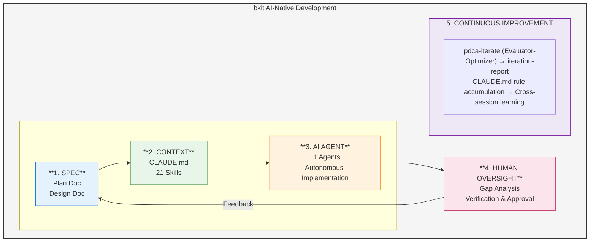
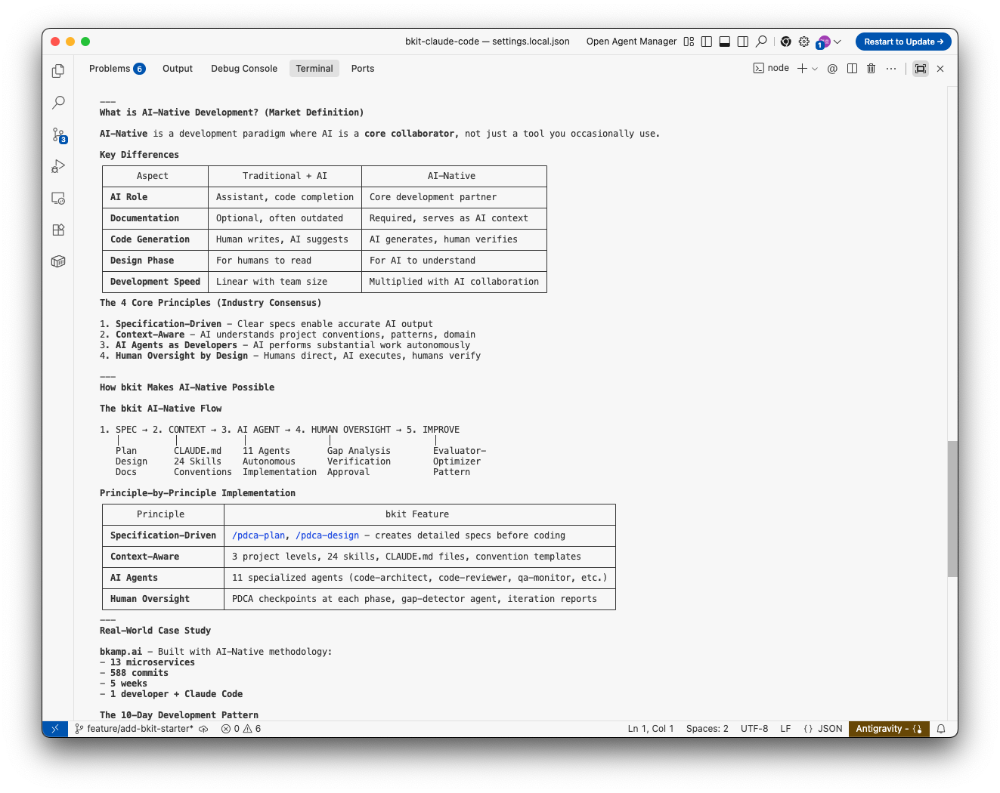
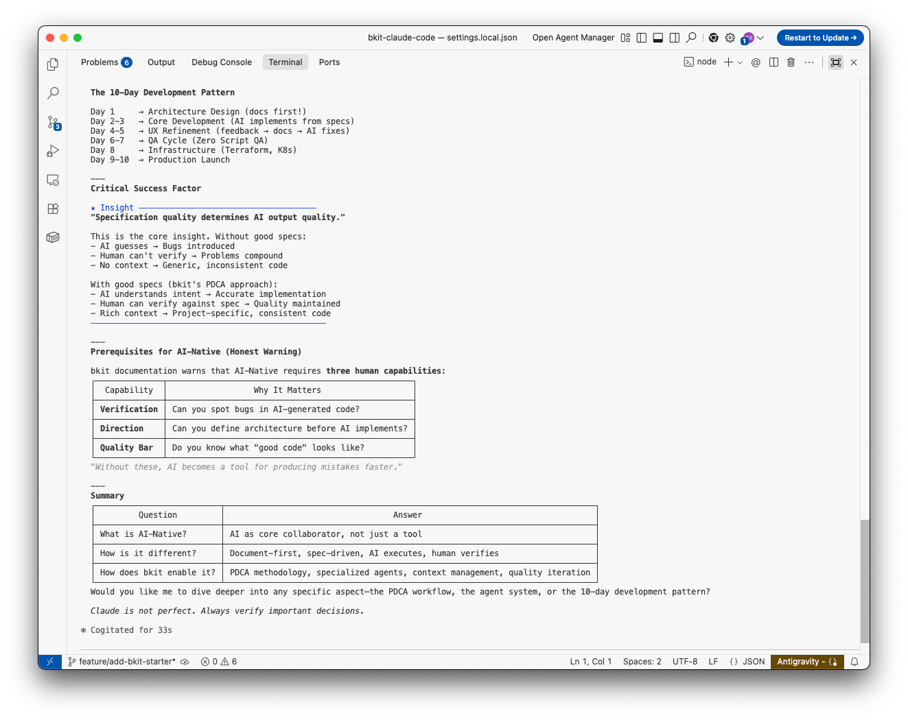

# AI-Native Development Methodology with bkit

## Overview

This document explains what AI-Native development means in the current market and how bkit realizes these principles to transform software development.

### bkit AI-Native Development Flow



---

## What is AI-Native Development?



AI-Native development is a paradigm where AI is not just a tool, but a **core collaborator** in the software development process. Unlike traditional development with AI assistance, AI-Native development fundamentally rethinks how software is designed, built, and maintained.

### Key Characteristics (Industry Consensus)

| Characteristic | Description |
|----------------|-------------|
| **Built on AI** | AI is integrated from the ground up, not added as an afterthought |
| **Break Constraints** | Removes traditional limitations on development speed and scale |
| **Continuously Improve** | Systems that get better through AI-driven iteration |
| **Proprietary AI** | Custom AI workflows tailored to specific development needs |

---

## The 4 AI-Native Principles

Based on research from industry leaders (Addy Osmani, Sapphire Ventures, DevOps.com, Augment), we identify four core principles:

### 1. Specification-Driven Development

**Principle**: Clear specifications enable AI to generate accurate, consistent code.

**Traditional Approach**:
- Write code first, document later
- Specifications often incomplete or outdated
- AI generates generic code without context

**AI-Native Approach**:
- Comprehensive specs before implementation
- Living documentation that evolves with code
- AI generates context-aware, project-specific code

### 2. Context-Aware Development

**Principle**: AI must understand project context to make intelligent decisions.

**Key Elements**:
- Project structure and conventions
- Existing code patterns and styles
- Business domain knowledge
- Team preferences and constraints

### 3. AI Agents as Developers

**Principle**: AI agents perform substantial development work autonomously.

**Capabilities**:
- Independent task completion
- Multi-step problem solving
- Automated testing and validation
- Self-correction through iteration

### 4. Human Oversight by Design

**Principle**: Humans provide strategic direction while AI handles execution.

**Balance**:
- AI proposes, human approves
- Critical decisions require human judgment
- Verification at key checkpoints
- Final quality assurance by humans

---

## AI-Native Engineer Mindset

According to Addy Osmani's research on AI-Native engineers, effective practitioners exhibit these characteristics:

### 1. Strategic Thinking
- Frame problems clearly before engaging AI
- Break complex tasks into manageable steps
- Provide relevant context upfront

### 2. Iterative Refinement
- Use AI output as starting point, not final product
- Continuously improve through feedback loops
- Build on what works, discard what doesn't

### 3. Quality Verification
- Always review AI-generated code
- Test edge cases and error handling
- Validate against requirements

### 4. Context Engineering (v1.4.5 Enhanced)

Context Engineering is the **systematic design of information flow to LLMs**—going beyond simple prompt crafting to build entire systems that consistently guide AI behavior.

**Key Practices**:
- Design multi-layered context injection systems
- Build state management for session persistence
- Create adaptive triggers based on user intent
- Implement quality feedback loops (Evaluator-Optimizer)

**bkit Implementation**:
```
Domain Knowledge (21 Skills) ─┐
Behavioral Rules (11 Agents) ─┼─→ Unified Hook System ─→ Dynamic Context Injection
State Management (86+ funcs) ─┘
```

See [bkit-system/philosophy/context-engineering.md](bkit-system/philosophy/context-engineering.md) for detailed implementation.

---

## How bkit Realizes AI-Native Development

bkit implements each AI-Native principle through specific features and workflows:

### Principle 1: Specification-Driven Development

| bkit Feature | Implementation |
|--------------|----------------|
| **PDCA Plan Phase** | Creates detailed specifications before coding |
| **PDCA Design Phase** | Defines architecture, APIs, data models |
| **Document Templates** | Standardized formats for consistent specs |
| **Schema Skill (Phase 1)** | Establishes terminology and data structures |

**Workflow**:
```
/pdca plan {feature}    → Create specification
/pdca design {feature}  → Design architecture
→ AI generates code from specs
```

### Principle 2: Context-Aware Development (Context Engineering)

bkit implements **Context Engineering**—the systematic curation of context tokens for optimal LLM inference.

| bkit Feature | Implementation |
|--------------|----------------|
| **3 Project Levels** | Starter, Dynamic, Enterprise contexts |
| **Convention Skill (Phase 2)** | Defines naming, structure, patterns |
| **CLAUDE.md Files** | Project-specific AI instructions |
| **Skill System (21 skills)** | Domain-specific knowledge |
| **Unified Hook System (v1.4.5)** | Centralized context injection via hooks.json |
| **lib/*.js (86+ functions)** | State management, intent detection, ambiguity handling |

**Context Engineering Architecture**:
```
┌─────────────────────────────────────────────────────────────────┐
│              bkit Context Engineering Layers                     │
├─────────────────────────────────────────────────────────────────┤
│  Layer 1: Domain Knowledge   │ 21 Skills (structured instructions)│
│  Layer 2: Behavioral Rules   │ 11 Agents (role + constraints)    │
│  Layer 3: State Management   │ PDCA v2.0, Multi-Feature Context  │
│  Layer 4: Dynamic Injection  │ Intent detection, ambiguity score │
│  Layer 5: Feedback Loop      │ Match Rate → Iteration            │
└─────────────────────────────────────────────────────────────────┘
```

**Context Injection Flow**:
```
User Message → Intent Detection → Skill/Agent Trigger →
→ State Injection → Tool Hooks → Response → Feedback Loop
```

### Principle 3: AI Agents as Developers

| bkit Feature | Implementation |
|--------------|----------------|
| **11 Specialized Agents** | code-architect, code-reviewer, qa-monitor, etc. |
| **Evaluator-Optimizer Pattern** | Automatic iteration cycles |
| **gap-detector Agent** | Finds design-implementation gaps |
| **code-analyzer Agent** | Quality and security analysis |

**Agent Workflow**:
```
code-explorer → code-architect → implementation → code-reviewer → qa-monitor
```

### Principle 4: Human Oversight by Design

| bkit Feature | Implementation |
|--------------|----------------|
| **PDCA Methodology** | Checkpoint at each phase |
| **Check Phase** | Human verification of AI work |
| **Act Phase** | Human approval before proceeding |
| **Iteration Reports** | Transparent progress documentation |

**Verification Points**:
```
Plan → [Human Review] → Design → [Human Review] → Do → Check → [Human Review] → Act
```

---

## bkit's 3 Core AI-Native Competencies

### 1. Rapid Specification-to-Implementation

**Traditional**: Days to weeks from spec to working code
**With bkit**: 2-3 conversations for bulk implementation

```
Specification Document → PDCA Design → AI Implementation → Working Code
```

### 2. Automated Quality Iteration

**Evaluator-Optimizer Pattern**:
- Automatic gap detection between design and implementation
- Code quality analysis (security, performance, maintainability)
- Functional testing with Zero Script QA
- Self-healing through iteration cycles

```bash
/pdca iterate {feature}  # Runs until quality threshold met
```

### 3. Continuous Context Evolution

**Context builds over time**:
- Project grows → More context for AI
- More context → Better AI decisions
- Better decisions → Higher quality code
- Higher quality → Faster development

---

## Comparison: Traditional vs AI-Native with bkit



| Aspect | Traditional Development | AI-Native with bkit |
|--------|------------------------|---------------------|
| **Specification** | Optional, often skipped | Required, template-driven |
| **Context** | In developer's head | Documented, AI-accessible |
| **Code Generation** | Human writes everything | AI generates, human reviews |
| **Quality Assurance** | Manual testing, code review | Automated analysis + human oversight |
| **Iteration** | Manual fix cycles | Automatic Evaluator-Optimizer |
| **Documentation** | Afterthought | Continuous, integrated |
| **Learning Curve** | Tool-specific | Pattern-based, transferable |

---

## Getting Started with AI-Native Development

### Step 1: Initialize with Context
```bash
/starter      # or /dynamic, /enterprise
```

### Step 2: Create Specifications
```bash
/pdca plan {feature}
/pdca design {feature}
```

### Step 3: Implement with AI Agents
```bash
# AI implements based on specs
# Human reviews and refines
```

### Step 4: Iterate to Quality
```bash
/pdca iterate {feature}  # Automatic improvement cycles
/pdca analyze {feature}  # Gap analysis
```

### Step 5: Document and Learn
```bash
/pdca report {feature}   # Generate completion report
```

---

## References

- Addy Osmani - "The 70% Problem: Hard Truths About AI-Assisted Coding"
- Sapphire Ventures - "What Makes AI-Native Different"
- DevOps.com - "AI-Native vs AI-Enabled Development"
- Anthropic - "Building Effective Agents" (Evaluator-Optimizer Pattern)

---

## Conclusion

AI-Native development is not about using AI tools occasionally—it's about fundamentally restructuring how software is built. bkit provides the framework, methodology, and tools to make this transformation practical and achievable.

The key insight: **Specification quality determines AI output quality**. By enforcing structured documentation through PDCA methodology, bkit ensures that AI agents have the context they need to produce high-quality, consistent code.

---

*bkit - Vibecoding Kit for AI-Native Development*
*POPUP STUDIO PTE. LTD. - https://popupstudio.ai*
