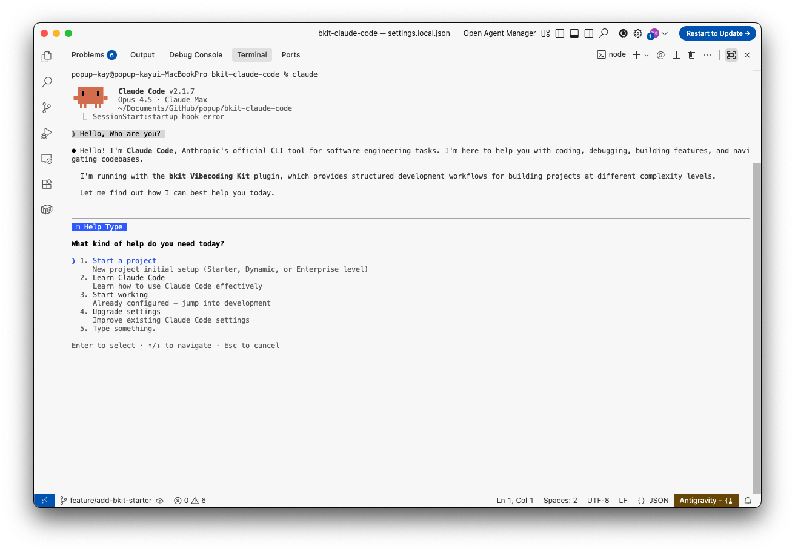
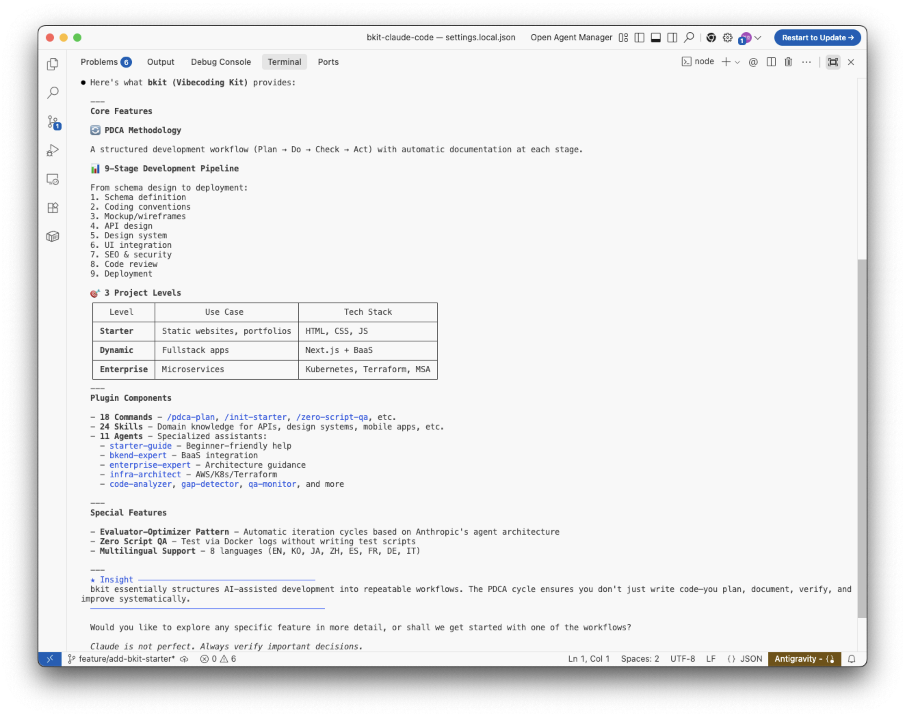

# bkit - Vibecoding Kit

[](https://opensource.org/licenses/Apache-2.0)
[](https://docs.anthropic.com/en/docs/claude-code/getting-started)
[](CHANGELOG.md)
[](https://popupstudio.ai)

> **PDCA methodology + AI coding assistant mastery for AI-native development**

bkit is a Claude Code plugin that transforms how you build software with AI. It provides structured development workflows, automatic documentation, and intelligent code assistance through the PDCA (Plan-Do-Check-Act) methodology.



---

## What is Context Engineering?

**Context Engineering** is the systematic curation of context tokens for optimal LLM inference—going beyond simple prompt crafting to build entire systems that consistently guide AI behavior.

```
Traditional Prompt Engineering:
  "The art of writing good prompts"

Context Engineering:
  "The art of designing systems that integrate prompts, tools, and state
   to provide LLMs with optimal context for inference"
```

**bkit is a practical implementation of Context Engineering**, providing a systematic context management system for Claude Code.

### bkit's Context Engineering Architecture

bkit implements Context Engineering through three interconnected layers:

| Layer | Components | Purpose |
|-------|------------|---------|
| **Domain Knowledge** | 21 Skills | Structured expert knowledge (phases, levels, specialized domains) |
| **Behavioral Rules** | 11 Agents | Role-based constraints with model selection (opus/sonnet/haiku) |
| **State Management** | 86+ Functions | PDCA status, intent detection, ambiguity scoring, multi-feature context |

### 5-Layer Hook System

Context injection occurs at five distinct layers:

```
Layer 1: hooks.json (Global)     → SessionStart, UserPromptSubmit, PreCompact, PreToolUse, PostToolUse, Stop
Layer 2: Skill Frontmatter       → Domain-specific hooks (deprecated in v1.4.4, use hooks.json)
Layer 3: Agent Frontmatter       → Task-specific hooks with constraints
Layer 4: Description Triggers    → Semantic matching in 8 languages
Layer 5: Scripts (39 modules)    → Actual Node.js execution logic with unified handlers
```

> **Learn more**: See [Context Engineering Principles](bkit-system/philosophy/context-engineering.md) for detailed implementation.

---

## Features



- **Task Management + PDCA Integration (v1.4.7)** - Task Chain Auto-Creation, Task ID Persistence, Check↔Act Iteration
- **Core Modularization (v1.4.7)** - lib/common.js split into 4 modules (lib/core/, lib/pdca/, lib/intent/, lib/task/)
- **Context Engineering (v1.4.4)** - Systematic context curation with 7 library modules and unified hook system
- **PDCA Methodology** - Structured development workflow with automatic documentation
- **PDCA Skill Integration (v1.4.4)** - Unified `/pdca` skill with 8 actions (plan, design, do, analyze, iterate, report, status, next)
- **Evaluator-Optimizer Pattern** - Automatic iteration cycles from Anthropic's agent architecture
- **9-Stage Development Pipeline** - From schema design to deployment
- **3 Project Levels** - Starter (static), Dynamic (fullstack), Enterprise (microservices)
- **Multilingual Support** - 8 languages (EN, KO, JA, ZH, ES, FR, DE, IT)
- **21 Skills** - Domain-specific knowledge for various development scenarios
- **11 Agents** - Specialized AI assistants for different tasks
- **39 Scripts** - Hook execution with unified handlers (hooks-json-integration)
- **132 Utility Functions** - 4 modular libraries with state management, intent detection, task tracking
- **Check-Act Iteration Loop** - Automatic gap analysis and fix cycles with max 5 iterations (90% threshold)

---

### 🚀 초보자라면?

> **Claude Code가 처음이신가요?**
>
> [bkit-starter](https://github.com/popup-studio-ai/bkit-starter)로 시작하세요!
>
> - 완전한 한글 가이드
> - 프로그래밍 경험 없이도 시작 가능
> - 첫 프로젝트 만들기 체험
>
> ```bash
> /plugin enable bkit-starter
> ```
>
> bkit은 bkit-starter를 마스터한 후 사용하는 고급 확장 버전입니다.

---

## Quick Start

> **Note**: bkit is designed for **Claude Code**. For Gemini CLI, see [bkit-gemini](https://github.com/popup-studio-ai/bkit-gemini).

### Option 1: Marketplace Installation (Recommended)

The easiest way to install bkit is through the Claude Code marketplace.

```bash
# Step 1: Add bkit marketplace
/plugin marketplace add popup-studio-ai/bkit-claude-code

# Step 2: Install bkit plugin
/plugin install bkit
```

#### Managing Marketplaces

Use `/plugin` command and navigate to **Marketplaces** tab to manage your plugin sources:


- **bkit-marketplace**: Contains bkit and bkit-starter plugins
- **claude-plugins-official**: Official Anthropic plugins

#### Discovering Plugins

Navigate to **Discover** tab to browse and install available plugins:


| Plugin | Description | Best For |
|--------|-------------|----------|
| **bkit** | Full PDCA methodology + Claude Code mastery | Experienced developers |
| **bkit-starter** | Korean learning guide for beginners | First-time Claude Code users |

#### Auto-Update Configuration

Keep your plugins up-to-date automatically by configuring auto-update in your settings:

```json
// ~/.claude/settings.json
{
  "plugins": {
    "autoUpdate": true
  }
}
```

**Update Commands:**
- Press `u` in the Marketplaces view to update all plugins
- Press `r` to remove a marketplace
- Use `Space` to toggle plugin selection in Discover view

### Plugin Structure

```
bkit-claude-code/
├── .claude-plugin/
│   ├── plugin.json          # Claude Code plugin manifest
│   └── marketplace.json     # Marketplace registry
├── agents/                  # Specialized AI agents
├── skills/                  # Domain knowledge
├── hooks/                   # Event hooks (hooks.json)
├── scripts/                 # Hook execution scripts
├── lib/                     # Shared utilities (4 modules)
├── templates/               # Document templates
└── bkit.config.json         # Centralized configuration
```

---

## Customization

After installing bkit via the marketplace, you can customize any component by copying it to your project's `.claude/` folder.

> **Comprehensive Guide**: See **[CUSTOMIZATION-GUIDE.md](CUSTOMIZATION-GUIDE.md)** for detailed instructions on customizing bkit for your organization, including platform-specific paths, component examples, and license attribution requirements.

### How It Works

Claude Code searches for configuration files in this priority order:
1. **Project `.claude/`** (highest priority - your customizations)
2. **User `~/.claude/`**
3. **Plugin installation** (default)

### Customization Steps

```bash
# Step 1: Find the plugin installation location
ls ~/.claude/plugins/bkit/

# Step 2: Copy only the files you want to customize
mkdir -p .claude/skills/starter
cp ~/.claude/plugins/bkit/skills/starter/SKILL.md .claude/skills/starter/

# Step 3: Edit the copied file in your project
# Your project's .claude/skills/starter/SKILL.md will override the plugin's version

# Step 4: Commit to version control (optional)
git add .claude/
git commit -m "feat: customize bkit starter skill"
```

### Available Components for Customization

| Component | Location | Description |
|-----------|----------|-------------|
| **Skills** | `~/.claude/plugins/bkit/skills/` | Domain knowledge and slash commands (e.g., `/pdca plan`) |
| **Skills** | `~/.claude/plugins/bkit/skills/` | Domain knowledge and context |
| **Agents** | `~/.claude/plugins/bkit/agents/` | Specialized AI assistants |
| **Templates** | `~/.claude/plugins/bkit/templates/` | Document templates |
| **Scripts** | `~/.claude/plugins/bkit/scripts/` | Hook scripts |
| **Config** | `~/.claude/plugins/bkit/bkit.config.json` | Central configuration |

### Important Notes

- **Customized files don't receive plugin updates.** When bkit is updated, your customized files remain unchanged while non-customized files are updated automatically.
- **Check the [CHANGELOG](CHANGELOG.md)** periodically for updates that might affect your customizations.
- **Delete a customized file** to revert to the plugin's default version.
- **Attribution required**: When creating derivative plugins, follow the [License & Attribution](CUSTOMIZATION-GUIDE.md#license--attribution) guidelines.

---

## Usage

### Start Learning
```bash
/claude-code-learning
```

### Initialize a Project
```bash
/starter      # Static website (Starter level)
/dynamic      # Fullstack with BaaS (Dynamic level)
/enterprise   # Microservices with K8s (Enterprise level)
```

### PDCA Workflow (v1.4.4 - Skills-based)
```bash
/pdca plan {feature}     # Create plan document
/pdca design {feature}   # Create design document
/pdca do {feature}       # Implementation guide
/pdca analyze {feature}  # Run gap analysis
/pdca iterate {feature}  # Auto-fix with Evaluator-Optimizer pattern
/pdca report {feature}   # Generate completion report
/pdca status             # Check current PDCA status
/pdca next               # Guide to next PDCA step
```

---

## Project Levels

| Level | Description | Stack |
|-------|-------------|-------|
| **Starter** | Static websites, portfolios | HTML, CSS, JS |
| **Dynamic** | Fullstack applications | Next.js, BaaS |
| **Enterprise** | Microservices architecture | K8s, Terraform, MSA |

---

## Is bkit Only for Development?


bkit is **primarily designed for software development**. However, some components can inspire structured workflows beyond coding:

| Component | Beyond Development Uses |
|-----------|------------------------|
| **PDCA Methodology** | Project management, process improvement |
| **Document Templates** | Planning any structured project |
| **Gap Analysis** | Comparing any plan vs. actual outcome |

> **Note**: For general writing, research, or non-technical tasks, plain Claude Code (without bkit) is better suited.

---

## Documentation

### Customization Guide

- **[CUSTOMIZATION-GUIDE.md](CUSTOMIZATION-GUIDE.md)** - Complete guide to customizing bkit for your organization
  - Platform-specific configuration paths (macOS, Linux, Windows, WSL)
  - Component customization (agents, skills, commands, hooks, templates)
  - License attribution requirements for derivative works
  - bkit design philosophy and architecture decisions

### Current Reference (bkit-system/)

- **[System Architecture](bkit-system/README.md)** - Plugin structure and trigger system overview
- **[Context Engineering](bkit-system/philosophy/context-engineering.md)** - LLM context curation principles (v1.4.2)
- **[Core Mission & Philosophy](bkit-system/philosophy/core-mission.md)** - 3 core philosophies (Automation First, No Guessing, Docs=Code)
- **[AI-Native Principles](bkit-system/philosophy/ai-native-principles.md)** - AI-Native development and 3 core competencies
- **[PDCA Methodology](bkit-system/philosophy/pdca-methodology.md)** - PDCA cycle and 9-stage pipeline relationship
- **[Graph Index](bkit-system/_GRAPH-INDEX.md)** - Obsidian-optimized component graph

### Component Reference

- [Development Pipeline](skills/development-pipeline/SKILL.md) - 9-stage pipeline skill
- [Skills Reference](skills/) - 22 domain skills (Commands deprecated in v1.4.4)
- [Agents Reference](agents/) - 11 specialized agents

### PDCA Documents

- [Active PDCA](docs/pdca/) - Current plan/design/analysis documents
- [Archive](docs/archive/) - Completed PDCA + legacy documents

### Other

- **[Changelog](CHANGELOG.md)** - Version history and release notes

### Visualize with Obsidian

The `bkit-system/` documentation is optimized for [Obsidian](https://obsidian.md/)'s Graph View:

1. Open `bkit-system/` as an Obsidian vault
2. Press `Ctrl/Cmd + G` to open Graph View
3. Explore component relationships visually

See **[bkit-system/README.md](bkit-system/README.md#viewing-with-obsidian)** for detailed instructions.

---

## Language Support

bkit automatically detects your language from trigger keywords:

| Language | Trigger Keywords |
|----------|-----------------|
| English | static website, beginner, API design |
| Korean | 정적 웹, 초보자, API 설계 |
| Japanese | 静的サイト, 初心者, API設計 |
| Chinese | 静态网站, 初学者, API设计 |
| Spanish | sitio web estático, principiante |
| French | site web statique, débutant |
| German | statische Webseite, Anfänger |
| Italian | sito web statico, principiante |

### Setting Response Language

Claude Code supports configuring your preferred response language through the `language` setting in your settings file.

#### Configuration Files (Priority Order)

| File | Scope | Git Tracked |
|------|-------|-------------|
| `.claude/settings.local.json` | Project (personal) | No (gitignored) |
| `.claude/settings.json` | Project (shared) | Yes |
| `~/.claude/settings.json` | User (global) | N/A |

#### How to Configure

Add the `language` key to any settings file:

```json
{
  "language": "korean"
}
```

#### Supported Languages

| Language | Setting Value |
|----------|---------------|
| English | `"english"` (default) |
| Korean | `"korean"` |
| Japanese | `"japanese"` |
| Chinese | `"chinese"` |
| Spanish | `"spanish"` |
| French | `"french"` |
| German | `"german"` |
| Italian | `"italian"` |

> **Note**: Trigger keywords work in any language. The `language` setting only affects Claude's response language.

---

## Contributing

We welcome contributions! Please see [CONTRIBUTING.md](CONTRIBUTING.md) for guidelines.

### Branch Protection

- Only `admin` team members can merge to `main`
- All changes require pull request review
- Version releases are managed through Git tags

---

## License

Copyright 2024-2026 POPUP STUDIO PTE. LTD.

Licensed under the Apache License, Version 2.0. See [LICENSE](LICENSE) for details.

You must include the [NOTICE](NOTICE) file in any redistribution.

---

## Support

- **Issues**: [GitHub Issues](https://github.com/popup-studio-ai/bkit-claude-code/issues)
- **Email**: contact@popupstudio.ai

---

Made with AI by [POPUP STUDIO](https://popupstudio.ai)
