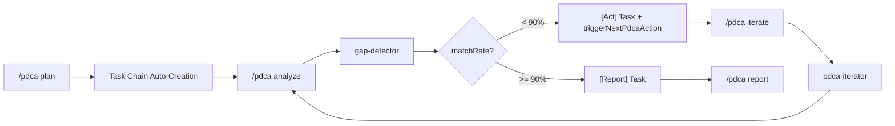

# bkit System Architecture

> Architecture guide documenting bkit plugin's internal structure and trigger system
>
> **v1.4.0**: Dual Platform Support (Claude Code + Gemini CLI)
>
> **v1.4.1**: Context Engineering perspective added - Optimal token curation for LLM reasoning
>
> **v1.4.2**: Context Engineering modules + Task Management integration + UserPromptSubmit/PreCompact hooks
>
> **v1.4.3**: Gemini CLI v0.25+ compatibility - `xmlSafeOutput()` for XML wrapping, engines version update
>
> **v1.4.4**: Commands deprecated → Skills migration, PDCA Skill integration (8 actions), hooks-json-integration (unified scripts)
>
> **v1.4.5**: `/pdca archive` action, 8-language trigger completion (ES/FR/DE/IT), internationalization (KO→EN translation)
>
> **v1.4.6**: Sub-agent call stability with `bkit:` prefix, all 11 agents updated
>
> **v1.4.7**: Task Management + PDCA Integration, Core Modularization (lib/ split into 4 modules with 132 functions)
>
> **v1.5.0**: Claude Code Exclusive - Gemini CLI support removed, simplified architecture

## Purpose of This Document

1. **Predictability**: Understand what features trigger based on user actions
2. **Testability**: Verify expected behavior per scenario
3. **Contributor Guide**: Understand relationships when adding new features

## Quick Links

- [[_GRAPH-INDEX]] - Obsidian graph hub (visualize all relationships)
- [[philosophy/core-mission]] - Core mission & 3 philosophies
- [[philosophy/context-engineering]] - Context Engineering principles ⭐ NEW
- [[triggers/trigger-matrix]] - Trigger matrix (core reference)
- [[scenarios/scenario-write-code]] - Code write flow

## Context Engineering Overview (v1.4.1)

bkit is a practical implementation of **Context Engineering**. Context Engineering is the discipline of optimally curating context tokens for LLM reasoning.

```
┌─────────────────────────────────────────────────────────────────┐
│              bkit Context Engineering Architecture              │
├─────────────────────────────────────────────────────────────────┤
│                                                                 │
│  ┌──────────────────┐  ┌──────────────────┐  ┌──────────────┐  │
│  │ Domain Knowledge │  │ Behavioral Rules │  │ State Mgmt   │  │
│  │    (26 Skills)   │  │   (16 Agents)    │  │ (4 modules)  │  │
│  │                  │  │                  │  │              │  │
│  │ • 9-Phase Guide  │  │ • Role Def.      │  │ • PDCA v2.0  │  │
│  │ • 3 Levels       │  │ • Constraints    │  │ • Multi-Feat │  │
│  │ • 8 Languages    │  │ • Few-shot       │  │ • Caching    │  │
│  └────────┬─────────┘  └────────┬─────────┘  └──────┬───────┘  │
│           │                     │                    │          │
│           └─────────────────────┼────────────────────┘          │
│                                 ▼                               │
│  ┌──────────────────────────────────────────────────────────┐  │
│  │                Unified Hook System (v1.4.4)               │  │
│  │  L1: hooks.json (10 events - all hooks centralized)      │  │
│  │  L2: Unified Scripts (stop, bash-pre, write-post, etc.)  │  │
│  │  L3: Agent Frontmatter (constraints only)                │  │
│  │  L4: Description Triggers (keyword matching)             │  │
│  │  L5: Scripts (45 Node.js modules)                        │  │
│  └──────────────────────────────────────────────────────────┘  │
│                                 │                               │
│                                 ▼                               │
│  ┌──────────────────────────────────────────────────────────┐  │
│  │         Dynamic Context Injection                         │  │
│  │  • Task Size → PDCA Level                                │  │
│  │  • User Intent → Agent/Skill Auto-Trigger                │  │
│  │  • Ambiguity Score → Clarifying Questions                │  │
│  │  • Match Rate → Check-Act Iteration                      │  │
│  └──────────────────────────────────────────────────────────┘  │
│                                                                 │
└─────────────────────────────────────────────────────────────────┘
```

### Core Context Engineering Patterns

| Pattern | Implementation | Purpose |
|---------|----------------|---------|
| **Role Definition** | Agent frontmatter | Specify expertise, responsibility scope, level |
| **Structured Instructions** | Skill SKILL.md | Structure knowledge with checklists, tables, diagrams |
| **Few-shot Examples** | Agent/Skill prompts | Code patterns, output templates, conversation examples |
| **Constraint Specification** | Hook + Permission Mode | Tool restrictions, score thresholds, workflow rules |
| **State Injection** | SessionStart + Scripts | PDCA state, feature context, iteration counters |
| **Adaptive Guidance** | `lib/pdca/`, `lib/intent/` | Level-based branching, language-specific triggers, ambiguity handling |

Details: [[philosophy/context-engineering]]

## v1.4.7 Architecture

### Component Diagram (5-Layer)


### Data Flow (PDCA Cycle with Task Integration v1.4.7)



**v1.4.7 Task Chain Features:**
- Task Chain Auto-Creation: Plan→Design→Do→Check→Report tasks created on `/pdca plan`
- Task ID Persistence: Task IDs stored in `.pdca-status.json`
- Check↔Act Iteration: Max 5 iterations, 90% threshold
- Full-Auto Mode: manual/semi-auto/full-auto levels

### Component Dependencies (v1.4.7)

| Component | Depends On | Purpose |
|-----------|-----------|---------|
| `skill-orchestrator.js` | `lib/pdca/`, `lib/task/` | PDCA state + Task management |
| `gap-detector-stop.js` | `lib/common.js` → `lib/task/` | Task creation, triggerNextPdcaAction |
| `iterator-stop.js` | `lib/common.js` → `lib/task/` | Task update, phase transition |
| `pdca-skill-stop.js` | `lib/task/` | Task chain creation (v1.4.7) |
| `pdca` skill | `templates/*.md` | Template imports |
| `agents/*.md` | `skills` | `skills_preload` fields |

**Library Module Structure (v1.4.7):**
```
lib/
├── common.js              # Migration Bridge (re-exports all)
├── core/                  # Platform, cache, debug, config (7 files)
├── pdca/                  # PDCA phase, status, automation (6 files)
├── intent/                # Language, trigger, ambiguity (4 files)
└── task/                  # Classification, context, creator, tracker (5 files)
```

## System Overview

```
┌─────────────────────────────────────────────────────────────────┐
│                bkit Trigger System (v1.4.7)                      │
├─────────────────────────────────────────────────────────────────┤
│                                                                 │
│  ┌──────────────┐    ┌──────────────┐    ┌──────────────┐      │
│  │   Skills     │───▶│   Agents     │───▶│   Scripts    │      │
│  │  (22)        │    │  (11)        │    │  (39)        │      │
│  └──────────────┘    └──────────────┘    └──────────────┘      │
│         │                   │                   │               │
│         ▼                   ▼                   ▼               │
│  ┌──────────────────────────────────────────────────────┐      │
│  │                    Hooks Layer (5 events)             │      │
│  │  SessionStart │ UserPromptSubmit │ PreToolUse │       │      │
│  │  PostToolUse  │ PreCompact       │ (+ Stop)           │      │
│  └──────────────────────────────────────────────────────┘      │
│                              │                                  │
│                              ▼                                  │
│  ┌──────────────────────────────────────────────────────┐      │
│  │              Claude Code Runtime                       │      │
│  └──────────────────────────────────────────────────────┘      │
│                                                                 │
└─────────────────────────────────────────────────────────────────┘
```

## Component Summary

| Component | Count | Role | Details |
|-----------|-------|------|---------|
| Skills | 26 | Domain knowledge + Slash commands | [[components/skills/_skills-overview]] |
| Agents | 16 | Specialized task execution | [[components/agents/_agents-overview]] |
| Commands | DEPRECATED | Migrated to Skills (v1.4.4) | - |
| Hooks | 10 events | Event-based triggers (unified) | [[components/hooks/_hooks-overview]] |
| Scripts | 45 | Actual logic execution | [[components/scripts/_scripts-overview]] |
| Lib | 5 modules | Shared utilities | `lib/core/`, `lib/pdca/`, `lib/intent/`, `lib/task/`, `lib/team/` (241 functions) |
| Config | 1 | Centralized settings | `bkit.config.json` |
| Templates | 27 | Document templates | PDCA + Pipeline + Shared |

## v1.5.1 Features

| Feature | Components | Discovery Mechanism |
|---------|-----------|---------------------|
| Output Styles | 4 style files in `output-styles/` | Auto-suggested at SessionStart based on level |
| Agent Teams | `lib/team/` module (9 files) | Announced at SessionStart, suggested for major features |
| Agent Memory | `memory:` frontmatter in all 16 agents | Auto-active, mentioned at SessionStart |

## Trigger Layers

bkit triggers occur across 5 layers:

```
Layer 1: hooks.json (Global) → SessionStart, UserPromptSubmit, PreCompact, PreToolUse, PostToolUse, Stop
Layer 2: Unified Scripts     → unified-stop.js, unified-bash-pre.js, unified-write-post.js, etc.
Layer 3: Agent Frontmatter   → Constraints and role definitions (hooks deprecated)
Layer 4: Description Triggers → "Triggers:" keyword matching
Layer 5: Scripts             → Actual Node.js logic execution (45 modules)
```

> **Note (v1.4.4)**: All hooks centralized in hooks.json. SKILL.md frontmatter hooks deprecated (backward compatible).

Details: [[triggers/trigger-matrix]]

## Key Scenarios

| Scenario | Triggered Components | Details |
|----------|---------------------|---------|
| Code Write (Write/Edit) | 2-3 hooks + scripts | [[scenarios/scenario-write-code]] |
| New Feature Request | PDCA flow + agents | [[scenarios/scenario-new-feature]] |
| QA Execution | qa-monitor + scripts | [[scenarios/scenario-qa]] |

## Folder Structure

```
bkit-system/
├── README.md                  # This file
├── _GRAPH-INDEX.md            # Obsidian graph hub
├── philosophy/                # Design philosophy
│   ├── core-mission.md        # Core mission & 3 philosophies
│   ├── ai-native-principles.md # AI-Native development principles
│   └── pdca-methodology.md    # PDCA & Pipeline methodology
├── components/
│   ├── skills/                # Skill details
│   ├── agents/                # Agent details
│   ├── hooks/                 # Hook event reference
│   └── scripts/               # Script details
├── triggers/
│   ├── trigger-matrix.md      # Trigger matrix
│   └── priority-rules.md      # Priority rules
├── scenarios/                 # User scenario flows
└── testing/
    └── test-checklist.md      # Test checklist
```

## Source Locations

| Item | Path |
|------|------|
| Skills | `skills/*/SKILL.md` |
| Agents | `agents/*.md` |
| Scripts | `scripts/*.js` |
| Templates | `templates/*.md` |
| Hooks | `hooks/hooks.json` |
| Lib | `lib/core/`, `lib/pdca/`, `lib/intent/`, `lib/task/` |
| Config | `bkit.config.json` |
| Context | `CLAUDE.md` |
| Manifest | `.claude-plugin/plugin.json` |

> **Note (v1.5.0)**: bkit is now Claude Code exclusive. Gemini CLI support was removed.

> **Note**: The `.claude/` folder is not in version control. All plugin elements are at root level.
> **v1.4.0**: Skills, Agents, Scripts, Templates, Lib, and Config are shared between both platforms.

---

## Viewing with Obsidian

The bkit-system documentation is optimized for [Obsidian](https://obsidian.md/)'s Graph View, allowing you to visualize component relationships interactively.

### Option 1: Open bkit-system as a Vault (Recommended)

1. Open Obsidian
2. Click "Open folder as vault"
3. Select the `bkit-system/` folder
4. Press `Ctrl/Cmd + G` to open Graph View
5. Start from `_GRAPH-INDEX.md` to explore all connections

### Option 2: Open Project Root as a Vault

1. Open Obsidian
2. Click "Open folder as vault"
3. Select the project root folder
4. Navigate to `bkit-system/` in the file explorer
5. Open `_GRAPH-INDEX.md` and use Graph View

### Pre-configured Settings

The `bkit-system/.obsidian/` folder includes shared settings:

| File | Purpose | Shared |
|------|---------|:------:|
| `graph.json` | Optimized graph view layout | Yes |
| `core-plugins.json` | Required Obsidian plugins | Yes |
| `workspace.json` | Personal workspace state | No |
| `app.json` | Personal app settings | No |

> **Tip**: The graph settings are pre-configured for optimal visualization of bkit's 26 skills, 16 agents, 45 scripts, and their relationships.
