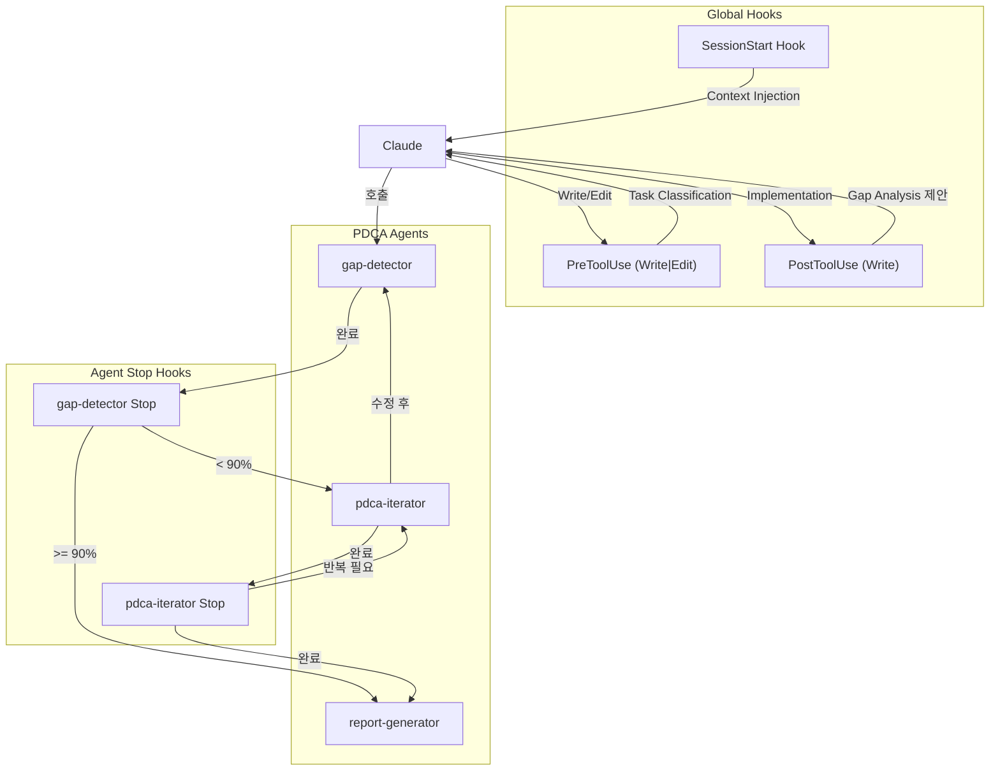

# bkit v1.3.0 Refactoring Design Document

> **Summary**: PDCA Check-Act 반복 기능 복구, 크기 기반 PDCA 적용 규칙, 자동 트리거 개선을 위한 상세 설계
>
> **Plan Reference**: `docs/01-plan/features/bkit-v1.3.0-refactoring.plan.md`
> **Version**: 1.2.3 → 1.3.0
> **Author**: User
> **Date**: 2026-01-22
> **Status**: Draft

---

## 1. Current State Analysis

### 1.1 Codebase Structure

```
bkit-claude-code/
├── agents/
│   ├── pdca-iterator.md      ← Check-Act 반복 에이전트 (로직 문서화만, 자동 연결 없음)
│   ├── gap-detector.md       ← Gap 분석 에이전트 (정상)
│   ├── code-analyzer.md      ← 코드 품질 분석 (정상)
│   ├── report-generator.md   ← 완료 보고서 (정상)
│   └── ...
├── hooks/
│   ├── hooks.json            ← 글로벌 훅 정의
│   └── session-start.sh      ← SessionStart 훅
├── scripts/
│   ├── pre-write.sh          ← PreToolUse (Write|Edit) 통합 훅
│   ├── pdca-post-write.sh    ← PostToolUse (Write) 훅
│   ├── gap-detector-post.sh  ← gap-detector Stop 후 훅
│   ├── analysis-stop.sh      ← 분석 완료 후 훅
│   └── ...
├── lib/
│   └── common.sh             ← 공통 유틸리티 함수
└── skills/
    └── (18개 스킬)
```

### 1.2 Current Issues

| Component | Issue | Root Cause |
|-----------|-------|------------|
| pdca-iterator | Check-Act 반복 미작동 | 문서에만 로직 있음, 실제 자동 호출 없음 |
| gap-detector-post.sh | pdca-iterator 연결 없음 | 제안만 함, Match Rate 파싱 없음 |
| pre-write.sh | major_feature만 block | 크기 기반 규칙 미세 조정 필요 |
| session-start.sh | 트리거 매핑 없음 | 키워드 → 에이전트 매핑 정보 미제공 |
| hooks.json | 기본 훅만 정의 | Check-Act 자동 연결 훅 없음 |

### 1.3 Data Flow Analysis (AS-IS)

```
사용자: "로그인 기능 만들어줘"
    │
    ▼
┌─────────────────────────────────────────────────────────────┐
│ SessionStart Hook                                           │
│ → AskUserQuestion 제안 (Learn bkit/Claude Code/Continue/New)│
└─────────────────────────────────────────────────────────────┘
    │
    ▼
┌─────────────────────────────────────────────────────────────┐
│ PreToolUse Hook (Write|Edit)                                │
│ → Task Classification (quick_fix/minor/feature/major)       │
│ → Design doc 확인                                           │
│ → major_feature + no design → Block                         │
└─────────────────────────────────────────────────────────────┘
    │
    ▼
┌─────────────────────────────────────────────────────────────┐
│ PostToolUse Hook (Write)                                    │
│ → "Gap Analysis 실행할까요?" 제안 (design doc 있을 때만)     │
└─────────────────────────────────────────────────────────────┘
    │
    ▼
┌─────────────────────────────────────────────────────────────┐
│ gap-detector Agent (수동 호출)                              │
│ → Gap Analysis 수행                                         │
│ → 결과 출력                                                  │
└─────────────────────────────────────────────────────────────┘
    │
    ▼
┌─────────────────────────────────────────────────────────────┐
│ analysis-stop.sh                                            │
│ → "Match rate < 70% → /pdca-iterate 실행" 제안              │
│ → 여기서 끝남 (자동 연결 없음) ❌                            │
└─────────────────────────────────────────────────────────────┘
```

---

## 2. Target Architecture (TO-BE)

### 2.1 Data Flow (TO-BE)

```
사용자: "로그인 기능 만들어줘"
    │
    ▼
┌─────────────────────────────────────────────────────────────┐
│ SessionStart Hook (개선)                                    │
│ → AskUserQuestion + 트리거 키워드 매핑 정보 주입            │
│ → Claude가 키워드 인식하면 적절한 에이전트 사용 안내        │
└─────────────────────────────────────────────────────────────┘
    │
    ▼
┌─────────────────────────────────────────────────────────────┐
│ PreToolUse Hook (Write|Edit) - 개선                         │
│ → Task Classification (크기 기반)                           │
│   ├── quick_fix: 제안 없음                                  │
│   ├── minor_change: 가볍게 PDCA 언급                        │
│   ├── feature: 설계서 확인 권장 (block 안 함)              │
│   └── major_feature: 설계서 강력 권장 (선택적 block)       │
└─────────────────────────────────────────────────────────────┘
    │
    ▼
┌─────────────────────────────────────────────────────────────┐
│ PostToolUse Hook (Write) - 개선                             │
│ → Feature 크기 확인                                         │
│ → Design doc 있으면 Gap Analysis 제안                       │
│ → 누적 변경량 추적 (선택적)                                 │
└─────────────────────────────────────────────────────────────┘
    │
    ▼
┌─────────────────────────────────────────────────────────────┐
│ gap-detector Agent                                          │
│ → Gap Analysis 수행                                         │
│ → Match Rate 산출                                           │
└─────────────────────────────────────────────────────────────┘
    │
    ▼
┌─────────────────────────────────────────────────────────────┐
│ gap-detector Stop Hook (신규/개선)                          │
│ → Match Rate 파싱                                           │
│   ├── >= 90%: report-generator 제안 + Archive 제안         │
│   ├── 70-89%: 선택지 제공 (수동 수정 vs pdca-iterator)     │
│   └── < 70%: pdca-iterator 강력 권장                       │
└─────────────────────────────────────────────────────────────┘
    │
    ▼ (< 90%)
┌─────────────────────────────────────────────────────────────┐
│ pdca-iterator Agent (자동 제안 또는 수동 호출)              │
│ → gap-detector 결과 기반 수정 작업                          │
│ → 수정 완료 후 gap-detector 재호출                          │
│ → 반복 (최대 5회)                                           │
└─────────────────────────────────────────────────────────────┘
    │
    ▼ (>= 90%)
┌─────────────────────────────────────────────────────────────┐
│ report-generator Agent                                      │
│ → 완료 보고서 생성                                          │
│ → Archive 제안                                              │
└─────────────────────────────────────────────────────────────┘
```

### 2.2 Component Interactions



---

## 3. Detailed Design

### 3.1 Check-Act 반복 루프 구현

#### 3.1.1 gap-detector Stop Hook 개선

**파일**: `scripts/gap-detector-stop.sh` (신규)

```bash
#!/bin/bash
# scripts/gap-detector-stop.sh
# Purpose: Parse gap analysis result and guide next steps
# Hook: Stop for gap-detector agent

set -e

# Get the conversation context from stdin
INPUT=$(cat)

# Try to extract match rate from the agent's output
# Pattern: "Overall Match Rate: XX%" or "매치율: XX%"
MATCH_RATE=$(echo "$INPUT" | grep -oE '(Overall|Match Rate|매치율)[^0-9]*([0-9]+)' | grep -oE '[0-9]+' | head -1)

# Default to 0 if not found
MATCH_RATE=${MATCH_RATE:-0}

# Generate guidance based on match rate
if [ "$MATCH_RATE" -ge 90 ]; then
    GUIDANCE="✅ Gap Analysis 완료: ${MATCH_RATE}% 매치

설계-구현이 잘 일치합니다.

다음 단계:
1. /pdca-report 로 완료 보고서 생성
2. Archive 진행 (docs/archive/로 이동)"

elif [ "$MATCH_RATE" -ge 70 ]; then
    GUIDANCE="⚠️ Gap Analysis 완료: ${MATCH_RATE}% 매치

일부 차이가 있습니다. 선택하세요:
1. 수동으로 차이점 수정
2. /pdca-iterate 로 자동 개선 실행
3. 차이를 의도적인 것으로 기록"

else
    GUIDANCE="🔴 Gap Analysis 완료: ${MATCH_RATE}% 매치

설계-구현 차이가 큽니다.

권장: /pdca-iterate 를 실행하여 자동 개선하세요.
또는 설계 문서를 현재 구현에 맞게 업데이트하세요."
fi

# Escape for JSON
ESCAPED_GUIDANCE=$(echo "$GUIDANCE" | sed 's/"/\\"/g' | tr '\n' '\\n')

cat << EOF
{"decision": "allow", "hookSpecificOutput": {"additionalContext": "$ESCAPED_GUIDANCE"}}
EOF
```

#### 3.1.2 pdca-iterator 에이전트 개선

**파일**: `agents/pdca-iterator.md` (수정)

**변경 사항**:
1. Stop hook 추가 - 반복 여부 결정
2. 반복 횟수 추적 지침 추가
3. gap-detector 재호출 명시

```yaml
---
name: pdca-iterator
description: |
  Evaluator-Optimizer pattern agent for automatic iteration cycles.
  Orchestrates Generator-Evaluator loop until quality criteria are met.
  Core role in PDCA Check-Act phase for continuous improvement.

  ## Auto-Invoke Conditions
  - After gap-detector completes with Match Rate < 90%
  - User requests "자동 수정", "반복 개선", "iterate"
  - /pdca-iterate command executed

  ## Iteration Rules
  - Maximum 5 iterations per session
  - Re-run gap-detector after each fix cycle
  - Stop when Match Rate >= 90% or max iterations reached

  Triggers: iterate, optimize, auto-fix, 반복 개선, 자동 수정, 고쳐줘, 개선해줘

  Do NOT use for: initial development, research tasks, design document creation.
permissionMode: acceptEdits
model: sonnet
tools:
  - Read
  - Write
  - Edit
  - Glob
  - Grep
  - Bash
  - Task
  - TodoWrite
  - LSP
hooks:
  Stop:
    - hooks:
        - type: command
          command: "${CLAUDE_PLUGIN_ROOT}/scripts/iterator-stop.sh"
          timeout: 5000
---
```

#### 3.1.3 pdca-iterator Stop Hook

**파일**: `scripts/iterator-stop.sh` (신규)

```bash
#!/bin/bash
# scripts/iterator-stop.sh
# Purpose: Guide next iteration or completion
# Hook: Stop for pdca-iterator agent

set -e

INPUT=$(cat)

# Check if iteration completed or needs continuation
# Look for completion markers
if echo "$INPUT" | grep -qE '(완료|Complete|>= 90%|매치율.*9[0-9]%)'; then
    GUIDANCE="✅ pdca-iterator 완료

설계-구현 일치도가 목표에 도달했습니다.

다음 단계:
1. /pdca-report 로 완료 보고서 생성
2. 변경사항 리뷰 후 커밋"
else
    GUIDANCE="🔄 pdca-iterator 진행 중

수정이 완료되었습니다. gap-detector로 재평가하여 매치율을 확인하세요.

/pdca-analyze {feature} 로 재평가 실행"
fi

ESCAPED_GUIDANCE=$(echo "$GUIDANCE" | sed 's/"/\\"/g' | tr '\n' '\\n')

cat << EOF
{"decision": "allow", "hookSpecificOutput": {"additionalContext": "$ESCAPED_GUIDANCE"}}
EOF
```

### 3.2 크기 기반 PDCA 적용 규칙

#### 3.2.1 Task Classification 개선

**파일**: `lib/common.sh` (수정)

현재 기준:
- quick_fix: < 50 chars
- minor_change: < 200 chars
- feature: < 1000 chars
- major_feature: >= 1000 chars

**개선된 기준** (줄 수 기반으로 변경):

```bash
# ============================================================
# Task Classification (v1.3.0 - Line-based)
# ============================================================

# Classify task by line count (more accurate than char count)
# Usage: classify_task_by_lines "content string"
# Output: "quick_fix" | "minor_change" | "feature" | "major_feature"
classify_task_by_lines() {
    local content="$1"
    local line_count=$(echo "$content" | wc -l)

    # Get thresholds from config or use defaults
    local quick_fix_lines=$(get_config ".taskClassification.lines.quickFix" "10")
    local minor_change_lines=$(get_config ".taskClassification.lines.minorChange" "50")
    local feature_lines=$(get_config ".taskClassification.lines.feature" "200")

    if [ "$line_count" -lt "$quick_fix_lines" ]; then
        echo "quick_fix"
    elif [ "$line_count" -lt "$minor_change_lines" ]; then
        echo "minor_change"
    elif [ "$line_count" -lt "$feature_lines" ]; then
        echo "feature"
    else
        echo "major_feature"
    fi
}

# Get PDCA guidance based on classification (v1.3.0)
# Returns guidance level: none, light, recommended, required
get_pdca_level() {
    local classification="$1"

    case "$classification" in
        quick_fix)
            echo "none"
            ;;
        minor_change)
            echo "light"
            ;;
        feature)
            echo "recommended"
            ;;
        major_feature)
            echo "required"
            ;;
    esac
}
```

#### 3.2.2 pre-write.sh 개선

**파일**: `scripts/pre-write.sh` (수정)

```bash
# ------------------------------------------------------------
# 1. Task Classification (v1.3.0 - 크기 기반 규칙)
# ------------------------------------------------------------
if [ -n "$CONTENT" ]; then
    CLASSIFICATION=$(classify_task_by_lines "$CONTENT")
    PDCA_LEVEL=$(get_pdca_level "$CLASSIFICATION")
    LINE_COUNT=$(echo "$CONTENT" | wc -l)

    case "$PDCA_LEVEL" in
        "none")
            # Quick Fix - 제안 없음
            ;;
        "light")
            # Minor Change - 가볍게 언급
            CONTEXT_PARTS+=("Minor change (${LINE_COUNT} lines). PDCA optional.")
            ;;
        "recommended")
            # Feature - 설계서 권장 (block 안 함)
            CONTEXT_PARTS+=("Feature-level change (${LINE_COUNT} lines). Design doc recommended.")
            ;;
        "required")
            # Major Feature - 설계서 강력 권장
            if [ -z "$DESIGN_DOC" ]; then
                CONTEXT_PARTS+=("⚠️ Major feature (${LINE_COUNT} lines) without design doc. Consider /pdca-design first.")
                # Note: block 제거 - 제안만 함 (Automation First 원칙)
            fi
            ;;
    esac
fi
```

### 3.3 자동 트리거 개선

#### 3.3.1 SessionStart Hook 개선

**파일**: `hooks/session-start.sh` (수정)

```bash
#!/bin/bash
# bkit Vibecoding Kit - SessionStart Hook (v1.3.0)

# ... (기존 레벨 감지 코드 유지)

cat << 'JSON'
{
  "systemMessage": "👋 bkit Vibecoding Kit v1.3.0 activated",
  "hookSpecificOutput": {
    "hookEventName": "SessionStart",
    "additionalContext": "# bkit Vibecoding Kit - Session Startup\n\n## MANDATORY: First Message Action\n\nUse **AskUserQuestion** tool with these options:\n- Learn bkit / Learn Claude Code / Continue Previous Work / Start New Project\n\n## PDCA Core Rules\n- New feature → Check/create design doc first\n- After implementation → Suggest Gap analysis\n- Gap Analysis < 90% → Suggest pdca-iterator\n\n## Trigger Keyword Mapping\nWhen user mentions these keywords, consider using the corresponding agent:\n\n| Keyword | Agent | Action |\n|---------|-------|--------|\n| 검증, verify, check | gap-detector | Gap Analysis |\n| 개선, improve, iterate | pdca-iterator | Auto-fix loop |\n| 분석, analyze, quality | code-analyzer | Code quality check |\n| 보고서, report, summary | report-generator | Generate report |\n| QA, 테스트, test | qa-monitor | Zero Script QA |\n\n## Task Size Rules (Automation First)\n- Quick Fix (<10 lines): No PDCA needed\n- Minor Change (<50 lines): PDCA optional\n- Feature (<200 lines): Design doc recommended\n- Major Feature (>=200 lines): Design doc strongly recommended"
  }
}
JSON

exit 0
```

### 3.4 Archive Rules 구현

#### 3.4.1 Archive 스크립트

**파일**: `scripts/archive-feature.sh` (신규)

```bash
#!/bin/bash
# scripts/archive-feature.sh
# Purpose: Archive completed PDCA documents
# Usage: archive-feature.sh <feature-name>

set -e

FEATURE="$1"
ARCHIVE_DATE=$(date +%Y-%m)
ARCHIVE_DIR="docs/archive/${ARCHIVE_DATE}/${FEATURE}"

# Check if feature exists
PLAN_DOC="docs/01-plan/features/${FEATURE}.plan.md"
DESIGN_DOC="docs/02-design/features/${FEATURE}.design.md"
ANALYSIS_DOC="docs/03-analysis/${FEATURE}.analysis.md"

if [ ! -f "$PLAN_DOC" ] && [ ! -f "$DESIGN_DOC" ]; then
    echo "Error: No PDCA documents found for feature '${FEATURE}'"
    exit 1
fi

# Create archive directory
mkdir -p "$ARCHIVE_DIR"

# Move documents
[ -f "$PLAN_DOC" ] && mv "$PLAN_DOC" "$ARCHIVE_DIR/"
[ -f "$DESIGN_DOC" ] && mv "$DESIGN_DOC" "$ARCHIVE_DIR/"
[ -f "$ANALYSIS_DOC" ] && mv "$ARCHIVE_DIR/"

# Update archive index
INDEX_FILE="docs/archive/${ARCHIVE_DATE}/_INDEX.md"
if [ ! -f "$INDEX_FILE" ]; then
    cat > "$INDEX_FILE" << EOF
# Archive - ${ARCHIVE_DATE}

| Feature | Archived Date | Status |
|---------|--------------|--------|
EOF
fi

echo "| ${FEATURE} | $(date +%Y-%m-%d) | Completed |" >> "$INDEX_FILE"

echo "✅ Archived: ${FEATURE} → ${ARCHIVE_DIR}"
```

### 3.5 hooks.json 전체 구조

**파일**: `hooks/hooks.json` (수정)

```json
{
  "$schema": "https://json.schemastore.org/claude-code-hooks.json",
  "description": "bkit Vibecoding Kit v1.3.0 - Global hooks for PDCA workflow",
  "hooks": {
    "SessionStart": [
      {
        "once": true,
        "hooks": [
          {
            "type": "command",
            "command": "${CLAUDE_PLUGIN_ROOT}/hooks/session-start.sh",
            "timeout": 5000
          }
        ]
      }
    ],
    "PreToolUse": [
      {
        "matcher": "Write|Edit",
        "hooks": [
          {
            "type": "command",
            "command": "${CLAUDE_PLUGIN_ROOT}/scripts/pre-write.sh",
            "timeout": 5000
          }
        ]
      }
    ],
    "PostToolUse": [
      {
        "matcher": "Write",
        "hooks": [
          {
            "type": "command",
            "command": "${CLAUDE_PLUGIN_ROOT}/scripts/pdca-post-write.sh",
            "timeout": 5000
          }
        ]
      }
    ]
  }
}
```

**Note**: Agent-specific hooks (Stop)은 각 에이전트의 frontmatter에 정의됨.

---

## 4. File Changes Summary

### 4.1 New Files

| File | Purpose |
|------|---------|
| `scripts/gap-detector-stop.sh` | Gap Analysis 후 Match Rate 기반 분기 |
| `scripts/iterator-stop.sh` | pdca-iterator 완료 후 안내 |
| `scripts/archive-feature.sh` | PDCA 문서 아카이브 |
| `docs/02-design/features/bkit-v1.3.0-refactoring.design.md` | 이 설계서 |

### 4.2 Modified Files

| File | Changes |
|------|---------|
| `agents/pdca-iterator.md` | Stop hook 추가, Auto-invoke 조건 명시 |
| `agents/gap-detector.md` | Stop hook을 새 스크립트로 변경 |
| `hooks/session-start.sh` | 트리거 키워드 매핑 추가 |
| `scripts/pre-write.sh` | 줄 수 기반 분류, block 제거 |
| `lib/common.sh` | classify_task_by_lines, get_pdca_level 함수 추가 |

### 4.3 No Changes Needed

| File | Reason |
|------|--------|
| `hooks/hooks.json` | 구조 유지, Agent-specific hooks는 frontmatter에 |
| `scripts/pdca-post-write.sh` | 현재 기능 충분 |
| `scripts/analysis-stop.sh` | gap-detector-stop.sh로 대체 |

---

## 5. Implementation Order

### Phase 1: 기반 정리 (Day 1)

1. [ ] `lib/common.sh` 수정 - 줄 수 기반 분류 함수 추가
2. [ ] `scripts/pre-write.sh` 수정 - 크기 기반 규칙 적용, block 제거
3. [ ] 존재하지 않는 스킬 참조 최종 확인

### Phase 2: Check-Act 반복 구현 (Day 1-2)

1. [ ] `scripts/gap-detector-stop.sh` 생성 - Match Rate 파싱
2. [ ] `agents/gap-detector.md` 수정 - Stop hook 연결
3. [ ] `scripts/iterator-stop.sh` 생성 - 반복 안내
4. [ ] `agents/pdca-iterator.md` 수정 - Stop hook, Auto-invoke 조건

### Phase 3: 자동 트리거 개선 (Day 2)

1. [ ] `hooks/session-start.sh` 수정 - 트리거 매핑 주입

### Phase 4: Archive 구현 (Day 2-3)

1. [ ] `scripts/archive-feature.sh` 생성
2. [ ] Archive 명령어 추가 (commands/archive.md)

### Phase 5: 테스트 및 문서화 (Day 3)

1. [ ] 시나리오 테스트 (5개 이상)
2. [ ] 문서 업데이트

---

## 6. Test Scenarios

### 6.1 Check-Act 반복 테스트

```
시나리오: Gap Analysis 후 자동 개선
1. 사용자: "로그인 API 구현해줘"
2. Claude: 설계서 참조하여 구현
3. 사용자: "/pdca-analyze login"
4. gap-detector: Match Rate 75% 산출
5. Stop hook: "pdca-iterator 실행 권장" 출력
6. 사용자: "/pdca-iterate login"
7. pdca-iterator: 차이점 수정
8. pdca-iterator: gap-detector 재호출 제안
9. 반복... 90% 도달
10. Stop hook: "report-generator 실행 권장"
```

### 6.2 크기 기반 규칙 테스트

```
시나리오 A: Quick Fix (10줄 미만)
- 입력: 간단한 버그 수정
- 예상: PDCA 제안 없음

시나리오 B: Feature (50-200줄)
- 입력: 중간 규모 기능
- 예상: "Design doc recommended" 메시지

시나리오 C: Major Feature (200줄 이상)
- 입력: 대규모 기능
- 예상: "Design doc strongly recommended" 메시지 (block 아님)
```

### 6.3 트리거 키워드 테스트

```
시나리오: 키워드 인식
1. 사용자: "코드 검증해줘"
   → 예상: gap-detector 사용 제안
2. 사용자: "자동으로 개선해줘"
   → 예상: pdca-iterator 사용 제안
3. 사용자: "품질 분석해줘"
   → 예상: code-analyzer 사용 제안
```

---

## 7. Risk Mitigation

| Risk | Mitigation |
|------|------------|
| Match Rate 파싱 실패 | 정규식 다양화, 기본값 0 처리 |
| 무한 반복 | 최대 5회 제한, 개선 없으면 중단 |
| Block 제거로 인한 품질 저하 | "strongly recommended" 메시지로 가이드 |

---

## Version History

| Version | Date | Changes | Author |
|---------|------|---------|--------|
| 0.1 | 2026-01-22 | Initial design | User |
