# Context Engineering Deep Dive: Claude Code의 유기적 시스템 활용

> **Version**: Claude Code v2.1.19 기준 (2026년 1월)
> **목적**: CLAUDE.md, Skills, Hooks, Subagents, Task Management System의 심층 이해와 유기적 활용

---

## 목차

1. [서론: 왜 Deep Dive가 필요한가?](#1-서론-왜-deep-dive가-필요한가)
2. [Tools 시스템 이해](#2-tools-시스템-이해)
3. [Subagents의 Context 격리 메커니즘](#3-subagents의-context-격리-메커니즘)
4. [CLAUDE.md 최적화 전략](#4-claudemd-최적화-전략)
5. [조건부 Rules 로딩 메커니즘](#5-조건부-rules-로딩-메커니즘)
6. [Skills 자동 호출 메커니즘](#6-skills-자동-호출-메커니즘)
7. [Hooks의 동적 컨텍스트 주입](#7-hooks의-동적-컨텍스트-주입)
8. [Task Management System](#8-task-management-system)
9. [유기적 시스템 통합 Best Practices](#9-유기적-시스템-통합-best-practices)
10. [GitHub 이슈 트렌드와 안정화 동향](#10-github-이슈-트렌드와-안정화-동향)
11. [Anthropic 공식 Best Practices](#11-anthropic-공식-best-practices)
12. [실전 트러블슈팅 가이드](#12-실전-트러블슈팅-가이드)
13. [커뮤니티 리소스 및 도구](#13-커뮤니티-리소스-및-도구)
14. [결론: Context Engineering 마스터리](#14-결론-context-engineering-마스터리)

---

## 1. 서론: 왜 Deep Dive가 필요한가?

### 1.1 기본 이해를 넘어서

03번 문서에서 Claude Code의 4대 시스템(Memory, Skills, Hooks, Subagents)의 기본 개념을 다루었습니다. 이 문서에서는 다음과 같은 심층 질문에 답합니다:

| 질문 | 핵심 개념 |
|------|----------|
| Subagents는 별도의 Context Window를 갖는가? | Context 격리 |
| CLAUDE.md는 어떻게 구성해야 효율적인가? | 메모리 최적화 |
| Rules의 조건부 로딩은 어떤 조건으로 작동하는가? | 동적 로딩 |
| Skills가 명령어 없이 자동 호출되는 원리는? | 의도 추론 |
| Hooks에서 외부 API나 MCP를 호출할 수 있는가? | 시스템 확장 |
| 이 모든 것을 어떻게 유기적으로 활용하는가? | 통합 전략 |

### 1.2 Context Engineering의 본질

```
★ Insight ─────────────────────────────────────
Context Engineering의 핵심은 "적시적소"입니다:
• 필요한 정보를 필요한 순간에 로드
• 불필요한 정보는 컨텍스트 밖에 유지
• 시스템 간 유기적 연계로 효율 극대화
─────────────────────────────────────────────────
```

---

## 2. Tools 시스템 이해

### 2.1 Tools란 무엇인가?

**Tools는 Claude Code가 실제로 "행동"할 수 있게 해주는 기능 단위입니다.**

Claude는 대화만으로는 파일을 읽거나 수정할 수 없습니다. Tools를 통해 파일 시스템 접근, 명령어 실행, 웹 검색 등의 실제 작업을 수행합니다.

### 2.2 전체 Tools 목록

#### 핵심 Tools (Built-in)

| Tool | 설명 | Permission 필요 |
|------|------|:---------------:|
| **Read** | 파일 내용 읽기 | ❌ |
| **Write** | 파일 생성 또는 덮어쓰기 | ✅ |
| **Edit** | 파일의 특정 부분 수정 | ✅ |
| **Bash** | 셸 명령어 실행 | ✅ |
| **Glob** | 패턴 매칭으로 파일 찾기 | ❌ |
| **Grep** | 파일 내용에서 패턴 검색 | ❌ |
| **Task** | Subagent 실행 (복잡한 작업 위임) | ❌ |
| **Skill** | Skill 실행 | ✅ |
| **WebFetch** | URL에서 콘텐츠 가져오기 | ✅ |
| **WebSearch** | 웹 검색 수행 | ✅ |
| **LSP** | 코드 인텔리전스 (정의 이동, 참조 찾기) | ✅ |
| **NotebookEdit** | Jupyter 노트북 셀 수정 | ✅ |

#### Task Management Tools

| Tool | 설명 | Permission 필요 |
|------|------|:---------------:|
| **TaskCreate** | 새 작업 생성 | ❌ |
| **TaskUpdate** | 작업 상태/종속성 업데이트 | ❌ |
| **TaskList** | 모든 작업 나열 | ❌ |
| **TaskGet** | 특정 작업 상세 조회 | ❌ |
| **TaskOutput** | 백그라운드 작업 출력 조회 | ❌ |

#### 기타 Tools

| Tool | 설명 | Permission 필요 |
|------|------|:---------------:|
| **AskUserQuestion** | 사용자에게 객관식 질문 | ❌ |
| **KillShell** | 백그라운드 셸 종료 | ❌ |
| **MCPSearch** | MCP 도구 검색 | ❌ |
| **ExitPlanMode** | Plan 모드 종료 | ✅ |

### 2.3 Tools가 사용되는 위치

Tools는 Claude Code의 여러 곳에서 참조됩니다:

```mermaid
flowchart TB
    subgraph Tools["Tools 시스템"]
        T["Read, Write, Edit, Bash,<br/>Glob, Grep, Task, Skill..."]
    end

    subgraph Usage["Tools 사용처"]
        P["settings.json<br/>permissions.allow/deny"]
        H["Hooks<br/>PreToolUse matcher"]
        S["Skills frontmatter<br/>allowed-tools"]
        A["Agents frontmatter<br/>tools, disallowedTools"]
    end

    Tools --> Usage

    style Tools fill:#e3f2fd
    style Usage fill:#fff3e0
```

### 2.4 Permission 규칙 형식

#### 기본 형식

```
Tool 또는 Tool(specifier)
```

#### Tool별 Specifier 형식

| Tool | Specifier 형식 | 예시 |
|------|---------------|------|
| **Bash** | 명령어 패턴 | `Bash(npm run:*)`, `Bash(git *)` |
| **Read/Edit** | gitignore 패턴 | `Read(./src/**)`, `Edit(~/.zshrc)` |
| **WebFetch** | 도메인 | `WebFetch(domain:github.com)` |
| **MCP Tools** | 서버__도구 | `mcp__puppeteer__navigate` |
| **Task** | Agent 이름 | `Task(Explore)`, `Task(Plan)` |
| **Skill** | Skill 이름 | `Skill(commit)`, `Skill(deploy:*)` |

#### Bash 패턴 매칭 상세

```yaml
# :* (Prefix Matching) - 단어 경계 존재
Bash(npm run:*)     # npm run build ✅, npm run test ✅
                    # npmrun ❌ (단어 경계 필요)

# * (Glob Matching) - 단어 경계 없음
Bash(npm *)         # npm install ✅, npm run build ✅
Bash(* --version)   # node --version ✅, npm --version ✅
```

#### Read/Edit 경로 패턴

| 패턴 | 의미 | 예시 |
|------|------|------|
| `//path` | 절대 경로 | `Read(//Users/me/secrets/**)` |
| `~/path` | 홈 디렉토리 기준 | `Read(~/.zshrc)` |
| `/path` | settings 파일 기준 상대 경로 | `Edit(/src/**/*.ts)` |
| `path` | 현재 디렉토리 기준 | `Read(*.env)` |

### 2.5 Settings.json의 Permissions 설정

```json
{
  "permissions": {
    "allow": [
      "Bash(npm run:*)",
      "Bash(pnpm:*)",
      "Read(./src/**)",
      "Edit(./src/**)"
    ],
    "deny": [
      "Bash(rm -rf:*)",
      "Bash(curl:*)",
      "Read(./.env)",
      "Read(./secrets/**)"
    ],
    "ask": [
      "Bash(git push:*)",
      "Write(./package.json)"
    ]
  }
}
```

**규칙 평가 순서**: `deny → ask → allow` (deny가 항상 우선)

### 2.6 Skills/Agents Frontmatter의 Tools 설정

#### Skills의 allowed-tools

```yaml
---
name: safe-reader
description: 읽기 전용 탐색
allowed-tools: Read, Grep, Glob
---
```

→ 이 Skill 실행 중에는 **Read, Grep, Glob만** 사용 가능

#### Agents의 tools와 disallowedTools

```yaml
---
name: code-reviewer
description: 코드 리뷰 전문가
tools: Read, Grep, Glob, Bash
disallowedTools: Write, Edit
---
```

→ 이 Agent는 **Read, Grep, Glob, Bash는 사용 가능**, Write, Edit은 명시적 거부

### 2.7 Hooks의 PreToolUse matcher

Hooks에서 **matcher는 Tool 이름을 기준**으로 매칭합니다:

```json
{
  "hooks": {
    "PreToolUse": [
      {
        "matcher": "Bash",
        "hooks": [{ "type": "command", "command": "./validate-bash.sh" }]
      },
      {
        "matcher": "Write|Edit",
        "hooks": [{ "type": "command", "command": "./check-style.sh" }]
      },
      {
        "matcher": "mcp__memory__.*",
        "hooks": [{ "type": "command", "command": "./log-memory.sh" }]
      }
    ]
  }
}
```

| matcher 패턴 | 매칭 대상 |
|-------------|----------|
| `Bash` | Bash 도구만 |
| `Write\|Edit` | Write 또는 Edit |
| `mcp__memory__.*` | memory MCP 서버의 모든 도구 |
| `*` | 모든 도구 |

### 2.8 MCP Tools 네이밍 규칙

MCP(Model Context Protocol) 서버가 제공하는 도구는 특별한 네이밍 규칙을 따릅니다:

```
mcp__<server>__<tool>
```

**예시**:
- `mcp__memory__create_entities` - Memory 서버의 create_entities 도구
- `mcp__filesystem__read_file` - Filesystem 서버의 read_file 도구
- `mcp__puppeteer__navigate` - Puppeteer 서버의 navigate 도구

```
★ Insight ─────────────────────────────────────
Tools 이해의 핵심:
• Tools = Claude Code가 "행동"하는 방법
• Permission = 어떤 행동을 허용/거부할지
• matcher = Hook이 어떤 행동에 반응할지
• allowed-tools = Skill/Agent가 사용할 수 있는 행동
─────────────────────────────────────────────────
```

---

## 3. Subagents의 Context 격리 메커니즘

### 3.1 핵심 답변: 별도의 Context Window

**Yes, Subagents는 완전히 독립된 Context Window를 갖습니다.**

공식 문서에서 명시적으로 설명합니다:

> "Each subagent runs in its own context window with a custom system prompt, specific tool access, and independent permissions."

#### Context Window 용량

| 항목 | 공식 문서 정보 |
|------|---------------|
| **용량 크기** | 명시적 수치 없음 (공식 문서에서 미공개) |
| **Auto-compaction** | 메인 대화와 동일하게 적용 (~95% 기본값) |
| **용량 추정 근거** | compaction 로그 예시: `"preTokens": 167189` (~167K) |
| **환경 변수** | `CLAUDE_AUTOCOMPACT_PCT_OVERRIDE`가 subagent에도 적용됨 |

> **공식 문서 원문**: "Subagents support automatic compaction using the same logic as the main conversation. By default, auto-compaction triggers at approximately 95% capacity. [...] **Applies to both main conversations and subagents.**"

```
⚠️ 주의 ─────────────────────────────────────
Subagent의 정확한 Context Window 크기(토큰 수)는
공식 문서에 명시되어 있지 않습니다.
다만, 메인 대화와 동일한 compaction 로직이 적용되고
~167K 토큰 사용 예시가 있어 유사한 규모로 추정됩니다.
─────────────────────────────────────────────────
```

### 2.2 Context 격리 아키텍처

```mermaid
flowchart TB
    subgraph Main["메인 세션 (Context Window A)"]
        User[사용자]
        Claude[Claude]
        MainCtx[("~200K tokens<br/>메인 컨텍스트")]
    end

    subgraph Sub1["Subagent 1 (Context Window B)"]
        Explore[Explore Agent]
        SubCtx1[("독립 컨텍스트<br/>읽기 전용 도구")]
    end

    subgraph Sub2["Subagent 2 (Context Window C)"]
        Custom[Custom Agent]
        SubCtx2[("독립 컨텍스트<br/>커스텀 도구")]
    end

    User --> Claude
    Claude -->|"Task 위임"| Explore
    Claude -->|"Task 위임"| Custom
    Explore -->|"요약된 결과만"| Claude
    Custom -->|"요약된 결과만"| Claude

    style MainCtx fill:#e1f5fe
    style SubCtx1 fill:#fff3e0
    style SubCtx2 fill:#f3e5f5
```

### 2.3 격리의 이점

| 이점 | 설명 |
|------|------|
| **컨텍스트 보존** | 탐색/구현이 메인 대화를 오염시키지 않음 |
| **제약 강제** | 도구 접근을 제한하여 안전성 확보 |
| **재사용성** | 설정을 여러 프로젝트에서 재사용 |
| **비용 제어** | Haiku 같은 저비용 모델로 라우팅 가능 |

### 2.4 Subagent의 컨텍스트 관리

```mermaid
sequenceDiagram
    participant M as 메인 세션
    participant S as Subagent
    participant T as Transcript 파일

    M->>S: Task 위임 (prompt만 전달)
    Note over S: 새로운 Context Window 생성<br/>부모의 권한 컨텍스트 상속
    S->>S: 독립적 작업 수행
    S->>T: transcript 저장<br/>(subagents/ 폴더)
    S->>M: 요약된 결과 반환
    Note over M: 결과만 메인 컨텍스트에 추가

    rect rgb(255, 240, 240)
        Note over M,S: Resume 시: agent ID로<br/>이전 컨텍스트 전체 복구
    end
```

### 2.5 컨텍스트 격리 실전 예시

**문제 상황**: 대규모 코드베이스 탐색 시 메인 컨텍스트 급속 소모

**해결책**: Explore Subagent 활용

```yaml
---
name: deep-codebase-explorer
description: 코드베이스 깊이 탐색 전문가. 파일 패턴 분석, 아키텍처 매핑에 사용.
model: haiku
tools: Read, Glob, Grep
---

코드베이스를 체계적으로 분석하세요:
1. 디렉토리 구조 파악 (Glob 사용)
2. 핵심 패턴 식별 (Grep 사용)
3. 주요 파일 분석 (Read 사용)
4. 발견 사항을 구조화된 요약으로 반환

상세 내용은 메인 세션에 전달하지 말고, 핵심 인사이트만 정리하세요.
```

**결과**:
- Subagent: 수천 줄의 코드 읽기 → 자체 컨텍스트에서 처리
- 메인 세션: 요약된 인사이트만 수신 (~500 토큰)

### 2.6 Foreground vs Background Subagent

Subagent는 **Foreground**(전경)와 **Background**(백그라운드) 두 가지 모드로 실행할 수 있습니다.

| 특성 | Foreground | Background |
|------|-----------|------------|
| **실행 방식** | 메인 대화 차단 | 동시 실행 |
| **권한 프롬프트** | 사용자에게 전달 | 자동 거부 (사전 승인만) |
| **명확화 질문** | 사용자에게 전달 | 실패하고 계속 진행 |
| **MCP 도구** | 사용 가능 | 사용 불가 |
| **적합한 용도** | 복잡한 의사결정, 사용자 입력 필요 | 독립적인 탐색, 병렬 처리 |

**백그라운드 전환**: 실행 중인 작업을 `Ctrl+B`로 백그라운드로 전환 가능

**백그라운드 비활성화**:
```bash
export CLAUDE_CODE_DISABLE_BACKGROUND_TASKS=1
```

### 2.7 `--agents` CLI 플래그

CLI에서 **세션별 임시 Subagent**를 JSON으로 정의할 수 있습니다:

```bash
claude --agents '{
  "code-reviewer": {
    "description": "코드 리뷰 전문가. 코드 변경 후 적극적으로 사용.",
    "prompt": "당신은 시니어 코드 리뷰어입니다. 코드 품질, 보안, 모범 사례에 집중하세요.",
    "tools": ["Read", "Grep", "Glob", "Bash"],
    "model": "sonnet"
  }
}'
```

**특성**:
- 해당 세션에만 존재 (디스크에 저장되지 않음)
- 빠른 테스트나 자동화 스크립트에 유용
- **우선순위**: CLI 정의 > 프로젝트 > 사용자 > 플러그인

### 2.8 Subagent에 Skills 사전 로드

Subagent가 특정 Skill의 지식을 **사전에 가지고 시작**하도록 설정할 수 있습니다:

```yaml
---
name: api-developer
description: 팀 컨벤션에 따라 API 엔드포인트 구현
skills:
  - api-conventions
  - error-handling-patterns
---

API 엔드포인트를 구현하세요. 사전 로드된 skill의 컨벤션과 패턴을 따르세요.
```

```
⚠️ 주의 ─────────────────────────────────────
Skills 사전 로드의 핵심:
• Skill의 **전체 내용**이 Subagent 컨텍스트에 주입됨
• Skill을 "호출 가능"하게 만드는 것이 아님
• Subagent는 부모 대화의 Skill을 상속하지 않음
─────────────────────────────────────────────────
```

### 2.9 Subagent 비활성화 및 제어

특정 Subagent 사용을 제한하려면:

```json
{
  "permissions": {
    "deny": ["Task(Explore)", "Task(my-custom-agent)"]
  }
}
```

또는 CLI:
```bash
claude --disallowedTools "Task(Explore)"
```

### 2.10 Subagent Transcript 저장

Subagent의 대화 기록은 다음 위치에 저장됩니다:

```
~/.claude/projects/{project}/{sessionId}/subagents/agent-{agentId}.jsonl
```

**특성**:
- 메인 대화 compaction과 독립적으로 유지
- 세션 내 지속
- `cleanupPeriodDays` 설정에 따라 정리 (기본 30일)

---

## 4. CLAUDE.md 최적화 전략

### 3.1 핵심 원칙: 최소 정보 + 참조 링크

**권장 접근법**: CLAUDE.md에는 핵심 정보만 포함하고, 상세 내용은 별도 파일로 분리하여 `@import`로 참조합니다.

```mermaid
flowchart LR
    subgraph Root["루트 CLAUDE.md"]
        direction TB
        A["핵심 프로젝트 정보<br/>(~100줄)"]
        B["@imports"]
    end

    subgraph Refs["참조 문서"]
        C["@docs/architecture.md"]
        D["@docs/conventions.md"]
        E["@~/.claude/my-prefs.md"]
    end

    Root --> Refs

    style Root fill:#e8f5e9
    style Refs fill:#fff3e0
```

### 3.2 최적화된 CLAUDE.md 구조

```markdown
# 프로젝트: MyApp

## 핵심 정보
- 기술 스택: Next.js 15, TypeScript, Prisma
- 아키텍처: 모노레포 (apps/, packages/)

## 빠른 명령어
- 빌드: `pnpm build`
- 테스트: `pnpm test`
- 린트: `pnpm lint`

## 참조
- 아키텍처 상세: @docs/ARCHITECTURE.md
- 코딩 규칙: @docs/CONVENTIONS.md
- API 스펙: @docs/API.md
- 개인 설정: @~/.claude/my-project-prefs.md

## 중요 규칙
- 모든 API는 input validation 필수
- 새 기능은 feature branch에서 개발
- PR 전 테스트 통과 필수
```

### 3.3 @import 문법 상세

| 문법 | 설명 | 예시 |
|------|------|------|
| 상대 경로 | 현재 위치 기준 | `@docs/guide.md` |
| 절대 경로 | 시스템 절대 경로 | `@/Users/me/shared.md` |
| 홈 디렉토리 | 사용자 홈 기준 | `@~/.claude/global.md` |
| 재귀 import | 최대 5단계까지 | A → B → C → D → E |

```
★ Insight ─────────────────────────────────────
@import의 핵심 장점:
• 팀 공유 문서와 개인 설정 분리 가능
• Git Worktree 환경에서도 일관성 유지
• 문서 업데이트 시 CLAUDE.md 수정 불필요
─────────────────────────────────────────────────
```

### 3.4 메모리 계층별 최적 활용

```mermaid
flowchart TB
    subgraph L1["Level 1: Managed Policy"]
        MP["조직 전체 표준<br/>/Library/.../CLAUDE.md"]
    end

    subgraph L2["Level 2: User Memory"]
        UM["개인 글로벌 설정<br/>~/.claude/CLAUDE.md"]
    end

    subgraph L3["Level 3: Project Memory"]
        PM["팀 공유 프로젝트 규칙<br/>./CLAUDE.md"]
    end

    subgraph L4["Level 4: Project Local"]
        PL["개인 프로젝트 설정<br/>./CLAUDE.local.md"]
    end

    L1 --> L2 --> L3 --> L4

    L1 -.->|"보안 정책, 컴플라이언스"| L1
    L2 -.->|"선호하는 코드 스타일"| L2
    L3 -.->|"프로젝트 아키텍처"| L3
    L4 -.->|"로컬 테스트 URL"| L4
```

### 3.5 CLAUDE.md 신뢰성 이슈 (중요)

```
⚠️ 주의 ─────────────────────────────────────
CLAUDE.md 관련 알려진 문제들 (GitHub 이슈 기반):
• Context Compaction 후 지침 손실 (#19471)
• 지침이 반복적으로 무시됨 (#19635, #17530)
• Plan Mode에서 CLAUDE.md 적용 지연 (#18601)
이 문제들은 활발히 개선 중이나, 현재로선 대응 전략이 필요합니다.
─────────────────────────────────────────────────
```

#### 대응 전략

| 문제 | 대응 방법 |
|------|----------|
| **Compaction 후 손실** | 중요 지침은 `IMPORTANT:` 또는 `YOU MUST` 접두어 사용 |
| **지침 무시** | 대화 중간에 핵심 규칙 재언급 |
| **Plan Mode 미적용** | Plan Mode 전에 `/clear` 실행 후 시작 |

#### Anthropic 권장 CLAUDE.md 길이

| 권장 범위 | 설명 |
|----------|------|
| **~100줄** | 핵심 정보만 (최적) |
| **~10K 단어** | 최대 권장 |
| **~47K 단어** | 경고 표시 |
| **150-200 지침** | LLM이 일관성 있게 따를 수 있는 한계 |

#### /init 명령어 활용

```bash
# 프로젝트 디렉토리에서 실행
claude
> /init
```

**장점**:
- 프로젝트 구조 자동 분석
- 기술 스택 감지하여 템플릿 생성
- 삭제가 생성보다 쉬움 → 불필요한 부분만 제거

### 3.6 Managed Policy 파일 위치 (OS별)

조직 전체에 적용되는 **Managed Policy CLAUDE.md** 파일 위치:

| OS | 경로 |
|---|------|
| **macOS** | `/Library/Application Support/ClaudeCode/CLAUDE.md` |
| **Linux** | `/etc/claude-code/CLAUDE.md` |
| **Windows** | `C:\Program Files\ClaudeCode\CLAUDE.md` |

**용도**: IT/DevOps가 관리하는 조직 전체 지침
- 보안 정책
- 컴플라이언스 요구사항
- 조직 표준 코딩 규칙

**배포 방법**: MDM, Group Policy, Ansible 등 구성 관리 시스템을 통해 배포

### 3.7 Symlinks 지원

**공유 규칙 디렉토리 심볼릭 링크**:
```bash
# 공유 규칙 디렉토리 링크
ln -s ~/shared-claude-rules .claude/rules/shared

# 개별 규칙 파일 링크
ln -s ~/company-standards/security.md .claude/rules/security.md
```

**특성**:
- 심볼릭 링크가 정상적으로 해석되어 내용 로드
- 순환 심볼릭 링크는 감지되어 적절히 처리됨

### 3.8 @import 충돌 방지

마크다운 코드 블록 내부의 `@` 참조는 import로 처리되지 않습니다:

```markdown
# 이것은 import 처리됨
@docs/guide.md

# 코드 스팬 내부는 무시됨
패키지 설치: `@anthropic-ai/claude-code`

# 코드 블록 내부도 무시됨
```json
{
  "dependencies": {
    "@anthropic-ai/sdk": "^1.0.0"
  }
}
```
```

### 3.9 Definition of Done 패턴 (커뮤니티 권장)

CLAUDE.md에 **완료 기준**을 명시하면 Claude가 작업 완료 여부를 판단하는 데 도움이 됩니다:

```markdown
## Definition of Done
- [ ] 모든 테스트 통과
- [ ] 코드 커버리지 감소 없음
- [ ] Lighthouse 성능 점수 90+ 유지
- [ ] TypeScript 엄격 모드 에러 없음
- [ ] ESLint 경고 없음

## Prompts for Claude
- 코딩 전: 불릿 포인트로 계획 제안 후 'OK' 대기
- YOU MUST: 기존 패턴을 따르고 새로운 패턴 도입 시 사전 승인 받기
```

### 3.10 중첩 디렉토리 Rules 자동 발견

모노레포에서 하위 디렉토리의 `.claude/rules/`가 자동으로 발견됩니다:

```
monorepo/
├── .claude/rules/          # 전체 프로젝트 규칙
├── packages/
│   └── frontend/
│       └── .claude/rules/  # 프론트엔드 작업 시 자동 로드
└── apps/
    └── api/
        └── .claude/rules/  # API 작업 시 자동 로드
```

**작동 원리**:
- 현재 작업 디렉토리(cwd)에서 시작하여 루트까지 재귀적 탐색
- 하위 디렉토리의 rules는 해당 하위 트리의 파일 작업 시에만 포함

---

## 5. 조건부 Rules 로딩 메커니즘

### 4.1 핵심 답변: paths Frontmatter로 조건부 로딩

`.claude/rules/` 디렉토리의 규칙 파일은 YAML frontmatter의 `paths` 필드를 통해 **특정 파일 작업 시에만** 로딩됩니다.

### 4.2 로딩 조건 상세

```yaml
---
paths:
  - "src/api/**/*.ts"       # API 관련 TypeScript 파일
  - "src/api/**/*.test.ts"  # API 테스트 파일
---

# API 개발 규칙

이 규칙은 src/api/ 디렉토리의 TypeScript 파일 작업 시에만 적용됩니다.

- 모든 엔드포인트에 input validation 포함
- 표준 에러 응답 형식 사용
- OpenAPI 문서화 주석 필수
```

### 4.3 Glob 패턴 지원

| 패턴 | 매칭 대상 |
|------|----------|
| `**/*.ts` | 모든 디렉토리의 TypeScript 파일 |
| `src/**/*` | src/ 하위 모든 파일 |
| `*.md` | 루트의 Markdown 파일 |
| `src/components/*.tsx` | 특정 디렉토리의 React 컴포넌트 |
| `src/**/*.{ts,tsx}` | ts와 tsx 파일 모두 |
| `{src,lib}/**/*.ts` | src와 lib 디렉토리 |

### 4.4 조건부 로딩 작동 원리

```mermaid
sequenceDiagram
    participant U as 사용자
    participant C as Claude
    participant R as Rules 시스템

    U->>C: "src/api/users.ts 수정해줘"
    C->>R: 현재 작업 파일 확인
    R->>R: Rules 파일들의 paths 매칭

    alt paths 매칭됨
        R->>C: 해당 Rule 컨텍스트에 로드
        Note over C: API 규칙 적용하여 작업
    else paths 매칭 안됨
        R->>C: Rule 로드하지 않음
        Note over C: 기본 규칙으로 작업
    end

    C->>U: 결과 반환
```

### 4.5 실전 Rules 구조 예시

```
.claude/
├── CLAUDE.md              # 항상 로드
└── rules/
    ├── typescript.md      # paths 없음 → 항상 로드
    ├── api/
    │   └── rest.md        # paths: ["src/api/**"] → 조건부
    ├── frontend/
    │   ├── react.md       # paths: ["src/components/**"]
    │   └── styles.md      # paths: ["**/*.css", "**/*.scss"]
    └── testing.md         # paths: ["**/*.test.*", "**/*.spec.*"]
```

---

## 6. Skills 자동 호출 메커니즘

### 5.1 핵심 답변: description 기반 의도 추론

Claude는 Skill의 `description` 필드를 분석하여 사용자의 요청과 매칭되면 자동으로 해당 Skill을 호출합니다.

### 5.2 자동 호출 vs 수동 호출

```mermaid
flowchart TB
    subgraph Input["사용자 입력"]
        A["이 코드 어떻게 동작해?"]
        B["/explain-code src/auth.ts"]
    end

    subgraph Process["Claude 처리"]
        C{"description과<br/>의도 매칭?"}
        D["Skill 자동 로드"]
        E["Skill 직접 호출"]
    end

    subgraph Skill["explain-code Skill"]
        F["description: 코드를 시각적<br/>다이어그램과 비유로 설명"]
    end

    A --> C
    C -->|"매칭됨"| D
    D --> Skill

    B --> E
    E --> Skill
```

### 5.3 효과적인 description 작성법

**핵심 원칙**: description은 Claude가 "언제" 이 Skill을 사용해야 하는지 판단하는 기준입니다.

```yaml
# 좋은 예시
---
name: code-reviewer
description: 코드 품질 및 보안 리뷰 전문가. 코드 변경 후 즉시 사용. "리뷰해줘", "코드 검토", "이거 괜찮아?" 같은 요청에 반응.
---

# 나쁜 예시
---
name: code-reviewer
description: 코드 리뷰 도구
---
```

### 5.4 호출 제어 옵션

| 옵션 | 값 | 효과 |
|------|---|------|
| `disable-model-invocation` | `true` | Claude가 자동 호출 불가, 사용자만 `/skill-name`으로 호출 |
| `user-invocable` | `false` | `/` 메뉴에서 숨김, Claude만 자동 호출 가능 |
| (기본값) | - | Claude와 사용자 모두 호출 가능 |

### 5.5 description 문구 패턴

효과적인 자동 호출을 위한 description 패턴:

```yaml
---
name: deploy
description: |
  프로덕션 배포 전문가.
  다음 상황에서 사용:
  - "배포해줘", "deploy", "프로덕션 반영"
  - 코드 변경 완료 후 배포 요청 시
  주의: 이 Skill은 실제 배포를 수행하므로 신중히 사용
disable-model-invocation: true  # 배포는 사용자가 명시적으로만
---
```

### 5.6 동적 컨텍스트 주입 (Shell Command Preprocessing)

Skill 내용에서 **`!`command``** 구문을 사용하면 Skill 실행 전에 Shell 명령어가 전처리되어 결과가 주입됩니다.

```yaml
---
name: pr-summary
description: PR 변경사항 요약
context: fork
agent: Explore
allowed-tools: Bash(gh:*)
---

## Pull request context
- PR diff: !`gh pr diff`
- PR comments: !`gh pr view --comments`
- Changed files: !`gh pr diff --name-only`

## Your task
이 PR을 요약하세요...
```

**작동 방식**:
1. `!`command`` 구문이 **먼저 실행됨** (전처리)
2. 명령어 출력이 플레이스홀더를 대체
3. Claude는 **최종 렌더링된 프롬프트**만 수신

```
★ Insight ─────────────────────────────────────
동적 컨텍스트 주입의 핵심:
• `!`command`` = Skill 로드 시 전처리
• Claude가 실행하는 것이 아님 (사전 실행)
• 실시간 데이터를 Skill에 주입 가능
• Git 상태, API 응답, 파일 목록 등 활용
─────────────────────────────────────────────────
```

### 5.7 Skill 치환 변수

Skill 내용에서 사용할 수 있는 치환 변수:

| 변수 | 설명 | 예시 |
|------|------|------|
| `$ARGUMENTS` | Skill 호출 시 전달된 인수 | `/fix-issue 123` → `123` |
| `${CLAUDE_SESSION_ID}` | 현재 세션 고유 ID | 로그 파일명 생성 |

**$ARGUMENTS 사용 예시**:

```yaml
---
name: fix-issue
description: GitHub 이슈 수정
---

Fix GitHub issue $ARGUMENTS following our coding standards.
```

`/fix-issue 123` 호출 시:
→ "Fix GitHub issue **123** following our coding standards."

**$ARGUMENTS 미포함 시**:
- Claude Code가 자동으로 끝에 `ARGUMENTS: <입력값>` 추가

**세션 ID 활용 예시**:

```yaml
---
name: session-logger
description: 세션 활동 로깅
---

다음 내용을 logs/${CLAUDE_SESSION_ID}.log에 기록하세요:

$ARGUMENTS
```

### 5.8 Skill 설명 문자 예산 제한

**문제**: 많은 Skill이 있으면 description들이 **문자 예산(기본 15,000자)**을 초과할 수 있습니다.

**증상**:
- `/context` 실행 시 "일부 Skill이 제외됨" 경고
- 특정 Skill이 자동 호출되지 않음

**해결책**:

```bash
# 환경 변수로 제한 증가
export SLASH_COMMAND_TOOL_CHAR_BUDGET=30000
```

**확인 방법**:
```bash
> /context
# Skills 섹션에서 제외된 Skill 경고 확인
```

### 5.9 Extended Thinking 자동 활성화

Skill 내용에 특정 키워드를 포함하면 **Extended Thinking 모드**가 자동 활성화됩니다:

```yaml
---
name: complex-analysis
description: 복잡한 코드 분석 수행
---

이 분석에는 ultrathink가 필요합니다.

# 분석 지침
1. 아키텍처 전체 파악
2. 의존성 그래프 분석
3. 성능 병목점 식별
```

**핵심**: Skill 내용에 `ultrathink` 단어가 있으면 Extended Thinking이 활성화됨

---

## 7. Hooks의 동적 컨텍스트 주입

### 6.1 Hooks 계층 구조: 글로벌 vs 컴포넌트 스코프

Hooks는 **두 가지 레벨**에서 정의할 수 있으며, 작동 시점과 범위가 다릅니다.

#### 공식 문서 핵심 설명

> "Component-scoped hooks follow the same configuration format as settings-based hooks but are **automatically cleaned up when the component finishes executing**."

> "These hooks are **scoped to the component's lifecycle** and **only run when that component is active**."

#### Hooks 계층 비교표

| 구분 | settings.json Hooks | Skills/Agents frontmatter Hooks |
|------|---------------------|--------------------------------|
| **정의 위치** | `settings.json` 또는 `settings.local.json` | `SKILL.md` 또는 agent `.md` frontmatter |
| **작동 범위** | 세션 전체 (글로벌) | 해당 컴포넌트 활성 시에만 |
| **생명주기** | 세션 시작~종료까지 지속 | 컴포넌트 실행 시 활성화, 종료 시 자동 정리 |
| **지원 이벤트** | 모든 Hook 이벤트 (12개) | `PreToolUse`, `PostToolUse`, `Stop` (3개) |
| **용도** | 프로젝트 전체 규칙, 세션 자동화 | 특정 Skill/Agent 전용 규칙 |

#### 지원 이벤트 상세

```mermaid
flowchart TB
    subgraph Global["settings.json Hooks (글로벌)"]
        G1["SessionStart"]
        G2["UserPromptSubmit"]
        G3["PreToolUse"]
        G4["PermissionRequest"]
        G5["PostToolUse"]
        G6["SubagentStart"]
        G7["SubagentStop"]
        G8["Stop"]
        G9["PreCompact"]
        G10["SessionEnd"]
        G11["Notification"]
        G12["Setup"]
    end

    subgraph Scoped["Skills/Agents frontmatter Hooks (스코프)"]
        S1["PreToolUse"]
        S2["PostToolUse"]
        S3["Stop"]
    end

    Global -->|"세션 전체에서 작동"| G1
    Scoped -->|"컴포넌트 활성 시에만"| S1

    style Global fill:#e3f2fd
    style Scoped fill:#fff3e0
```

#### 작동 순서 예시

```mermaid
sequenceDiagram
    participant U as 사용자
    participant S as settings.json Hooks
    participant SK as Skill
    participant SH as Skill의 Hooks

    Note over S: 세션 시작 시 이미 활성화됨

    U->>SK: /my-skill 호출
    activate SK
    Note over SH: Skill의 hooks 활성화

    SK->>S: PreToolUse(Write) 발생
    S->>S: settings.json hook 실행
    SK->>SH: PreToolUse(Write) 발생
    SH->>SH: Skill의 hook 실행
    Note over S,SH: 둘 다 병렬로 실행됨

    SK->>U: Skill 작업 완료
    deactivate SK
    Note over SH: Skill의 hooks 자동 정리(cleanup)
    Note over S: settings.json hooks는 계속 유지
```

#### Skills frontmatter hooks 예시

```yaml
---
name: secure-operations
description: 보안 검증이 필요한 작업 수행
hooks:
  PreToolUse:
    - matcher: "Bash"
      hooks:
        - type: command
          command: "./scripts/security-check.sh"
  PostToolUse:
    - matcher: "Write|Edit"
      hooks:
        - type: command
          command: "./scripts/audit-log.sh"
---
```

**이 Skill이 호출될 때만** `security-check.sh`와 `audit-log.sh`가 작동합니다.
Skill 작업이 끝나면 이 hooks는 자동으로 비활성화됩니다.

#### 추가 옵션: `once`

Skills의 hooks에서만 사용 가능한 특별 옵션:

```yaml
hooks:
  PreToolUse:
    - matcher: "Bash"
      hooks:
        - type: command
          command: "./scripts/one-time-setup.sh"
          once: true  # 세션당 한 번만 실행
```

```
★ Insight ─────────────────────────────────────
Hooks 계층 이해 요약:
• settings.json = "항상 작동하는 글로벌 규칙"
• Skills/Agents frontmatter = "그 컴포넌트가 활성화될 때만"
• 둘 다 정의되면 병렬로 실행됨
• 컴포넌트 hooks는 종료 시 자동 정리
─────────────────────────────────────────────────
```

---

### 6.2 외부 API 및 MCP 호출 가능

**Yes, Hooks에서 외부 스크립트를 실행하여 API 호출, MCP 서버 연동이 가능합니다.**

Hooks는 Bash 명령어를 실행하므로, curl, wget, 또는 Node.js/Python 스크립트를 통해 어떤 외부 시스템이든 연동할 수 있습니다.

### 6.3 Hook 스크립트 실행 구조

```mermaid
flowchart LR
    subgraph Hook["Hook 시스템"]
        A[Hook 이벤트 발생]
        B[command 실행]
    end

    subgraph Script["외부 스크립트"]
        C["Bash Script<br/>./hooks/check.sh"]
        D["Node.js Script<br/>./hooks/validate.js"]
        E["Python Script<br/>./hooks/analyze.py"]
    end

    subgraph External["외부 시스템"]
        F["REST API"]
        G["MCP Server"]
        H["Database"]
    end

    A --> B
    B --> C & D & E
    C & D & E --> F & G & H

    style External fill:#fff3e0
```

### 6.4 외부 API 호출 예시

**SessionStart Hook으로 GitHub 이슈 가져오기**:

```json
{
  "hooks": {
    "SessionStart": [
      {
        "hooks": [
          {
            "type": "command",
            "command": "$CLAUDE_PROJECT_DIR/.claude/hooks/fetch-issues.sh"
          }
        ]
      }
    ]
  }
}
```

```bash
#!/bin/bash
# .claude/hooks/fetch-issues.sh

# GitHub API로 열린 이슈 가져오기
ISSUES=$(gh issue list --limit 5 --json title,number,labels --jq '.[] | "- #\(.number): \(.title)"')

# stdout으로 출력하면 Claude 컨텍스트에 주입됨
echo "## 현재 열린 이슈"
echo "$ISSUES"

exit 0
```

### 6.5 MCP 서버 연동

MCP 도구는 `mcp__<server>__<tool>` 형식으로 Hook에서 타겟팅할 수 있습니다:

```json
{
  "hooks": {
    "PreToolUse": [
      {
        "matcher": "mcp__memory__.*",
        "hooks": [
          {
            "type": "command",
            "command": "echo 'Memory 작업 시작' >> ~/mcp.log"
          }
        ]
      }
    ]
  }
}
```

### 6.6 동적 컨텍스트 주입 패턴

**CLAUDE_ENV_FILE을 통한 환경 변수 지속**:

```bash
#!/bin/bash
# SessionStart hook

# 환경 변수 설정
if [ -n "$CLAUDE_ENV_FILE" ]; then
  echo 'export NODE_ENV=development' >> "$CLAUDE_ENV_FILE"
  echo 'export API_URL=http://localhost:3000' >> "$CLAUDE_ENV_FILE"
fi

# 컨텍스트에 정보 주입
echo "## 개발 환경 정보"
echo "- Node.js: $(node --version)"
echo "- npm: $(npm --version)"
echo "- 현재 브랜치: $(git branch --show-current)"

exit 0
```

### 6.7 Hook 출력과 컨텍스트 연결

```mermaid
flowchart TB
    subgraph Hooks["Hook 이벤트"]
        SS["SessionStart"]
        UP["UserPromptSubmit"]
        PTU["PreToolUse"]
    end

    subgraph Output["출력 처리"]
        stdout["stdout"]
        stderr["stderr"]
        json["JSON Output"]
    end

    subgraph Effect["효과"]
        ctx["컨텍스트 주입"]
        block["작업 차단"]
        allow["작업 허용"]
    end

    SS --> stdout --> ctx
    UP --> stdout --> ctx
    PTU --> json --> allow & block
    PTU --> stderr --> block
```

### 6.8 Setup Hook (신규 이벤트)

**Setup Hook**은 `--init`, `--init-only`, `--maintenance` 플래그로 Claude Code를 호출할 때만 실행됩니다.

```json
{
  "hooks": {
    "Setup": [
      {
        "matcher": "init",
        "hooks": [
          {
            "type": "command",
            "command": "./scripts/install-deps.sh"
          }
        ]
      },
      {
        "matcher": "maintenance",
        "hooks": [
          {
            "type": "command",
            "command": "./scripts/cleanup.sh"
          }
        ]
      }
    ]
  }
}
```

**matcher 값**:
| Matcher | 트리거 플래그 | 용도 |
|---------|-------------|------|
| `init` | `--init`, `--init-only` | 초기 설정, 의존성 설치 |
| `maintenance` | `--maintenance` | 정기 유지보수, 캐시 정리 |

**용도**: 매 세션마다 실행할 필요 없는 일회성/주기적 작업
- 의존성 설치
- 데이터베이스 마이그레이션
- 정기 캐시 정리

### 6.9 Prompt-Based Hooks (LLM 기반 의사결정)

Shell 명령어 대신 **LLM(Haiku)을 통해 지능적 의사결정**을 수행하는 Hook 타입입니다.

```json
{
  "hooks": {
    "Stop": [
      {
        "hooks": [
          {
            "type": "prompt",
            "prompt": "Claude가 멈춰야 하는지 평가하세요. 컨텍스트: $ARGUMENTS\n\n다음을 분석하세요:\n1. 모든 작업이 완료되었는가\n2. 해결해야 할 오류가 있는가\n3. 후속 작업이 필요한가",
            "timeout": 30
          }
        ]
      }
    ]
  }
}
```

**작동 방식**:
1. Hook 입력과 프롬프트를 빠른 LLM(Haiku)에 전송
2. LLM이 구조화된 JSON으로 응답
3. Claude Code가 결정을 자동 처리

**응답 스키마**:
```json
{
  "ok": true,
  "reason": "모든 테스트가 통과하고 코드 변경이 완료됨"
}
```

**Bash Hook vs Prompt-Based Hook 비교**:

| 특성 | Bash Command | Prompt-Based |
|------|-------------|--------------|
| 실행 방식 | 스크립트 실행 | LLM 쿼리 |
| 결정 로직 | 코드로 구현 | LLM이 컨텍스트 평가 |
| 설정 복잡도 | 스크립트 파일 필요 | 프롬프트만 설정 |
| 컨텍스트 인식 | 제한적 | 자연어 이해 가능 |
| 성능 | 빠름 (로컬) | 느림 (API 호출) |
| 비용 | 없음 | Haiku 토큰 소비 |

### 6.10 Notification Hook 상세

Notification Hook의 다양한 **matcher 값**과 용도:

| Matcher | 설명 | 사용 예시 |
|---------|------|----------|
| `permission_prompt` | Claude Code 권한 요청 시 | 데스크톱 알림 |
| `idle_prompt` | 60초 이상 대기 후 사용자 입력 대기 | Slack 알림 |
| `auth_success` | 인증 성공 | 로그 기록 |
| `elicitation_dialog` | MCP 도구 elicitation 입력 필요 시 | 팝업 알림 |

```json
{
  "hooks": {
    "Notification": [
      {
        "matcher": "permission_prompt",
        "hooks": [{ "type": "command", "command": "./notify-desktop.sh '권한 승인 필요'" }]
      },
      {
        "matcher": "idle_prompt",
        "hooks": [{ "type": "command", "command": "./notify-slack.sh 'Claude가 입력을 기다리고 있습니다'" }]
      }
    ]
  }
}
```

### 6.11 CLAUDE_CODE_REMOTE 환경 변수

Hook 스크립트 내에서 실행 환경을 구분할 수 있습니다:

```bash
#!/bin/bash
if [ "$CLAUDE_CODE_REMOTE" = "true" ]; then
  # 원격(웹) 환경에서 실행 중
  echo "Remote environment - 제한된 기능 사용"
else
  # 로컬 CLI 환경
  echo "Local environment - 모든 기능 사용 가능"
fi
```

| 값 | 의미 |
|---|------|
| `"true"` | 원격(웹) 환경 |
| 미설정/빈 값 | 로컬 CLI 환경 |

---

## 8. Task Management System

### 7.1 개요

Claude Code v2.1.16+에서 추가된 Task Management System은 복잡한 작업을 구조화하고 추적하는 도구입니다.

### 7.2 Task 도구 목록

| 도구 | 기능 | 권한 |
|------|------|------|
| **TaskCreate** | 새 태스크 생성 | 불필요 |
| **TaskUpdate** | 태스크 상태/의존성 업데이트 | 불필요 |
| **TaskList** | 모든 태스크 나열 | 불필요 |
| **TaskGet** | 특정 태스크 상세 조회 | 불필요 |
| **TaskOutput** | 백그라운드 태스크 출력 조회 | 불필요 |

### 7.3 Task 상태 흐름

```mermaid
stateDiagram-v2
    [*] --> pending: TaskCreate
    pending --> in_progress: TaskUpdate (in_progress)
    in_progress --> completed: TaskUpdate (completed)
    in_progress --> pending: 차단됨

    state pending {
        [*] --> waiting
        waiting --> ready: blockedBy 해소
    }
```

### 7.4 의존성 관리

```mermaid
flowchart LR
    subgraph Tasks["태스크 관계"]
        T1["#1 DB 스키마 설계"]
        T2["#2 API 구현"]
        T3["#3 프론트엔드 연동"]
        T4["#4 테스트 작성"]
    end

    T1 -->|blocks| T2
    T2 -->|blocks| T3
    T2 -->|blocks| T4

    style T1 fill:#c8e6c9
    style T2 fill:#fff9c4
    style T3 fill:#ffccbc
    style T4 fill:#ffccbc
```

### 7.5 공유 태스크 목록

**환경 변수로 여러 Claude 인스턴스 간 태스크 공유**:

```bash
export CLAUDE_CODE_TASK_LIST_ID=shared-project-123
claude
```

### 7.6 실전 활용 예시

```
사용자: "로그인 기능 구현해줘"

Claude:
1. TaskCreate: "인증 스키마 설계" (status: pending)
2. TaskCreate: "로그인 API 구현" (blockedBy: #1)
3. TaskCreate: "로그인 UI 구현" (blockedBy: #2)
4. TaskCreate: "통합 테스트 작성" (blockedBy: #2, #3)

[#1 작업 시작]
TaskUpdate: #1 → in_progress
... 작업 ...
TaskUpdate: #1 → completed

[#2 자동 unblock, 작업 시작]
...
```

---

## 9. 유기적 시스템 통합 Best Practices

### 8.1 시스템 간 관계도

```mermaid
flowchart TB
    subgraph Memory["Memory Layer"]
        CLAUDE["CLAUDE.md<br/>프로젝트 컨텍스트"]
        Rules["Rules<br/>조건부 규칙"]
    end

    subgraph Execution["Execution Layer"]
        Skills["Skills<br/>재사용 가능한 지식"]
        Hooks["Hooks<br/>자동화된 워크플로우"]
    end

    subgraph Isolation["Isolation Layer"]
        Subagents["Subagents<br/>격리된 실행"]
        Tasks["Tasks<br/>작업 추적"]
    end

    CLAUDE --> Skills
    CLAUDE --> Subagents
    Rules -->|"조건부 로드"| Skills
    Skills -->|"context: fork"| Subagents
    Hooks -->|"이벤트 트리거"| Skills
    Hooks -->|"SubagentStart/Stop"| Subagents
    Tasks -->|"작업 조율"| Subagents

    style Memory fill:#e3f2fd
    style Execution fill:#e8f5e9
    style Isolation fill:#fff3e0
```

### 8.2 레이어별 Best Practices

#### Memory Layer

| 항목 | Best Practice |
|------|---------------|
| **CLAUDE.md** | 핵심만 유지 (~100줄), 상세는 @import로 분리 |
| **Rules** | 파일 타입별 규칙 분리, paths로 조건부 로딩 |
| **구조** | 계층적 메모리 활용 (User → Project → Local) |

#### Execution Layer

| 항목 | Best Practice |
|------|---------------|
| **Skills** | 단일 책임 원칙, 명확한 description 작성 |
| **Hooks** | 이벤트 기반 자동화, 환경 설정 주입 |
| **연계** | Skills가 Hooks를 정의하여 자체 워크플로우 구성 |

#### Isolation Layer

| 항목 | Best Practice |
|------|---------------|
| **Subagents** | 대용량 탐색은 Explore, 복잡한 작업은 커스텀 |
| **Tasks** | 복잡한 작업 분해, 의존성으로 순서 제어 |
| **연계** | 병렬 Subagents를 Tasks로 조율 |

### 8.3 통합 워크플로우 예시

**시나리오: 새로운 기능 개발**

```mermaid
sequenceDiagram
    participant U as 사용자
    participant C as Claude
    participant H as Hooks
    participant S as Skills
    participant A as Subagents
    participant T as Tasks

    U->>C: "사용자 프로필 기능 추가해줘"

    C->>T: TaskCreate: 요구사항 분석
    C->>T: TaskCreate: API 설계
    C->>T: TaskCreate: 구현
    C->>T: TaskCreate: 테스트

    C->>A: Explore subagent로<br/>기존 코드 분석
    A-->>C: 아키텍처 요약

    C->>S: api-conventions skill 로드
    Note over C,S: description 매칭으로 자동 로드

    C->>T: TaskUpdate: 요구사항 → completed
    C->>T: TaskUpdate: API 설계 → in_progress

    C->>C: API 설계 작업

    H->>H: PostToolUse(Write)<br/>린터 자동 실행

    C->>S: code-reviewer skill 호출<br/>(context: fork로 subagent 실행)

    C->>T: TaskUpdate: API 설계 → completed
```

### 8.4 프로젝트 설정 템플릿

**권장 프로젝트 구조**:

```
project/
├── CLAUDE.md                    # 핵심 정보 + @imports
├── CLAUDE.local.md              # 개인 설정 (gitignore)
├── .claude/
│   ├── settings.json            # hooks, permissions
│   ├── settings.local.json      # 개인 설정 (gitignore)
│   ├── rules/
│   │   ├── typescript.md        # 항상 로드
│   │   ├── api/
│   │   │   └── rest.md          # API 작업 시 로드
│   │   └── testing/
│   │       └── jest.md          # 테스트 작업 시 로드
│   ├── skills/
│   │   ├── code-reviewer/
│   │   │   └── SKILL.md
│   │   └── deploy/
│   │       └── SKILL.md
│   ├── agents/
│   │   ├── api-developer.md
│   │   └── tester.md
│   └── hooks/
│       ├── session-start.sh
│       └── post-edit-lint.sh
└── docs/
    ├── ARCHITECTURE.md          # @import 대상
    ├── CONVENTIONS.md           # @import 대상
    └── API.md                   # @import 대상
```

### 8.5 설정 파일 예시

**settings.json**:

```json
{
  "permissions": {
    "allow": [
      "Bash(npm:*)",
      "Bash(pnpm:*)",
      "Bash(git:*)"
    ],
    "deny": [
      "Bash(rm -rf *)"
    ]
  },
  "hooks": {
    "SessionStart": [
      {
        "matcher": "startup",
        "hooks": [
          {
            "type": "command",
            "command": "$CLAUDE_PROJECT_DIR/.claude/hooks/session-start.sh"
          }
        ]
      }
    ],
    "PostToolUse": [
      {
        "matcher": "Write|Edit",
        "hooks": [
          {
            "type": "command",
            "command": "pnpm lint --fix"
          }
        ]
      }
    ]
  }
}
```

---

## 10. GitHub 이슈 트렌드와 안정화 동향

### 10.1 최근 릴리즈 현황

| 버전 | 릴리즈 날짜 | 비고 |
|------|------------|------|
| **v2.1.19** | 2026-01-23 | Latest |
| v2.1.17 | 2026-01-22 | |
| v2.1.16 | 2026-01-22 | Task Management 개선 |
| v2.1.15 | 2026-01-21 | |
| v2.1.14 | 2026-01-20 | |

> 최근 2주간 10개 버전 릴리즈 - 매우 활발한 개발 중

### 10.2 주요 이슈 카테고리


### 10.3 CLAUDE.md 관련 이슈 (심각)

| 이슈 # | 제목 | 심각도 |
|--------|------|--------|
| **#19471** | CLAUDE.md instructions ignored after context compaction | 🔴 Critical |
| **#20501** | CLAUDE.md may as well be useless | 🔴 High |
| **#19635** | Claude ignores CLAUDE.md rules repeatedly | 🔴 High |
| **#17530** | Claude Not Reading CLAUDE.md | 🟡 Medium |
| #13614 | Support @include directive for composable CLAUDE.md | Feature |
| #20292 | Swap CLAUDE.md per task for context engineering | Feature |

### 10.4 Context/Compaction 관련 이슈

| 이슈 # | 제목 | 심각도 |
|--------|------|--------|
| **#20455** | Context limit reached prematurely (74.4% remaining but blocked) | 🔴 Critical |
| **#19567** | Claude Code hangs indefinitely during compaction | 🔴 Critical |
| **#20466** | Skill invocations re-executed after compaction | 🔴 High |
| **#18264** | autoCompact: false ignored - triggers at ~78% | 🟡 Medium |
| #19553 | Context limit reached before /context indicates 20% | 🟡 Medium |

### 10.5 Skills/Hooks 관련 이슈

| 이슈 # | 제목 | 심각도 |
|--------|------|--------|
| **#20576** | Skills not loading: ENOENT error | 🔴 High |
| **#19225** | Stop hooks in Skills never fire | 🔴 High |
| #15178 | Plugin skills not injected into available_skills | 🟡 Medium |
| #11544 | Hooks not loading from settings.json | 🟡 Medium |
| #20526 | Plan Lifecycle Hooks (Feature Request) | Feature |

### 10.6 Subagents 관련 이슈

| 이슈 # | 제목 | 심각도 |
|--------|------|--------|
| **#20369** | Orphaned subagent process leaks memory | 🔴 High |
| #20733 | Task tool subagents use stale ripgrep path | 🟡 Medium |
| #20264 | Allow restrictive permission modes for subagents | Feature |

### 10.7 권장 워크어라운드

```
★ Insight ─────────────────────────────────────
현재 알려진 버그들에 대한 대응:

1. **Compaction 관련**:
   - autoCompact 설정을 신뢰하지 말고 수동으로 /compact 사용
   - 중요 작업 전 /clear로 컨텍스트 초기화

2. **CLAUDE.md 무시 문제**:
   - 중요 지침에 "IMPORTANT:" 접두어 추가
   - 대화 중간에 핵심 규칙 재언급

3. **Context 사용량 불일치**:
   - /context 표시보다 실제 소진이 빠를 수 있음
   - 70% 도달 전에 작업 완료 권장
─────────────────────────────────────────────────
```

### 10.8 안정화 트렌드

```mermaid
timeline
    title Claude Code 안정화 타임라인

    2025 Q3 : Task Management 기본 구현
            : Hooks 시스템 도입
    2025 Q4 : Skills 시스템 추가
            : Subagents 개선
            : Auto-compaction 도입
    2026 Q1 : Task Management 개선
            : PreCompact hook 추가
            : prompt-based hooks
            : Background task 안정화
            : v2.1.x 빠른 버그픽스
```

### 10.9 향후 개선 방향 (Feature Requests)

| 기능 | 이슈 # | 설명 |
|------|--------|------|
| **@include 지시자** | #13614 | 여러 CLAUDE.md 조합 |
| **Task별 CLAUDE.md** | #20292 | 작업별 다른 컨텍스트 |
| **MCP Context 격리** | #17668 | MCP를 별도 Context에 할당 |
| **Plan Lifecycle Hooks** | #20526 | Plan 단계별 hook |
| **Skills 동적 리로드** | #20507 | /reload-skills 명령 |

---

## 11. Anthropic 공식 Best Practices

### 11.1 토큰 관리 전략

#### /clear 자주 사용 (핵심)

```bash
# 새 작업 시작 시 항상
> /clear

# 권장 시점:
# - 새로운 기능 구현 시작 시
# - 버그 수정 완료 후
# - 다른 파일로 작업 전환 시
```

> **Anthropic 권장**: "Use /clear often. Every time you start something new, clear the chat."

#### Context 사용량 모니터링

```bash
> /context

# 표시 정보:
# - 현재 사용량 (%)
# - 남은 토큰 수
# - 주요 컨텍스트 구성 요소
```

**주의**: 모노레포에서 새 세션 시작 시 기본 ~20K 토큰(10%) 소비

### 11.2 Extended Thinking 활용

Claude의 사고 깊이를 조절하는 키워드:

| 키워드 | 사고 깊이 | 사용 상황 |
|--------|----------|----------|
| `think` | 기본 | 간단한 분석 |
| `think hard` | 심층 | 복잡한 로직 |
| `think harder` | 더 심층 | 아키텍처 결정 |
| `ultrathink` | 최대 | 매우 복잡한 문제 |

```bash
# 예시
> think hard - 이 리팩토링 계획을 세워줘
> ultrathink - 마이크로서비스 아키텍처를 설계해줘
```

#### 영구 활성화

```bash
export MAX_THINKING_TOKENS=10000
```

### 11.3 멀티 Claude 인스턴스 활용

#### Git Worktrees 활용

```bash
# 경량 브랜치 격리
git worktree add ../project-feature-a feature-a
git worktree add ../project-feature-b feature-b

# 각 터미널에서 독립 실행
# Terminal 1: 기능 A 개발
cd ../project-feature-a && claude

# Terminal 2: 기능 B 개발
cd ../project-feature-b && claude

# Terminal 3: 코드 리뷰
claude "PR #123 리뷰해줘"
```

#### 역할 분리 패턴

```mermaid
flowchart LR
    subgraph Instance1["Claude 1"]
        A["코드 작성"]
    end

    subgraph Instance2["Claude 2"]
        B["코드 리뷰"]
    end

    subgraph Instance3["Claude 3"]
        C["테스트 작성"]
    end

    A -->|"PR 생성"| B
    B -->|"피드백"| A
    A -->|"구현 완료"| C
```

### 11.4 Headless 모드 자동화

```bash
# 단일 프롬프트 실행
claude -p "이 코드의 보안 취약점 분석해줘"

# 구조화된 JSON 출력
claude -p "package.json 분석" --output-format stream-json

# CI/CD 통합 예시
claude -p "린트 에러 자동 수정" --allowedTools "Edit,Bash(eslint:*)"
```

### 11.5 권장 워크플로우

#### Explore → Plan → Code → Commit

```
1. 탐색: "이 기능이 어떻게 구현되어 있는지 분석해줘"
2. 계획: "think hard - 리팩토링 계획 세워줘"
3. 확인: 계획 검토 후 승인
4. 구현: 코딩 진행
5. 커밋: 변경사항 커밋
```

#### Test-Driven Development

```
1. 테스트 작성
2. 테스트 실패 확인
3. 코드 구현
4. 테스트 통과 확인
5. 커밋
```

### 11.6 팀 협업 설정

#### 공유 설정 구조

```
project/
├── CLAUDE.md          # Git 커밋 → 팀 공유
├── .mcp.json          # MCP 서버 설정 공유
└── .claude/
    └── commands/      # 커스텀 명령어 공유
        ├── review-pr.md
        └── deploy.md
```

#### MCP 디버깅

```bash
# MCP 설정 문제 확인
claude --mcp-debug
```

### 11.7 ENABLE_TOOL_SEARCH 환경 변수

MCP 도구가 많아 컨텍스트를 과다하게 소비할 때, **지연 로드(lazy loading)**를 활성화할 수 있습니다:

```bash
# 기본값: 컨텍스트 10%에서 자동 활성화
export ENABLE_TOOL_SEARCH=auto

# 커스텀 임계값: 5%에서 활성화
export ENABLE_TOOL_SEARCH=auto:5

# 항상 활성화
export ENABLE_TOOL_SEARCH=true

# 비활성화
export ENABLE_TOOL_SEARCH=false
```

**작동 원리**:
- MCP 도구 설명이 컨텍스트의 일정 비율을 초과하면 자동으로 도구를 지연 로드
- 필요 시에만 도구를 검색하여 컨텍스트 절약

### 11.8 토큰 제한 환경 변수

| 환경 변수 | 설명 | 기본값 |
|----------|------|--------|
| `CLAUDE_CODE_MAX_OUTPUT_TOKENS` | 대부분 요청의 최대 출력 토큰 | 32,000 |
| `CLAUDE_CODE_FILE_READ_MAX_OUTPUT_TOKENS` | 파일 읽기 토큰 제한 | (기본값) |
| `MAX_THINKING_TOKENS` | Extended Thinking 토큰 예산 | 31,999 |
| `MAX_MCP_OUTPUT_TOKENS` | MCP 도구 응답 최대 토큰 | 25,000 |

**주의**: `CLAUDE_CODE_MAX_OUTPUT_TOKENS` 증가 시 auto-compaction 전 유효 컨텍스트 창이 감소합니다.

### 11.9 2026년 1월 최신 기능

#### /stats 명령어

```bash
> /stats

# 표시 정보:
# - 세션 토큰 사용량
# - API 호출 횟수
# - 비용 추정치
```

**용도**: AI 사용량 추적 및 비용 모니터링

#### Instant Compact

```bash
> /compact

# 2026년 1월 개선 사항:
# - 즉시 압축으로 워크플로우 중단 최소화
# - 더 정확한 요약 생성
# - 압축 후 컨텍스트 연속성 향상
```

#### 세션 검색 개선

```bash
> /sessions

# 개선 사항:
# - 더 빠른 세션 검색
# - 세션 내용 미리보기
# - 키워드 기반 필터링
```

### 11.10 Prompt Caching 제어

```bash
# 전역 비활성화
export DISABLE_PROMPT_CACHING=1

# 모델별 비활성화
export DISABLE_PROMPT_CACHING_HAIKU=1
export DISABLE_PROMPT_CACHING_SONNET=1
export DISABLE_PROMPT_CACHING_OPUS=1
```

**용도**: 특정 상황에서 캐싱 동작 제어 (디버깅, 일관성 테스트)

---

## 12. 실전 트러블슈팅 가이드

### 12.1 빠른 진단 체크리스트

90% 이슈는 이 5가지로 해결됩니다:

```bash
# 1. 설치 확인
claude --version

# 2. 인터넷 연결 확인
ping claude.ai

# 3. API 키 확인
echo $ANTHROPIC_API_KEY

# 4. 세션 상태 초기화
> /clear

# 5. 설정 리셋
claude config
```

### 12.2 빌트인 디버깅 도구

| 명령어 | 용도 |
|--------|------|
| `claude doctor` | 설치 진단 |
| `--verbose` | 상세 로깅 |
| `--mcp-debug` | MCP 설정 디버깅 |
| `/bug` | 문제 보고 |

### 12.3 일반적인 문제와 해결책

#### Node.js 버전 문제

```bash
# 최소 요구 버전: Node.js 18+
node --version

# 버전 업그레이드
nvm install 20
nvm use 20
```

#### WSL 환경 문제

```bash
# Node.js 경로 확인
which node
# Linux 경로(/usr/...)여야 함, /mnt/c/...가 아님

# nvm 충돌 시
# WSL의 PATH에서 Windows nvm 제거
```

#### Context 과다 사용

```
문제: 긴 대화로 context 빠르게 소진
해결:
1. /clear 자주 사용
2. /compact 수동 실행
3. 복잡한 작업은 Subagents로 위임
```

#### CLAUDE.md 미적용

```
문제: CLAUDE.md 지침이 무시됨
해결:
1. 파일 위치 확인 (프로젝트 루트)
2. 문법 오류 확인
3. /clear 후 재시작
4. 중요 지침에 "IMPORTANT:" 접두어
```

### 12.4 성능 최적화 팁

```
★ Insight ─────────────────────────────────────
성능 향상을 위한 핵심 팁:

1. **구체적 지시**: "테스트 추가해줘" ❌
   → "로그아웃 사용자 엣지 케이스 테스트 작성" ✅

2. **시각적 컨텍스트**: 스크린샷, 목업 제공
   → 2-3회 반복 후 품질 크게 향상

3. **파일 직접 참조**: Tab 완성으로 정확한 경로 지정

4. **데이터 파이프**: cat logs.txt | claude
─────────────────────────────────────────────────
```

---

## 13. 커뮤니티 리소스 및 도구

### 13.1 Awesome Claude Code

[GitHub: awesome-claude-code](https://github.com/hesreallyhim/awesome-claude-code)

#### Agent Skills & 워크플로우

| 리소스 | 설명 |
|--------|------|
| **Everything Claude Code** | 종합적인 엔지니어링 도메인 리소스 |
| **Trail of Bits Security Skills** | 전문 보안 중심 코드 감사 |
| **Superpowers** | 계획부터 디버깅까지 SDLC 전체 커버 |
| **Compound Engineering Plugin** | 지속적 개선에 초점을 맞춘 실용적 에이전트 |
| **Claude Codex Settings** | GitHub, Azure, MongoDB 등 클라우드 플랫폼 통합 |

#### 멀티 에이전트 시스템

| 도구 | 설명 | 특징 |
|------|------|------|
| **Ralph** | 자율 작업 완료 | 안전 가드레일 내장 |
| **Claude Squad** | 다중 에이전트 관리 | 별도 워크스페이스에서 여러 에이전트 관리 |
| **Claude Swarm** | 에이전트 스웜 | 메인 세션을 에이전트 스웜에 연결 |
| **Task Master** | AI 기반 프로젝트 관리 | 작업 분해 및 추적 자동화 |

#### 모니터링 & 분석 도구

| 도구 | 설명 | 용도 |
|------|------|------|
| **ccflare** | 웹 기반 사용량 대시보드 | 비용 추적 |
| **CC Usage** | 토큰 소비 및 비용 분석 CLI | 상세 사용량 분석 |
| **Claudex** | 대화 히스토리 브라우저 | 전체 텍스트 검색, 세션 관리 |

### 13.2 유용한 Hooks 예시

#### Britfix - 영국식 영어 자동 변환

```json
{
  "hooks": {
    "PostToolUse": [{
      "matcher": "Write|Edit",
      "hooks": [{
        "type": "command",
        "command": "./hooks/britfix.sh"
      }]
    }]
  }
}
```

#### TDD Guard - 테스트 우선 강제

```json
{
  "hooks": {
    "PreToolUse": [{
      "matcher": "Edit",
      "hooks": [{
        "type": "command",
        "command": "./hooks/tdd-guard.sh"
      }]
    }]
  }
}
```

### 13.3 모노레포 설정 패턴

#### CLAUDE.md 분리 전략

```
monorepo/
├── CLAUDE.md                 # 공통 규칙 (~100줄)
├── apps/
│   ├── web/
│   │   └── CLAUDE.md         # 웹앱 전용 규칙
│   └── api/
│       └── CLAUDE.md         # API 전용 규칙
└── packages/
    └── shared/
        └── CLAUDE.md         # 공유 패키지 규칙
```

#### 권장 루트 CLAUDE.md

```markdown
# 모노레포 가이드

## 구조
- apps/web: Next.js 프론트엔드
- apps/api: Express 백엔드
- packages/shared: 공유 유틸리티

## 공통 명령어
- `pnpm build` - 전체 빌드
- `pnpm test` - 전체 테스트

## 규칙
- 각 앱 디렉토리의 CLAUDE.md 참조
- 공유 패키지 변경 시 영향 범위 확인 필수

@apps/web/CLAUDE.md
@apps/api/CLAUDE.md
```

### 13.4 IDE 통합

| IDE | 플러그인 | 링크 |
|-----|---------|------|
| VS Code | Claude Code Chat | [마켓플레이스](https://marketplace.visualstudio.com) |
| Neovim | claude-code.nvim | [GitHub](https://github.com) |
| Emacs | claude-code-ide.el | [GitHub](https://github.com) |

### 13.5 학습 리소스

| 리소스 | 설명 | 링크 |
|--------|------|------|
| **ClaudeLog** | 공식 가이드, 튜토리얼 | [claudelog.com](https://claudelog.com) |
| **Anthropic Engineering Blog** | 공식 Best Practices | [anthropic.com/engineering](https://www.anthropic.com/engineering) |
| **Builder.io Guide** | CLAUDE.md 완벽 가이드 | [builder.io/blog](https://www.builder.io/blog/claude-md-guide) |

---

## 14. 결론: Context Engineering 마스터리

### 14.1 핵심 개념 요약

| 시스템 | 핵심 역할 | 최적 활용 |
|--------|----------|----------|
| **Memory** | 기본 컨텍스트 제공 | 최소 정보 + @import 참조 |
| **Rules** | 조건부 규칙 적용 | paths로 파일 타입별 분리 |
| **Skills** | 재사용 가능한 지식 | description으로 자동 트리거 |
| **Hooks** | 자동화된 워크플로우 | 외부 시스템 연동 가능 |
| **Subagents** | 격리된 실행 환경 | 대용량 탐색, 병렬 작업 |
| **Tasks** | 작업 구조화/추적 | 복잡한 작업 분해 |

### 14.2 Context Engineering 성숙도 모델

```mermaid
flowchart LR
    L1["Level 1<br/>기본 사용"]
    L2["Level 2<br/>구조화"]
    L3["Level 3<br/>자동화"]
    L4["Level 4<br/>통합"]

    L1 -->|"CLAUDE.md 작성"| L2
    L2 -->|"Skills/Hooks 활용"| L3
    L3 -->|"Subagents/Tasks 연계"| L4

    L1 -.->|"단순 명령어 사용"| L1
    L2 -.->|"규칙과 참조 분리"| L2
    L3 -.->|"이벤트 기반 워크플로우"| L3
    L4 -.->|"유기적 시스템 오케스트레이션"| L4
```

### 14.3 실천 권장사항

1. **시작은 간단하게**: CLAUDE.md부터 잘 구성
2. **점진적 확장**: 필요한 기능만 추가
3. **격리 활용**: 대용량 작업은 Subagents로
4. **자동화 구축**: Hooks로 반복 작업 제거
5. **추적 유지**: Tasks로 복잡한 작업 관리

### 14.4 참고 자료

- [Claude Code 공식 문서](https://code.claude.com/docs)
- [Claude Code Best Practices - Anthropic Engineering](https://www.anthropic.com/engineering/claude-code-best-practices)
- [Awesome Claude Code](https://github.com/hesreallyhim/awesome-claude-code)
- [Claude Code GitHub Issues](https://github.com/anthropics/claude-code/issues)

---

> **문서 정보**
> - 작성일: 2026-01-26
> - 기반 버전: Claude Code v2.1.19
> - 공식 문서 기준: code.claude.com (2026-01)
