# Context Engineering 강연 자료

> 작성일: 2026-01-25
> 대상: 대학교 수준 강연 (컴퓨터공학/AI 전공자)
> 기반: Claude Code v2.1.19, 공식 문서, GitHub 이슈 분석

---

## 목차

1. [Context Engineering이란?](#1-context-engineering이란)
2. [핵심 용어 및 개념](#2-핵심-용어-및-개념)
3. [Claude Code의 Context Engineering 시스템](#3-claude-code의-context-engineering-시스템)
4. [Memory 시스템 (CLAUDE.md)](#4-memory-시스템-claudemd)
5. [Skills 시스템](#5-skills-시스템)
6. [Hooks 시스템](#6-hooks-시스템)
7. [Subagents 시스템](#7-subagents-시스템)
8. [Context 관리 전략](#8-context-관리-전략)
9. [현재 이슈 및 한계점](#9-현재-이슈-및-한계점)
10. [실습 및 응용](#10-실습-및-응용)

---

## 1. Context Engineering이란?

### 1.1 정의

**Context Engineering**은 AI 에이전트가 효과적으로 작동하도록 **컨텍스트(문맥)를 구조화하고 관리하는 기술**입니다.

Anthropic의 정의에 따르면:
> "Context Engineering은 LLM에게 작업 수행에 필요한 모든 정보를 적절한 시점에 적절한 형태로 제공하는 시스템을 설계하는 것입니다."

### 1.2 왜 중요한가?

```
┌─────────────────────────────────────────────────────────────────────┐
│                        LLM의 근본적 한계                              │
├─────────────────────────────────────────────────────────────────────┤
│                                                                     │
│   1. Context Window 한계                                             │
│      - Claude: ~200,000 토큰                                        │
│      - 약 150,000 단어 또는 300페이지 분량                           │
│      - 무한하지 않음!                                                │
│                                                                     │
│   2. 세션 간 정보 손실                                               │
│      - 대화가 끝나면 모든 정보 소실                                   │
│      - 다음 세션에서 처음부터 다시 시작                               │
│                                                                     │
│   3. 정보 과부하                                                     │
│      - 너무 많은 정보 = 성능 저하                                     │
│      - 관련 없는 정보가 판단력을 흐림                                 │
│                                                                     │
└─────────────────────────────────────────────────────────────────────┘
```

### 1.3 Context Engineering의 목표

| 목표 | 설명 |
|------|------|
| **효율성** | 필요한 정보만 적시에 제공 |
| **지속성** | 세션 간 중요 정보 유지 |
| **구조화** | 정보를 체계적으로 조직 |
| **자동화** | 수동 개입 최소화 |

### 1.4 Prompt Engineering과의 차이

```
┌────────────────────────────────────────────────────────────────────┐
│                                                                    │
│   Prompt Engineering          vs         Context Engineering       │
│   ──────────────────                     ──────────────────        │
│                                                                    │
│   • 단일 요청 최적화                     • 시스템 전체 설계          │
│   • 정적 프롬프트                        • 동적 컨텍스트 관리        │
│   • 일회성                               • 지속적 운영              │
│   • "무엇을 물어볼까?"                   • "어떻게 정보를 관리할까?" │
│                                                                    │
│   예시:                                  예시:                      │
│   "코드를 리뷰해줘"                      CLAUDE.md에 코딩 규칙 저장, │
│                                         Skills로 리뷰 워크플로우,   │
│                                         Hooks로 자동 린팅          │
│                                                                    │
└────────────────────────────────────────────────────────────────────┘
```

---

## 2. 핵심 용어 및 개념

### 2.1 기본 용어

| 용어 | 정의 | 비유 |
|------|------|------|
| **Context** | LLM이 응답을 생성할 때 참조하는 모든 정보 | 시험 볼 때 가져갈 수 있는 오픈북 |
| **Context Window** | LLM이 한 번에 처리할 수 있는 최대 텍스트 양 | 책상 크기 (올려놓을 수 있는 책의 양) |
| **Token** | LLM이 텍스트를 처리하는 기본 단위 (약 4자/영어 단어) | 글자 블록 |
| **System Prompt** | AI의 행동을 정의하는 초기 지시사항 | 직원 교육 매뉴얼 |
| **Memory** | 세션 간 유지되는 정보 저장소 | 노트북/메모장 |
| **Compaction** | 컨텍스트 윈도우가 가득 찼을 때 요약하는 과정 | 책장 정리 |

### 2.2 Claude Code 특화 용어

| 용어 | 정의 | 역할 |
|------|------|------|
| **CLAUDE.md** | Claude Code의 메모리 파일 | 프로젝트/사용자 설정 저장 |
| **Skills** | 재사용 가능한 지시 모듈 | Claude 능력 확장 |
| **Hooks** | 이벤트 기반 자동화 스크립트 | 워크플로우 자동화 |
| **Subagents** | 특화된 작업을 수행하는 하위 AI | 전문가 팀 |
| **MCP** | Model Context Protocol | 외부 도구 연동 표준 |

### 2.3 아키텍처 개념

#### Context Window 구성

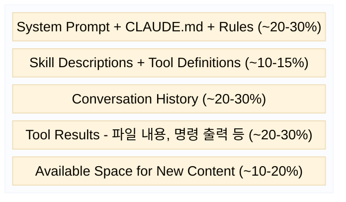

#### 외부 저장소 및 시스템 연동

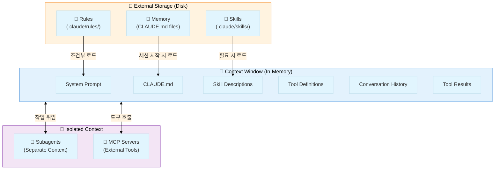

#### 데이터 흐름

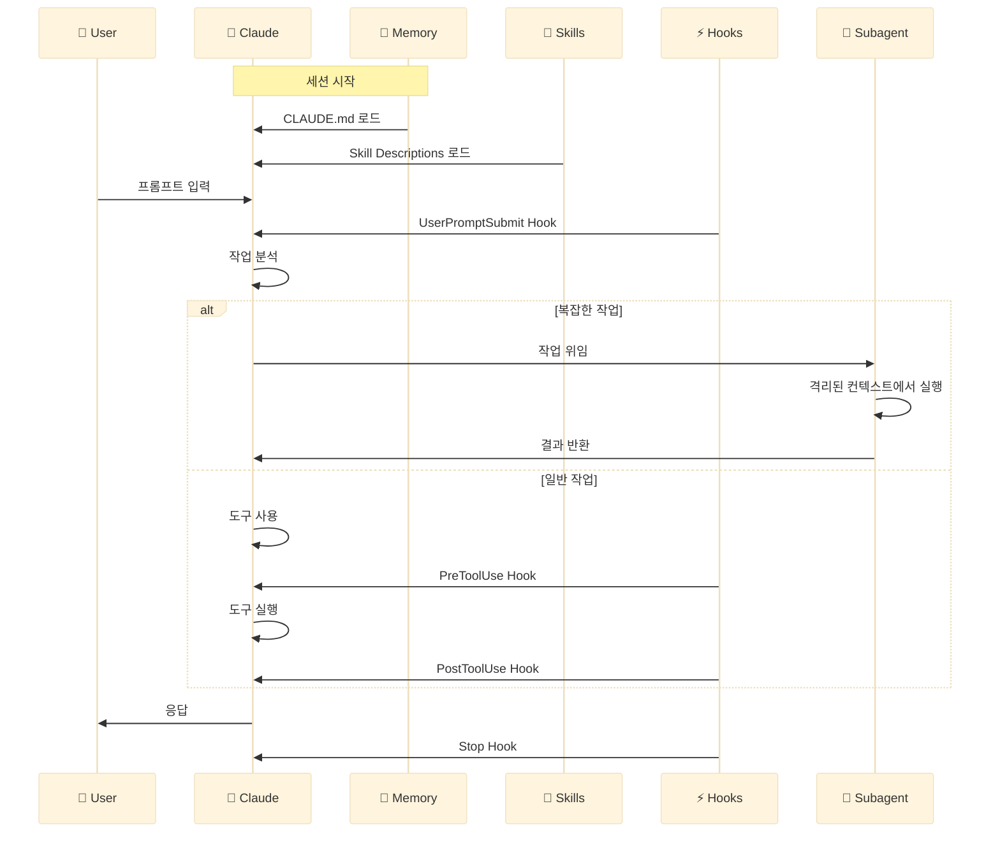

---

## 3. Claude Code의 Context Engineering 시스템

### 3.1 시스템 개요

Claude Code는 4가지 핵심 시스템으로 Context Engineering을 구현합니다:

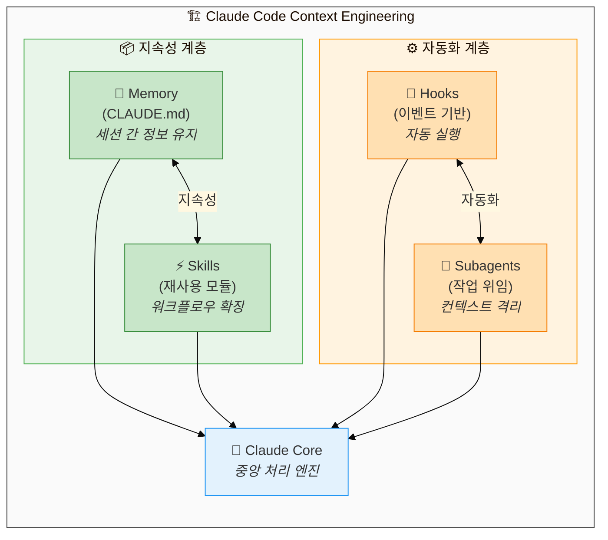

#### 시스템 상호작용 상세

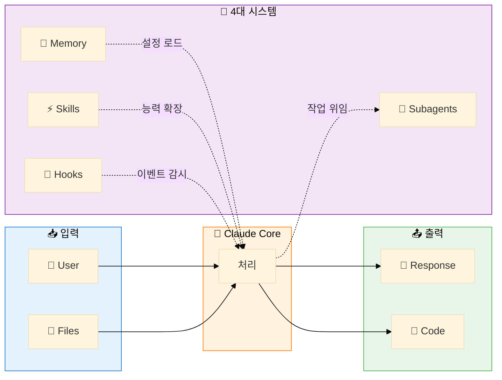

### 3.2 각 시스템의 역할

| 시스템 | 핵심 기능 | 사용 시점 |
|--------|----------|-----------|
| **Memory** | 세션 간 정보 유지 | 모든 세션 시작 시 자동 로드 |
| **Skills** | 재사용 가능한 워크플로우 | 특정 작업 수행 시 |
| **Hooks** | 이벤트 기반 자동화 | 도구 사용 전/후 |
| **Subagents** | 작업 위임 및 격리 | 복잡한 작업 분할 시 |

---

## 4. Memory 시스템 (CLAUDE.md)

### 4.1 메모리 계층 구조

Claude Code는 **4단계 계층적 메모리 시스템**을 제공합니다:

| 우선순위 | 메모리 타입 | 파일 위치 | 용도 | 공유 범위 |
|:--------:|------------|----------|------|----------|
| 1️⃣ 최고 | **Managed Policy** | `/Library/Application Support/ClaudeCode/CLAUDE.md` (macOS)<br>`/etc/claude-code/CLAUDE.md` (Linux)<br>`C:\Program Files\ClaudeCode\CLAUDE.md` (Windows) | 회사 코딩 표준, 보안 정책, 컴플라이언스 | 🏢 조직 전체 |
| 2️⃣ | **User Memory** | `~/.claude/CLAUDE.md` | 개인 코드 스타일, 도구 단축키, 선호 설정 | 👤 개인 (모든 프로젝트) |
| 3️⃣ | **Project Memory** | `./CLAUDE.md` 또는<br>`./.claude/CLAUDE.md` | 프로젝트 아키텍처, 코딩 규칙, 워크플로우 | 👥 팀 (Git으로 공유) |
| 4️⃣ 최저 | **Project Local** | `./CLAUDE.local.md` | 샌드박스 URL, 개인 테스트 데이터 | 👤 개인 (현재 프로젝트만) |

> **우선순위 규칙**: 숫자가 낮을수록 우선순위가 높습니다. 동일한 설정이 여러 파일에 있으면 우선순위가 높은 파일의 설정이 적용됩니다.

#### 플랫폼별 Managed Policy 경로

| 플랫폼 | 경로 |
|--------|------|
| macOS | `/Library/Application Support/ClaudeCode/CLAUDE.md` |
| Linux | `/etc/claude-code/CLAUDE.md` |
| Windows | `C:\Program Files\ClaudeCode\CLAUDE.md` |

#### 주요 특징

| 특징 | 설명 |
|------|------|
| **자동 로드** | 모든 메모리 파일은 세션 시작 시 자동으로 로드됨 |
| **Git 제외** | `CLAUDE.local.md`는 자동으로 `.gitignore`에 추가됨 |
| **재귀 탐색** | 현재 디렉토리에서 루트까지 모든 CLAUDE.md 파일 탐색 |
| **하위 발견** | 작업 중인 파일의 하위 디렉토리 CLAUDE.md도 자동 로드 |

### 4.2 재귀적 메모리 탐색

Claude Code는 현재 디렉토리에서 루트까지 **재귀적으로** CLAUDE.md 파일을 탐색합니다:

```
/project/foo/bar/  ← 현재 위치
├── CLAUDE.md      ← 로드됨 (우선순위 3)
/project/foo/
├── CLAUDE.md      ← 로드됨 (우선순위 2)
/project/
├── CLAUDE.md      ← 로드됨 (우선순위 1)
```

### 4.3 Import 시스템

외부 파일을 `@path/to/import` 구문으로 참조할 수 있습니다:

```markdown
# CLAUDE.md 예시

## 프로젝트 개요
See @README for project overview.
See @package.json for available npm commands.

## 팀 멤버별 개인 설정 (버전 관리 제외)
- @~/.claude/my-project-instructions.md

## Git 워크플로우 문서 참조
- git workflow @docs/git-instructions.md
```

**Import 규칙:**
- 상대/절대 경로 모두 지원
- 최대 5단계 재귀 Import
- 코드 블록 내 `@` 문자는 Import로 해석되지 않음
- `/memory` 명령으로 로드된 메모리 파일 확인 가능

### 4.4 Modular Rules 시스템

`.claude/rules/` 디렉토리를 사용한 모듈식 규칙 관리:

```
.claude/rules/
├── code-style.md       # 코드 스타일 가이드라인
├── testing.md          # 테스트 규칙
├── security.md         # 보안 요구사항
├── frontend/
│   ├── react.md        # React 규칙
│   └── styles.md       # 스타일 규칙
└── backend/
    ├── api.md          # API 규칙
    └── database.md     # DB 규칙
```

### 4.5 경로별 조건부 규칙

YAML 프론트매터를 사용하여 특정 파일에만 적용되는 규칙 정의:

```yaml
---
paths:
  - "src/api/**/*.ts"
  - "lib/**/*.ts"
---

# API 개발 규칙
- 모든 API 엔드포인트에 입력 검증 필수
- 표준 오류 응답 형식 사용
- OpenAPI 문서 주석 포함
```

**Glob 패턴 지원:**

| 패턴 | 매칭 대상 |
|------|----------|
| `**/*.ts` | 모든 디렉토리의 TypeScript 파일 |
| `src/**/*` | src 디렉토리 하위 모든 파일 |
| `*.md` | 프로젝트 루트의 Markdown 파일 |
| `src/**/*.{ts,tsx}` | src 하위의 .ts 및 .tsx 파일 |

### 4.6 CLAUDE.md 작성 모범 사례

| 원칙 | 좋은 예 | 나쁜 예 |
|------|---------|---------|
| **구체적** | "2-space 들여쓰기 사용" | "코드를 올바르게 포맷" |
| **최소화** | 세션 공통 지시만 포함 | 모든 가능한 지시 포함 |
| **구조화** | 마크다운 헤딩으로 그룹화 | 평문 나열 |
| **정기 검토** | 프로젝트 변경 시 업데이트 | 초기 작성 후 방치 |

**예시:**

```markdown
# 좋은 CLAUDE.md 예시

## 프로젝트 개요
- React + TypeScript 기반 대시보드
- 패키지 매니저: pnpm

## 빌드 명령어
- `pnpm dev`: 개발 서버
- `pnpm build`: 프로덕션 빌드
- `pnpm test`: 테스트 실행

## 코딩 규칙
- 2-space 들여쓰기
- 함수형 컴포넌트만 사용
- 타입 추론 가능 시 명시적 타입 생략

## 금지 사항
- console.log 커밋 금지
- any 타입 사용 금지
```

---

## 5. Skills 시스템

### 5.1 Skills 개요

Skills는 Claude의 능력을 확장하는 **재사용 가능한 지시 모듈**입니다.

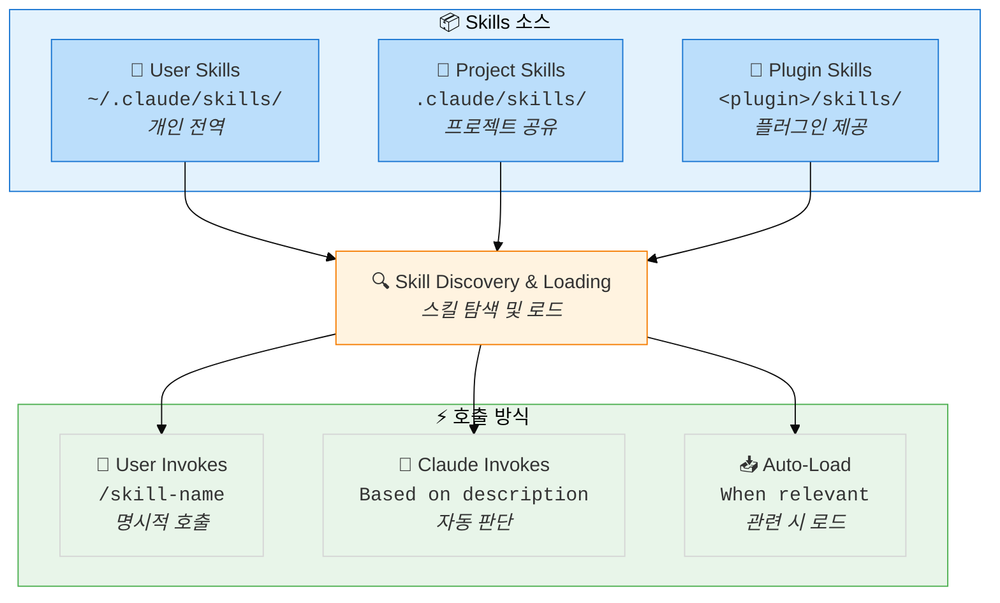

#### Skills 우선순위

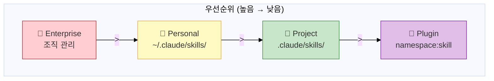

#### Skills 로딩 흐름

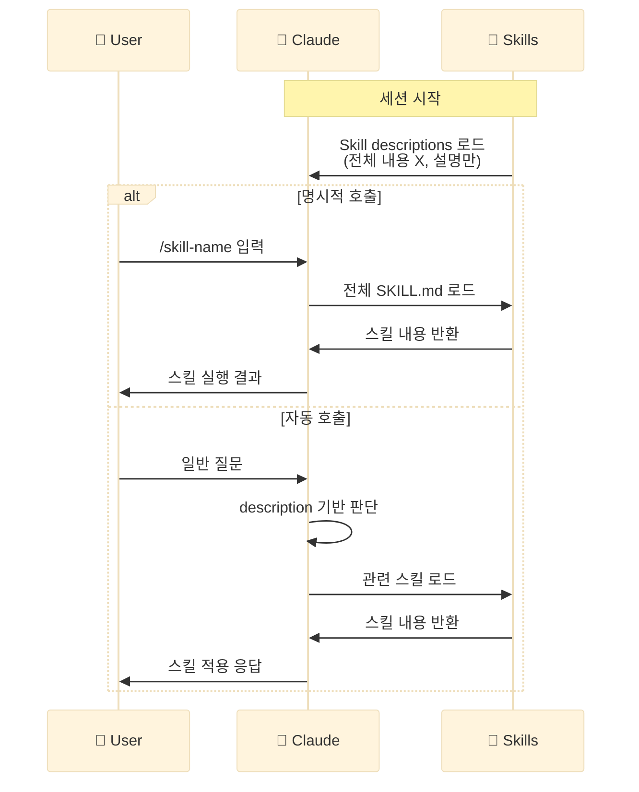

### 5.2 Skill 파일 구조

```
my-skill/
├── SKILL.md           # 메인 지시 (필수)
├── template.md        # Claude가 채울 템플릿
├── examples/
│   └── sample.md      # 예상 출력 예시
└── scripts/
    └── validate.sh    # Claude가 실행할 스크립트
```

### 5.3 SKILL.md 구조

```yaml
---
name: explain-code
description: 시각적 다이어그램과 비유로 코드 설명. "이게 어떻게 작동해?" 질문 시 사용
disable-model-invocation: false
user-invocable: true
allowed-tools: Read, Grep, Glob
model: sonnet
context: fork
agent: Explore
---

코드를 설명할 때 항상 포함:

1. **비유로 시작**: 일상생활에 비유
2. **다이어그램 그리기**: ASCII 아트로 흐름/구조 표시
3. **코드 워크스루**: 단계별 설명
4. **함정 강조**: 흔한 실수나 오해 지적
```

### 5.4 Skill 프론트매터 필드

| 필드 | 필수 | 설명 |
|------|:----:|------|
| `name` | 아니오 | 스킬 이름 (기본: 디렉토리명) |
| `description` | **권장** | 언제 이 스킬을 사용할지 |
| `argument-hint` | 아니오 | 자동완성 힌트 (예: `[issue-number]`) |
| `disable-model-invocation` | 아니오 | `true`: 사용자만 호출 가능 |
| `user-invocable` | 아니오 | `false`: Claude만 호출 가능 |
| `allowed-tools` | 아니오 | 허용 도구 제한 |
| `model` | 아니오 | 사용할 모델 (sonnet, opus, haiku) |
| `context` | 아니오 | `fork`: 격리된 서브에이전트에서 실행 |
| `agent` | 아니오 | `context: fork` 시 에이전트 타입 |
| `hooks` | 아니오 | 스킬 라이프사이클 훅 |

### 5.5 호출 제어 매트릭스

| 설정 | 사용자 호출 | Claude 호출 | 컨텍스트 로딩 |
|------|:-----------:|:-----------:|:-------------:|
| (기본값) | ✅ | ✅ | description만 |
| `disable-model-invocation: true` | ✅ | ❌ | 로드 안 됨 |
| `user-invocable: false` | ❌ | ✅ | description만 |

### 5.6 동적 컨텍스트 주입

`` !`command` `` 구문으로 쉘 명령 출력을 스킬에 주입:

```yaml
---
name: pr-summary
description: PR 변경사항 요약
context: fork
agent: Explore
---

## Pull Request 컨텍스트
- PR diff: !`gh pr diff`
- PR 코멘트: !`gh pr view --comments`
- 변경 파일: !`gh pr diff --name-only`

## 태스크
이 PR을 요약해주세요...
```

**실행 순서:**
1. 각 `` !`command` ``가 먼저 실행됨
2. 출력이 placeholder를 대체
3. Claude는 완성된 프롬프트만 받음

---

## 6. Hooks 시스템

### 6.1 Hook 라이프사이클

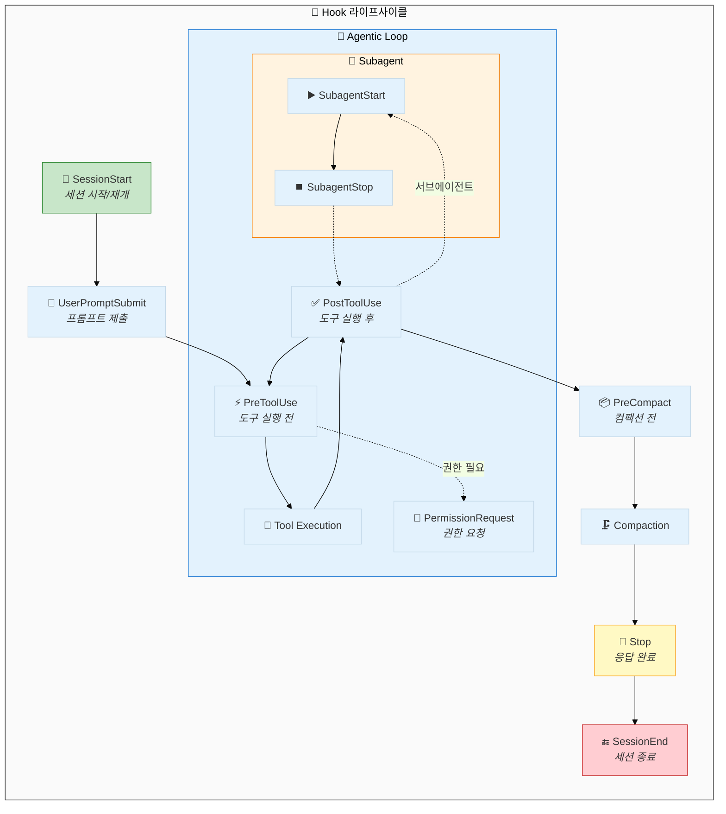

#### Hook 이벤트 흐름 상세

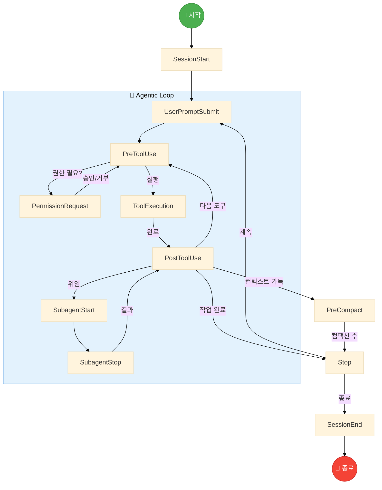

#### Hook 타입별 분류

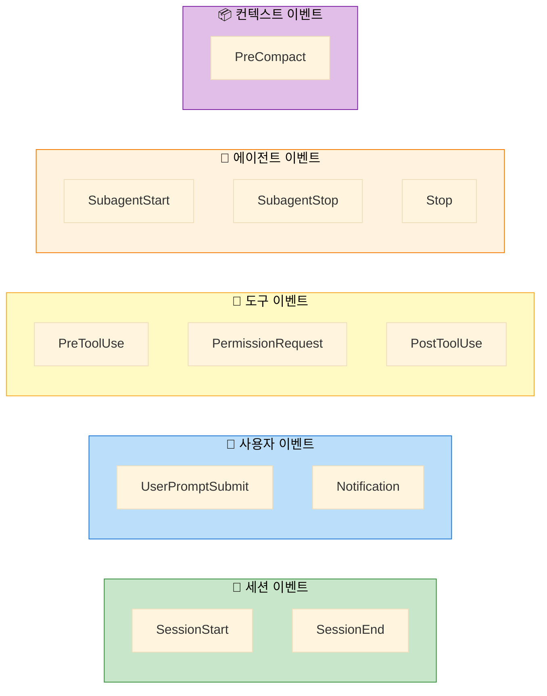

### 6.2 Hook 이벤트 상세

| Hook | 발생 시점 | Matcher | 주요 용도 |
|------|----------|---------|----------|
| `SessionStart` | 세션 시작/재개 | startup, resume, clear, compact | 환경 설정, 컨텍스트 로드 |
| `UserPromptSubmit` | 사용자 프롬프트 제출 | - | 프롬프트 검증, 컨텍스트 추가 |
| `PreToolUse` | 도구 실행 전 | 도구명 (Bash, Write 등) | 명령 검증, 승인/거부 |
| `PermissionRequest` | 권한 대화상자 표시 | 도구명 | 자동 승인/거부 |
| `PostToolUse` | 도구 실행 성공 후 | 도구명 | 린팅, 포맷팅, 검증 |
| `Stop` | Claude 응답 완료 | - | 완료 확인, 계속 강제 |
| `SubagentStart` | 서브에이전트 시작 | 에이전트명 | 모니터링, 설정 |
| `SubagentStop` | 서브에이전트 완료 | 에이전트명 | 결과 검증 |
| `Notification` | 알림 발생 | permission_prompt, idle_prompt | 외부 알림 연동 |
| `PreCompact` | 컴팩션 전 | manual, auto | 중요 정보 보존 |
| `SessionEnd` | 세션 종료 | - | 정리, 로깅 |

### 6.3 Hook 설정 예시

```json
{
  "hooks": {
    "PreToolUse": [
      {
        "matcher": "Bash",
        "hooks": [
          {
            "type": "command",
            "command": "$CLAUDE_PROJECT_DIR/.claude/hooks/validate-bash.sh",
            "timeout": 30
          }
        ]
      }
    ],
    "PostToolUse": [
      {
        "matcher": "Write|Edit",
        "hooks": [
          {
            "type": "command",
            "command": "npm run lint --fix"
          }
        ]
      }
    ],
    "Stop": [
      {
        "hooks": [
          {
            "type": "prompt",
            "prompt": "모든 작업이 완료되었는지 확인. 미완료 시 {\"ok\": false, \"reason\": \"이유\"} 반환"
          }
        ]
      }
    ]
  }
}
```

### 6.4 PreToolUse 결정 제어

PreToolUse hooks는 도구 실행을 **허용/거부/수정**할 수 있습니다:

```json
{
  "hookSpecificOutput": {
    "hookEventName": "PreToolUse",
    "permissionDecision": "allow",
    "permissionDecisionReason": "자동 승인된 안전한 작업",
    "updatedInput": {
      "command": "npm run lint"
    },
    "additionalContext": "현재 환경: production"
  }
}
```

**Exit Code 동작:**

| Exit Code | 동작 |
|-----------|------|
| **0** | 성공, stdout이 컨텍스트에 추가될 수 있음 |
| **2** | 블로킹 에러, stderr이 Claude에게 피드백 |
| **기타** | 비-블로킹 에러, 실행 계속 |

### 6.5 Prompt-Based Hooks

LLM을 사용한 지능적 결정 (Stop, SubagentStop에서 유용):

```json
{
  "hooks": {
    "Stop": [
      {
        "hooks": [
          {
            "type": "prompt",
            "prompt": "대화를 분석하고 모든 작업 완료 여부 확인. 완료: {\"ok\": true}, 계속 필요: {\"ok\": false, \"reason\": \"이유\"}",
            "timeout": 30
          }
        ]
      }
    ]
  }
}
```

---

## 7. Subagents 시스템

### 7.1 Subagents 개요

Subagents는 특화된 작업을 위해 **격리된 컨텍스트에서 실행되는 AI 어시스턴트**입니다.

### 7.2 내장 Subagents

| Agent | 모델 | 도구 | 용도 |
|-------|------|------|------|
| **Explore** | Haiku (빠름) | 읽기 전용 | 코드베이스 탐색, 검색 |
| **Plan** | 상속 | 읽기 전용 | 계획 모드에서 리서치 |
| **general-purpose** | 상속 | 모든 도구 | 복잡한 멀티스텝 작업 |
| **Bash** | 상속 | Bash | 터미널 명령 실행 |

### 7.3 커스텀 Subagent 생성

**위치별 우선순위:**

| 우선순위 | 위치 | 범위 |
|:--------:|------|------|
| 1 | `--agents` CLI 플래그 | 현재 세션만 |
| 2 | `.claude/agents/` | 현재 프로젝트 |
| 3 | `~/.claude/agents/` | 모든 프로젝트 |
| 4 | Plugin `agents/` | 플러그인 활성화 시 |

### 7.4 Subagent 정의 예시

```yaml
---
name: code-reviewer
description: 코드 품질과 모범 사례 검토. 코드 변경 후 자동 사용 권장.
tools: Read, Grep, Glob, Bash
disallowedTools: Write, Edit
model: sonnet
permissionMode: default
skills:
  - api-conventions
  - error-handling-patterns
hooks:
  PreToolUse:
    - matcher: "Bash"
      hooks:
        - type: command
          command: "./scripts/validate-readonly.sh"
---

당신은 시니어 코드 리뷰어입니다. 코드 품질과 보안에 집중하세요.

호출 시:
1. git diff로 최근 변경 확인
2. 수정된 파일에 집중
3. 즉시 리뷰 시작

리뷰 체크리스트:
- 코드 명확성 및 가독성
- 함수/변수 이름 적절성
- 중복 코드 여부
- 적절한 에러 처리
- 보안 취약점 (노출된 시크릿, API 키)
- 입력 검증
- 테스트 커버리지
- 성능 고려사항
```

### 7.5 Permission Modes

| 모드 | 동작 |
|------|------|
| `default` | 표준 권한 확인 |
| `acceptEdits` | 파일 편집 자동 승인 |
| `dontAsk` | 권한 프롬프트 자동 거부 |
| `bypassPermissions` | 모든 권한 체크 스킵 ⚠️ |
| `plan` | 읽기 전용 탐색 모드 |

### 7.6 실행 모드

| 모드 | 동작 | 권한 | MCP |
|------|------|------|-----|
| **Foreground** | 완료까지 블로킹 | 대화형 | ✅ |
| **Background** | 병렬 실행 | 상속된 것만 | ❌ |

---

## 8. Context 관리 전략

### 8.1 Context Window 이해

```
┌─────────────────────────────────────────────────────────────────────┐
│               200,000 토큰 Context Window                            │
├─────────────────────────────────────────────────────────────────────┤
│                                                                     │
│   System Prompt (~50 개별 지시)     ████████  ~15%                  │
│   CLAUDE.md + Rules                 ████      ~5-10%                │
│   Skill Descriptions                ██        ~3%                   │
│   MCP Tool Definitions              ██████    ~10%                  │
│   ─────────────────────────────────────────────────────             │
│   Conversation History              ████████████████████            │
│   Tool Results                      ████████████████                │
│   File Contents                     ██████████████                  │
│                                                                     │
│   [Available Space]                 ██████████  ~30-40%             │
│                                                                     │
└─────────────────────────────────────────────────────────────────────┘
```

**토큰 소비 현실:**
- 각 도구 호출: 1,000 ~ 10,000 토큰
- 약 50회 도구 호출 후 컨텍스트 포화
- **마지막 20% 구간에서 성능 저하** 발생
- 토큰 증가는 **O(N²)** (선형이 아님)

### 8.2 Context 최적화 명령어

| 명령 | 용도 | 권장 시점 |
|------|------|-----------|
| `/compact` | 대화 요약 후 재시작 | 70% 사용 시 |
| `/clear` | 컨텍스트 완전 초기화 | 작업 전환 시 |
| `/context` | MCP 서버별 컨텍스트 사용량 확인 | 정기적 |

**Auto-compaction**: 95% 도달 시 자동 실행 (수동 70%가 더 효과적)

### 8.3 컨텍스트 효율화 패턴

| 패턴 | 설명 | 효과 |
|------|------|------|
| **Subagent 위임** | 고-출력 작업을 서브에이전트로 격리 | 메인 컨텍스트 보존 |
| **CLAUDE.md 활용** | 반복 지시를 메모리 파일로 | 프롬프트 토큰 절약 |
| **MCP Tool Search** | 필요한 도구만 동적 로드 | 도구 정의 토큰 절약 |
| **Skill 분리** | 태스크별 스킬로 모듈화 | 관련 컨텍스트만 로드 |
| **경로별 Rules** | 파일 타입별 조건부 규칙 | 불필요한 규칙 제외 |

---

## 9. 현재 이슈 및 한계점

### 9.1 Memory 시스템 이슈 (GitHub 이슈 기반)

| 이슈 번호 | 제목 | 심각도 | 상태 |
|----------|------|--------|------|
| #19471 | CLAUDE.md 지시가 컨텍스트 컴팩션 후 완전히 무시됨 | 높음 | Open |
| #17616 | CLAUDE.md 지시를 계속 위반함 | 높음 | Open |
| #17530 | Claude가 CLAUDE.md를 읽지 않음 | 높음 | Open |
| #19635 | 인정 후에도 CLAUDE.md 규칙을 반복적으로 무시 | 중간 | Open |
| #16527 | 프로젝트 메모리 지시를 간헐적으로 따르지 않음 | 중간 | Open |
| #14626 | 컨텍스트 컴팩션 후 CLAUDE.md 자동 읽기 요청 | 기능요청 | Open |
| #20172 | 메모리 로딩에서 파일 제외 설정 추가 | 기능요청 | Open |

**핵심 문제:** CLAUDE.md 지시가 컴팩션 후 무시되는 현상이 가장 심각한 이슈입니다.

### 9.2 Skills/Hooks 시스템 이슈

| 이슈 번호 | 제목 | 심각도 | 상태 |
|----------|------|--------|------|
| #19225 | Skills의 Stop hooks가 실행되지 않음 | 높음 | Open |
| #17688 | 플러그인 내 SKILL.md 프론트매터에 정의된 스킬 범위 훅이 트리거되지 않음 | 높음 | Open |
| #17564 | 스킬 범위 훅이 스킬 리소스에 접근 불가 - CLAUDE_SKILL_ROOT 누락 | 높음 | Open |
| #20576 | Skills 로딩 안 됨: 관리 스킬 디렉토리의 ENOENT 에러 | 중간 | Open |
| #9716 | Claude Code 어시스턴트가 .claude/skills/ 디렉토리의 사용 가능한 스킬을 인식하지 못함 | 중간 | Open |
| #20125 | CLAUDE.md 지시를 따르지 않아 skills/hooks 시스템이 쓸모없게 됨 | 높음 | Open |

### 9.3 Subagents 시스템 이슈

| 이슈 번호 | 제목 | 심각도 | 상태 |
|----------|------|--------|------|
| #18784 | Claude가 서브에이전트 선택 시 에이전트 프론트매터 제약을 무시 | 높음 | Open |
| #18749 | Task 서브에이전트가 에이전트 정의의 tools 필드에도 불구하고 Bash 도구에 접근 불가 | 높음 | Open |
| #20190 | 서브에이전트 출력 잘림 | 중간 | Open |
| #16594 | 빌트인 서브에이전트가 하드코딩된 모델 이름 사용 | 중간 | Open |
| #17007 | 서브에이전트가 작동 중단됨 | 중간 | Open |

### 9.4 Context Compaction 이슈

| 이슈 번호 | 제목 | 심각도 | 상태 |
|----------|------|--------|------|
| #19567 | Context 컴팩션 중 Claude Code가 무한정 멈춤 | 높음 | Open |
| #20466 | 대화 컴팩션 후 스킬 호출이 다시 실행됨 | 중간 | Open |
| #20370 | `/compact [instructions]` 인수가 컴팩션 후 인스턴스에 보여 중복 실행 발생 가능 | 중간 | Open |
| #18264 | autoCompact: false 무시됨 - ~78%에서 컴팩션 트리거 | 중간 | Open |
| #14462 | Resume 플래그가 수동 컴팩션 후 컴팩션 전 상태로 되돌아감 | 중간 | Open |

### 9.5 전체 이슈 요약

```
┌─────────────────────────────────────────────────────────────────────┐
│                    Context Engineering 이슈 현황                      │
├─────────────────────────────────────────────────────────────────────┤
│                                                                     │
│   Memory 시스템                                                      │
│   ├── CLAUDE.md 무시 문제 ─────────────── 🔴 Critical               │
│   ├── 컴팩션 후 메모리 손실 ──────────── 🔴 Critical               │
│   └── Import 문법 불일치 ─────────────── 🟡 Minor                   │
│                                                                     │
│   Skills 시스템                                                      │
│   ├── Stop hooks 미실행 ──────────────── 🔴 Critical               │
│   ├── 플러그인 내 훅 미작동 ─────────── 🔴 Critical               │
│   └── 스킬 인식 실패 ─────────────────── 🟡 Moderate               │
│                                                                     │
│   Subagents 시스템                                                   │
│   ├── 프론트매터 제약 무시 ──────────── 🔴 Critical               │
│   ├── 도구 접근 불가 ─────────────────── 🔴 Critical               │
│   └── 출력 잘림 ──────────────────────── 🟡 Moderate               │
│                                                                     │
│   Compaction                                                        │
│   ├── 무한 멈춤 ──────────────────────── 🔴 Critical               │
│   ├── 스킬 중복 실행 ────────────────── 🟡 Moderate               │
│   └── autoCompact 설정 무시 ─────────── 🟡 Moderate               │
│                                                                     │
└─────────────────────────────────────────────────────────────────────┘
```

### 9.6 권장 대응 전략

| 이슈 유형 | 권장 대응 |
|----------|----------|
| CLAUDE.md 무시 | 중요 지시는 프롬프트에서 명시적 반복 |
| 컴팩션 문제 | 70% 도달 전 수동 `/compact` 사용 |
| 스킬 훅 미작동 | settings.json에서 전역 훅으로 정의 |
| 서브에이전트 제약 무시 | 도구 제한보다 프롬프트에서 행동 제약 명시 |

---

## 10. 실습 및 응용

### 10.1 기본 실습: CLAUDE.md 설정

**목표:** 프로젝트에 맞는 CLAUDE.md 작성

```markdown
# CLAUDE.md

## 프로젝트 정보
- 프로젝트명: Todo App
- 기술 스택: React, TypeScript, Tailwind CSS
- 패키지 매니저: npm

## 개발 명령어
- `npm run dev`: 개발 서버 실행
- `npm run build`: 프로덕션 빌드
- `npm run test`: 테스트 실행
- `npm run lint`: 린트 검사

## 코딩 규칙
- 함수형 컴포넌트만 사용
- Props는 TypeScript interface로 정의
- 스타일은 Tailwind CSS 클래스 사용
- 컴포넌트 파일은 PascalCase

## 금지 사항
- any 타입 사용 금지
- console.log 커밋 금지
- 인라인 스타일 사용 금지
```

### 10.2 중급 실습: Custom Skill 생성

**목표:** 코드 리뷰 스킬 만들기

```
mkdir -p ~/.claude/skills/code-review
```

**~/.claude/skills/code-review/SKILL.md:**

```yaml
---
name: code-review
description: 코드 변경사항을 리뷰하고 개선점을 제안합니다. 코드 작성 후 사용하세요.
allowed-tools: Read, Grep, Glob, Bash
model: sonnet
---

# 코드 리뷰 가이드

## 리뷰 시작
1. `git diff` 또는 `git diff --staged`로 변경사항 확인
2. 변경된 파일들을 순서대로 리뷰

## 체크리스트
- [ ] 코드 가독성
- [ ] 함수/변수 명명 규칙
- [ ] 에러 처리
- [ ] 타입 안전성
- [ ] 테스트 커버리지
- [ ] 성능 고려사항
- [ ] 보안 취약점

## 출력 형식
각 파일에 대해:
1. **파일명**: 경로
2. **요약**: 변경 내용 한 줄 요약
3. **이슈**: 발견된 문제점
4. **제안**: 개선 방안
```

### 10.3 고급 실습: Hooks와 Subagent 연동

**목표:** 파일 저장 시 자동 린트 및 포맷팅

**.claude/settings.json:**

```json
{
  "hooks": {
    "PostToolUse": [
      {
        "matcher": "Write|Edit",
        "hooks": [
          {
            "type": "command",
            "command": "$CLAUDE_PROJECT_DIR/scripts/auto-format.sh",
            "timeout": 30
          }
        ]
      }
    ]
  }
}
```

**scripts/auto-format.sh:**

```bash
#!/bin/bash

# 입력 JSON에서 파일 경로 추출
INPUT=$(cat)
FILE_PATH=$(echo "$INPUT" | jq -r '.tool_input.file_path // empty')

if [ -z "$FILE_PATH" ]; then
  exit 0
fi

# 확장자 확인
EXT="${FILE_PATH##*.}"

case "$EXT" in
  ts|tsx|js|jsx)
    npx prettier --write "$FILE_PATH" 2>/dev/null
    npx eslint --fix "$FILE_PATH" 2>/dev/null
    ;;
  py)
    black "$FILE_PATH" 2>/dev/null
    ;;
  md)
    npx prettier --write "$FILE_PATH" 2>/dev/null
    ;;
esac

exit 0
```

### 10.4 시나리오별 구성 권장사항

| 시나리오 | CLAUDE.md | Skills | Hooks | Subagents |
|----------|:---------:|:------:|:-----:|:---------:|
| 간단한 개인 프로젝트 | 최소화 | - | - | - |
| 팀 프로젝트 | 필수 + Rules | 공통 태스크 | 린팅 | - |
| 복잡한 모노레포 | 계층적 | 패키지별 | 검증 | 탐색용 |
| 엔터프라이즈 | Managed + Project | 표준화 | 보안 | 역할별 |

---

## 참고 자료

### 공식 문서
- [Memory (CLAUDE.md)](https://code.claude.com/docs/en/memory)
- [Skills](https://code.claude.com/docs/en/skills)
- [Hooks Reference](https://code.claude.com/docs/en/hooks)
- [Subagents](https://code.claude.com/docs/en/sub-agents)

### GitHub
- [anthropics/claude-code](https://github.com/anthropics/claude-code)
- [Issues](https://github.com/anthropics/claude-code/issues)

---

*이 강연 자료는 2026년 1월 25일 기준 공개된 정보를 바탕으로 작성되었습니다.*
