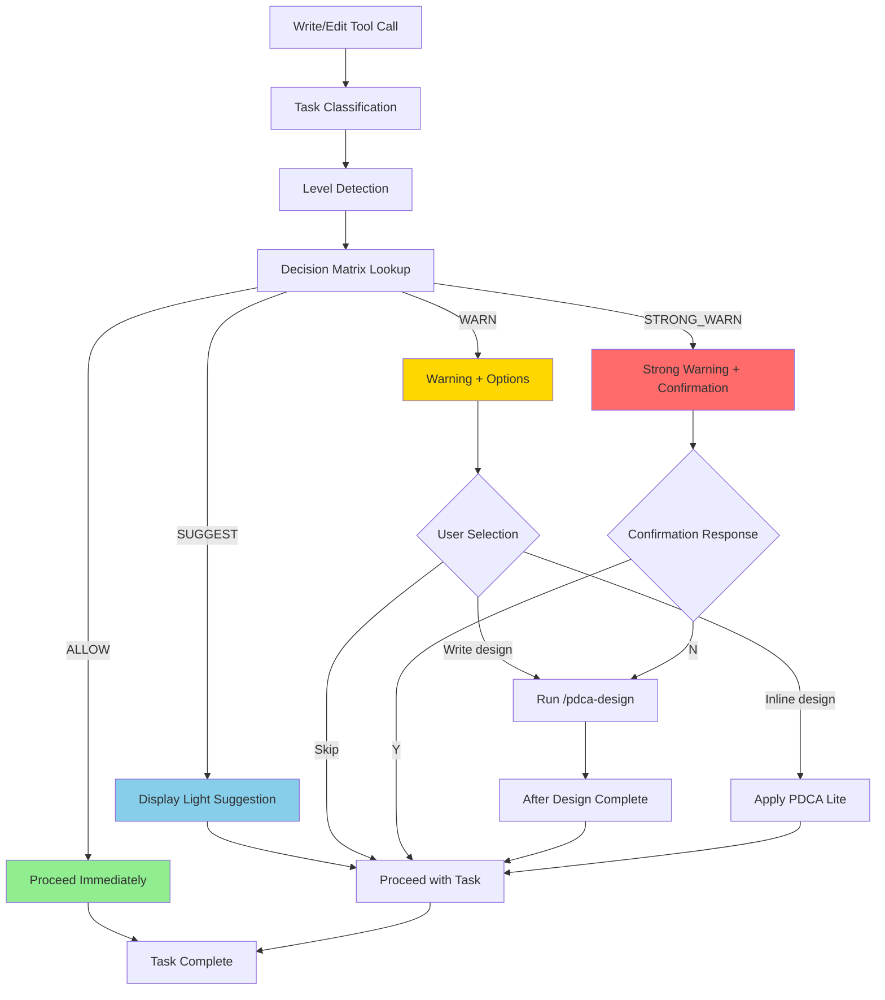

# Adaptive PDCA Guidance Design Document

> **Status**: Draft
> **Author**: Claude (with user collaboration)
> **Date**: 2026-01-15
> **Plan Reference**: `docs/01-plan/features/pdca-enforcement-improvement.plan.md` Section 2.2, 2.4
> **Related Design**: `task-classification.design.md` (Task Classification System)
> **Branch**: feature/improve-onboarding-and-pdca-enforcement

---

## 1. Overview

### 1.1 Purpose

**Differentiate** PDCA recommendation strength based on **project level** and **task classification**.
Provide educational guidance for Starter projects and strong recommendations for Enterprise projects.

### 1.2 Scope

- Define PDCA modes by level (Educational, Recommended, Strongly Recommended)
- Implement Decision Matrix in PreToolUse Hook
- PDCA Lite mode (Lightweight PDCA for Minor Changes)

### 1.3 Terminology

| Term | Description |
|------|-------------|
| **Starter Level** | Beginner projects like static websites, portfolios |
| **Dynamic Level** | BaaS fullstack applications |
| **Enterprise Level** | Large-scale systems based on microservices, K8s |
| **PDCA Lite** | Lightweight PDCA in 3-line summary format for Minor Changes |
| **Decision Matrix** | PDCA application table based on Level × Classification combinations |

### 1.4 Technical Constraints

> ⚠️ Claude Code's PreToolUse hook **cannot actually block** tool execution.
> `permissionDecision: "deny"`, Exit code 2, `approve: false` are all ignored.
>
> Therefore, only **"Guidance"** is possible, not "Enforcement".
>
> 📚 Source: Plan document Section 1.3 Technical Constraints

---

## 2. Current State Analysis

### 2.1 Current Problems

```
Current: Same PDCA applied to all project levels
Result:
  - Starter users: Excessive PDCA creates learning barrier
  - Enterprise users: Loose PDCA creates quality risks
  - Uniform experience that doesn't match the level
```

### 2.2 Current Level Detection System

bkit already has a level detection system in place:

```markdown
# .claude/instructions/level-detection.md (existing)

| Detection Criteria | Level |
|--------------------|-------|
| Only index.html exists | Starter |
| Next.js + .mcp.json | Dynamic |
| services/ + infra/ | Enterprise |
```

---

## 3. Design Goals

### 3.1 Functional Requirements

1. **Level Detection**: Automatically determine level from project structure
2. **Decision Matrix**: Determine PDCA strength by Level × Classification combination
3. **PDCA Lite**: Provide lightweight PDCA suitable for Minor Changes
4. **User Confirmation**: Request user approval on STRONG_WARN

### 3.2 Non-functional Requirements

1. **Transparency**: Explicitly show applied PDCA strength to user
2. **Consistency**: Always provide the same guidance under same conditions
3. **Flexibility**: User can adjust strength

---

## 4. Detailed Design

### 4.1 Decision Matrix (Core)

Determine PDCA guidance strength by combining level and task classification.

```
┌─────────────────────────────────────────────────────────────────┐
│                    PDCA Guidance Decision Matrix                 │
├─────────────────────────────────────────────────────────────────┤
│                                                                 │
│          │ Quick Fix │ Minor Change │ Feature │ Major Feature │
│ ─────────┼───────────┼──────────────┼─────────┼───────────────│
│ Starter  │  ALLOW    │    ALLOW     │ SUGGEST │    SUGGEST    │
│ Dynamic  │  ALLOW    │    ALLOW     │  WARN   │  STRONG_WARN  │
│ Enterprise│ ALLOW    │    WARN      │STRONG_W │  STRONG_WARN  │
│                                                                 │
└─────────────────────────────────────────────────────────────────┘
```

### 4.2 Guidance Strength Definitions

| Strength | Description | Action |
|----------|-------------|--------|
| **ALLOW** | Proceed immediately | Perform task without mentioning PDCA |
| **SUGGEST** | Design suggestion | Light suggestion like "Design document would be helpful" |
| **WARN** | Recommended warning | Display warning message, can proceed |
| **STRONG_WARN** | Strongly recommended | Detailed warning + request user confirmation before proceeding |

### 4.3 PDCA Modes by Level

| Level | Mode | Description |
|-------|------|-------------|
| **Starter** | Educational | PDCA concept education, no enforcement, learning priority |
| **Dynamic** | Recommended | PDCA recommended for Feature level and above, skippable |
| **Enterprise** | Strongly Recommended | Recommended from Minor, strongly recommended for Feature and above |

---

## 5. PDCA Lite Mode Design (Section 2.4)

### 5.1 Purpose

Full PDCA process is excessive for Minor Change level tasks.
Record and proceed quickly with **3-line summary** format lightweight PDCA.

### 5.2 PDCA Lite Format

```
📝 PDCA Lite
━━━━━━━━━━━━━━━━━━━━━━━━━━━━━━━━━━
• What: [Change target]
• Why: [Change reason]
• How: [Change method]
━━━━━━━━━━━━━━━━━━━━━━━━━━━━━━━━━━
Proceed? [Y/N]
```

### 5.3 PDCA Lite Application Example

```
User: "Change the login button color"

[Classification]: Minor Change
[Level]: Dynamic
[PDCA]: Lite (ALLOW → Apply Lite)

📝 PDCA Lite
━━━━━━━━━━━━━━━━━━━━━━━━━━━━━━━━━━
• What: Login button color
• Why: Design update request
• How: Change button.primary background-color
━━━━━━━━━━━━━━━━━━━━━━━━━━━━━━━━━━

Proceeding now.
```

### 5.4 PDCA Lite Recording Location

PDCA Lite content is recorded in the `quick_changes` array of `docs/.pdca-status.json`.
(Reference pdca-status-tracking.design.md)

```json
{
  "quick_changes": [
    {
      "date": "2026-01-15",
      "desc": "Login button color change",
      "type": "minor",
      "what": "Login button color",
      "why": "Design update request",
      "how": "Change button.primary background-color"
    }
  ]
}
```

---

## 6. Implementation Design

### 6.1 PreToolUse Hook Improvement Plan

**hooks/hooks.json** and **.claude/settings.json** PreToolUse hooks:

```json
{
  "PreToolUse": [
    {
      "matcher": "Write|Edit",
      "hooks": [
        {
          "type": "prompt",
          "prompt": "## Adaptive PDCA Guidance Check

### Step 1: Task Classification (Reference: task-classification skill)
Classification: [Quick Fix | Minor Change | Feature | Major Feature]

### Step 2: Project Level Detection
- Only index.html exists → Starter
- Next.js + .mcp.json → Dynamic
- services/ + infra/ folders → Enterprise

Level: [Starter | Dynamic | Enterprise]

### Step 3: Apply Decision Matrix

| Level      | Quick Fix | Minor | Feature | Major   |
|------------|-----------|-------|---------|---------|
| Starter    | ALLOW     | ALLOW | SUGGEST | SUGGEST |
| Dynamic    | ALLOW     | ALLOW | WARN    | STRONG  |
| Enterprise | ALLOW     | WARN  | STRONG  | STRONG  |

### Step 4: Apply Guidance

**ALLOW**: Proceed immediately, no mention
**SUGGEST**: Light suggestion \"Design document would be helpful\"
**WARN**:
  - Display warning: \"⚠️ Design document recommended\"
  - Suggest design document check/creation
  - Can proceed after user selection

**STRONG_WARN**:
  - Detailed warning: \"⛔ Design document strongly recommended\"
  - Check docs/02-design/
  - Strongly recommend running /bkit:pdca-design if missing
  - Confirmation required: \"Proceed without design?\"

### If Minor Change: Apply PDCA Lite
Display 3-line summary in 📝 PDCA Lite format

### Response Format
{
  \"classification\": \"...\",
  \"level\": \"...\",
  \"guidance\": \"allow|suggest|warn|strong_warn\",
  \"pdca_lite\": {\"what\": \"...\", \"why\": \"...\", \"how\": \"...\"},
  \"decision\": \"approve\",
  \"reason\": \"...\"
}",
          "timeout": 15000
        }
      ]
    }
  ]
}
```

### 6.2 Level Auto-Detection Logic

```
┌─────────────────────────────────────────────────────────────────┐
│                    Project Level Auto-Detection                  │
├─────────────────────────────────────────────────────────────────┤
│                                                                 │
│  Step 1: Check Files/Folders                                    │
│  ┌─────────────────────────────────────────────┐               │
│  │ Does services/ or infra/ folder exist?      │               │
│  │ Does kubernetes/ or terraform/ folder exist?│               │
│  └─────────────────────────────────────────────┘               │
│          ↓ Yes                    ↓ No                         │
│     Enterprise              ┌─────────────────────────┐        │
│                            │ Does package.json exist? │        │
│                            │ Does .mcp.json exist?    │        │
│                            └─────────────────────────┘        │
│                                 ↓ Yes         ↓ No            │
│                              Dynamic     ┌───────────┐         │
│                                          │ index.html│         │
│                                          │ exists?   │         │
│                                          └───────────┘         │
│                                           ↓ Yes    ↓ No       │
│                                         Starter   Unknown      │
│                                                                 │
└─────────────────────────────────────────────────────────────────┘
```

### 6.3 Guidance Message Templates

#### SUGGEST Message
```
💡 This task is classified as [Feature].
Design document would help proceed more systematically.

Proceed?
```

#### WARN Message
```
⚠️ PDCA Recommended

This task is classified as [Feature], and design document is recommended for Dynamic level.

📋 Recommended procedure:
1. Write design document with /bkit:pdca-design [feature-name]
2. Or proceed after inline design summary

[1] Write design document (Recommended)
[2] Proceed after inline design
[3] Proceed without design
```

#### STRONG_WARN Message
```
⛔ PDCA Strongly Recommended

This task is classified as [Major Feature], and design document is essentially recommended for Enterprise level.

📋 Required procedure:
1. Write plan document with /bkit:pdca-plan [feature-name]
2. Write design document with /bkit:pdca-design [feature-name]
3. Proceed with implementation after design is complete

⚠️ Proceeding without design may break architecture consistency.

Are you sure you want to proceed without design? [Y/N]
```

---

## 7. Flow Diagram



---

## 8. Expected Behavior Examples

### 8.1 Starter + Feature (SUGGEST)

```
User: "Add a projects section to my portfolio"

[Classification]: Feature (Adding new section)
[Level]: Starter (index.html based)
[Decision]: SUGGEST

💡 This task is classified as a new feature addition (Feature).
Design document would help proceed more systematically.

Adding the projects section now.
```

### 8.2 Dynamic + Feature (WARN)

```
User: "Create a payment feature"

[Classification]: Feature
[Level]: Dynamic (Next.js + .mcp.json)
[Decision]: WARN

⚠️ PDCA Recommended

This task is classified as a new feature addition (Feature).

📋 Recommended procedure:
1. Write design document with /bkit:pdca-design payment
2. Or proceed after inline design summary

What would you like to do?
[1] Write design document (Recommended)
[2] Proceed after inline design
[3] Proceed without design
```

### 8.3 Enterprise + Major Feature (STRONG_WARN)

```
User: "Redesign inter-microservice communication"

[Classification]: Major Feature (Architecture change)
[Level]: Enterprise (services/ + infra/)
[Decision]: STRONG_WARN

⛔ PDCA Strongly Recommended

This task is classified as an architecture change (Major Feature).

📋 Required procedure:
1. Write plan with /bkit:pdca-plan service-communication
2. Write design with /bkit:pdca-design service-communication

⚠️ Proceeding without design may break inter-microservice consistency.

Are you sure you want to proceed without design?
```

---

## 9. Changed Files List

### 9.1 Modified Files

| File | Change Content |
|------|----------------|
| `hooks/hooks.json` | Add Decision Matrix logic to PreToolUse hook |
| `.claude/settings.json` | Update PreToolUse hook |

### 9.2 Related Files

| File | Relationship |
|------|--------------|
| `skills/task-classification/SKILL.md` | Reference task classification criteria |
| `.claude/instructions/level-detection.md` | Reference level detection criteria |
| `docs/.pdca-status.json` | Store PDCA Lite records |

---

## 10. Test Plan

### 10.1 Test Matrix

| Level | Classification | Expected Guidance | Test Input |
|-------|----------------|-------------------|------------|
| Starter | Quick Fix | ALLOW | "Fix the typo" |
| Starter | Feature | SUGGEST | "Add a new section" |
| Dynamic | Minor | ALLOW | "Change the button color" |
| Dynamic | Feature | WARN | "Create a payment feature" |
| Dynamic | Major | STRONG_WARN | "Redesign the auth" |
| Enterprise | Minor | WARN | "Change the log format" |
| Enterprise | Feature | STRONG_WARN | "Add a new service" |
| Enterprise | Major | STRONG_WARN | "Architecture migration" |

### 10.2 Level Detection Tests

| Project Structure | Expected Level |
|-------------------|----------------|
| Only index.html | Starter |
| package.json + src/ | Dynamic |
| package.json + .mcp.json | Dynamic |
| services/ + infra/ | Enterprise |
| kubernetes/ + terraform/ | Enterprise |

---

## 11. Implementation Checklist

- [ ] Update `hooks/hooks.json` PreToolUse hook
- [ ] Update `.claude/settings.json` PreToolUse hook
- [ ] Implement PDCA Lite format message template
- [ ] Test Decision Matrix logic
- [ ] Test level detection logic
- [ ] Validate entire test matrix
- [ ] Validate with `./scripts/validate-plugin.sh`

---

## 12. Next Steps

1. Approve this design document
2. Implement together with `task-classification.design.md`
3. Reference `pdca-status-tracking.design.md` to integrate PDCA Lite recording
4. Perform testing
5. Create PR

---

> This document is a Design phase deliverable of the bkit PDCA workflow.
