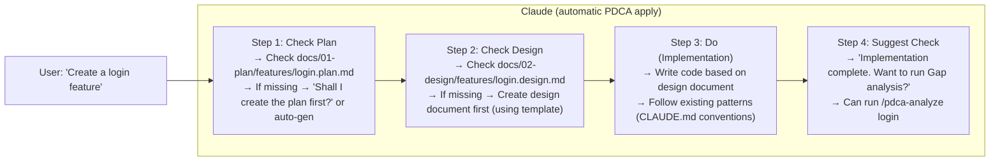
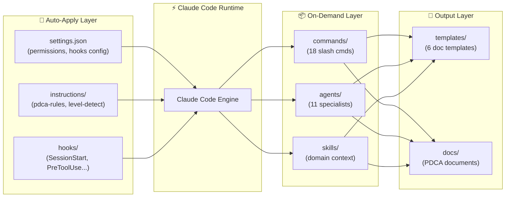
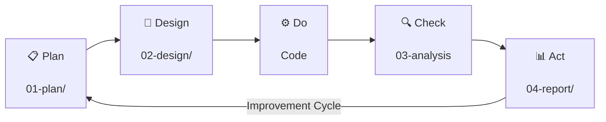
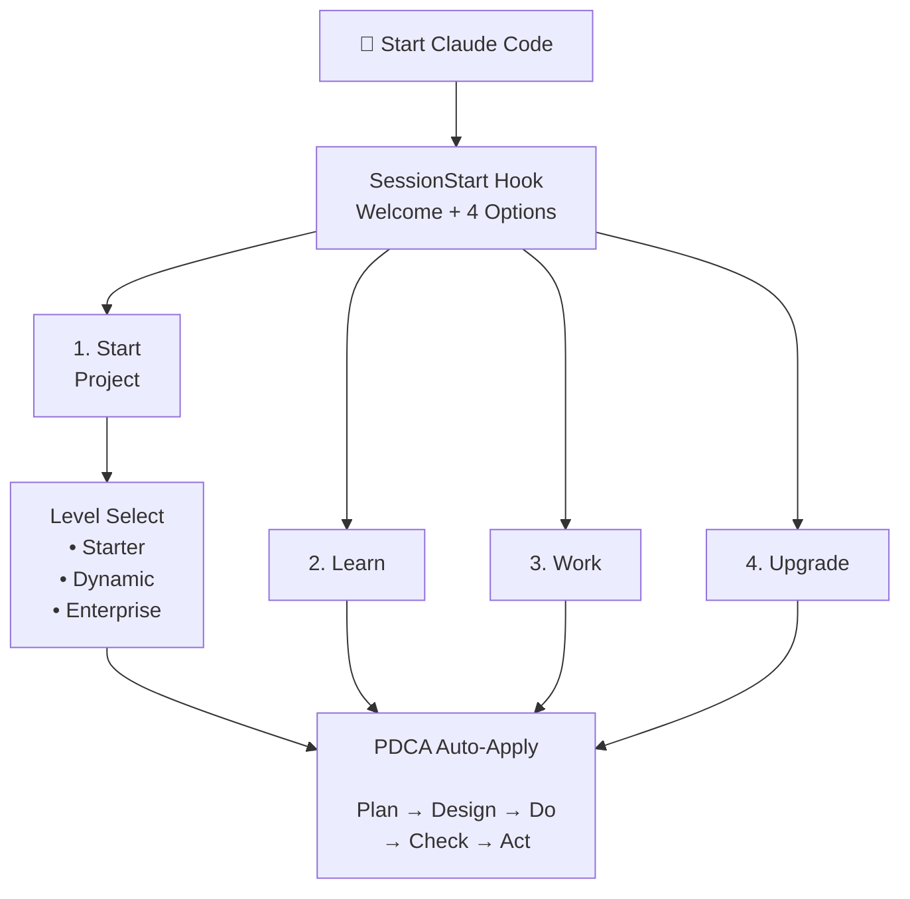

# bkit Vibecoding Kit - Complete Analysis

> Analysis of the complete user journey when users copy the `.claude` folder to their codebase.

---

## 📌 Core Summary: What bkit Aims to Achieve

```
┌─────────────────────────────────────────────────────────────────────────┐
│                         bkit's Core Mission                              │
├─────────────────────────────────────────────────────────────────────────┤
│                                                                         │
│   "Enable all developers using Claude Code to naturally adopt           │
│    'document-driven development' and 'continuous improvement'           │
│    even without knowing commands or PDCA methodology"                   │
│                                                                         │
│   In essence: AI guides humans toward good development practices        │
│                                                                         │
└─────────────────────────────────────────────────────────────────────────┘
```

### Three Core Philosophies

| Philosophy | Description |
|------------|-------------|
| **1. Automation First** | Claude automatically applies PDCA even if user doesn't know commands |
| **2. No Guessing** | If unsure, check docs → If not in docs, ask user (never guess) |
| **3. Docs = Code** | Design first, implement later (maintain design-implementation sync) |

---

## 🎬 User Experience Scenarios

### Stage 1: Session Start - Welcome

When user starts Claude Code, the **SessionStart Hook** automatically executes:

```
┌─────────────────────────────────────────────────────────────────────────┐
│  🎉 bkit Vibecoding Kit Session Start                                   │
│                                                                         │
│  What kind of help do you need?                                         │
│                                                                         │
│  1️⃣ Start a project - New project initial setup                        │
│  2️⃣ Learn Claude Code - Learn how to use it                            │
│  3️⃣ Start working - Already configured                                 │
│  4️⃣ Upgrade settings - Improve existing settings                       │
│                                                                         │
│  ⚠️ Claude is not perfect. Always verify important decisions.           │
└─────────────────────────────────────────────────────────────────────────┘
```

**Paths based on selection:**

| Selection | Next Question | Command Executed |
|-----------|---------------|------------------|
| 1. Start project | Level question (Starter/Dynamic/Enterprise) | `/init-starter`, `/init-dynamic`, `/init-enterprise` |
| 2. Learn | Experience level question | `/learn-claude-code` |
| 3. Start working | - | PDCA auto-apply mode |
| 4. Upgrade | - | `/upgrade-claude-code` |

---

### Stage 2: Automatic Level Detection

Claude analyzes the project and **automatically detects the level**.

```
Detection Order:
1. Check if level is specified in CLAUDE.md
2. File structure-based detection
```

| Level | Detection Conditions | Target Users |
|-------|---------------------|--------------|
| 🟢 **Starter** | Only index.html, simple structure | Beginners, static web |
| 🟡 **Dynamic** | Next.js + .mcp.json, BaaS integration | Intermediate, fullstack apps |
| 🔴 **Enterprise** | services/ + infra/ folders, K8s | Advanced, MSA architecture |

**Level-specific Claude behavior changes:**

| Aspect | Starter | Dynamic | Enterprise |
|--------|---------|---------|------------|
| Explanation style | Friendly, easy terms | Technical but clear | Expert terms, concise |
| Code comments | Detailed (for beginners) | Core logic only | Architecture decisions only |
| PDCA documents | Simplified | Feature-specific designs | Detailed architecture |

---

### Stage 3: Work Request - PDCA Auto-Apply

When user says "Create a login feature":



**Key Hook behaviors:**

| Hook | Trigger | Action |
|------|---------|--------|
| PreToolUse (Write) | Before file write | "Did you check the design document?" reminder |
| PostToolUse (git commit) | After commit | "Need to update PDCA status?" notice |
| Stop | On task completion | Design-implementation alignment, tests, docs checklist |

---

### Stage 4: 18 Commands for Workflow Automation

Users can use slash commands as needed.

#### Learning & Setup (4)

| Command | Function |
|---------|----------|
| `/learn-claude-code` | 4-stage learning curriculum (15min~1hour) |
| `/setup-claude-code` | Project analysis → auto-generate settings |
| `/upgrade-claude-code` | Analyze latest trends, improve settings |
| `/upgrade-level` | Starter → Dynamic → Enterprise upgrade |

#### Level Initialization (3)

| Command | Target |
|---------|--------|
| `/init-starter` | Static web (HTML/CSS/JS) |
| `/init-dynamic` | BaaS fullstack (Next.js + bkend.ai) |
| `/init-enterprise` | MSA (Microservices + K8s) |

#### PDCA Workflow (7)

| Command | Function |
|---------|----------|
| `/pdca-status` | Current PDCA progress dashboard |
| `/pdca-plan [feature]` | Write plan document |
| `/pdca-design [feature]` | Write design document |
| `/pdca-iterate [feature]` | Auto-fix with Evaluator-Optimizer pattern |
| `/pdca-analyze [feature]` | Gap analysis (design vs implementation) |
| `/pdca-report` | Generate report |
| `/pdca-next` | Suggest next action |

#### Pipeline Management (3)

| Command | Function |
|---------|----------|
| `/pipeline-start` | Start full development pipeline |
| `/pipeline-status` | Check pipeline status |
| `/pipeline-next` | Next pipeline stage |

#### Others (1)

| Command | Function |
|---------|----------|
| `/zero-script-qa` | QA without scripts |

---

### Stage 5: 11 Specialized Agents

Complex tasks are handled by specialized sub-agents.

| Agent | Role | Invocation Timing |
|-------|------|-------------------|
| `gap-detector` | Design-implementation diff analysis | On `/pdca-analyze` |
| `pdca-iterator` | Evaluator-Optimizer auto-iteration | On `/pdca-iterate` |
| `code-analyzer` | Code quality analysis | On refactoring requests |
| `design-validator` | Design document validation | On design completion |
| `report-generator` | Auto-generate reports | On `/pdca-report` |
| `bkend-expert` | bkend.ai specialist | Dynamic level BaaS work |
| `infra-architect` | Infrastructure design expert | Enterprise level infra work |
| `starter-guide` | Beginner guide | Starter level questions |
| `pipeline-guide` | Pipeline guidance | Pipeline-related work |
| `qa-monitor` | QA monitoring | QA work |
| `enterprise-expert` | CTO-level strategic advisor | Enterprise architecture decisions |

---

### Stage 6: Document Templates for Consistency

6 templates ensure consistency across all PDCA documents.

| Template | Purpose | Included Sections |
|----------|---------|-------------------|
| `plan.template.md` | Plan document | Goals, scope, success criteria, schedule |
| `design.template.md` | Design document | Architecture, data model, API spec, test plan |
| `analysis.template.md` | Analysis document | Match rate, missing/added/changed items, recommendations |
| `report.template.md` | Report document | Completed items, learnings, improvements |
| `_INDEX.template.md` | Folder index | Document list for that phase |
| `CLAUDE.template.md` | CLAUDE.md | Project info, conventions, commands |

---

## 💡 Value Users Gain

### Beginners (Starter Level)

```
Before: "I don't know where to start"
After:  4 options presented at session start → Natural beginning

Before: "Just write code, docs later..."
After:  Auto-generate simple plan/design docs → Habit formation

Before: "I keep making the same mistakes"
After:  Rules accumulate in CLAUDE.md → Cross-session learning
```

### Intermediate (Dynamic Level)

```
Before: "Setting up config files is tedious"
After:  /setup-claude-code → Auto-generation

Before: "Writing design docs is annoying"
After:  Templates + auto-generation → Design doc in 5 minutes

Before: "Code and docs don't match"
After:  /pdca-analyze → Auto gap analysis and sync suggestions
```

### Advanced (Enterprise Level)

```
Before: "Each team member uses Claude differently"
After:  Share .claude folder → Standardize entire team

Before: "Knowledge is volatile"
After:  PDCA docs + Git management → Permanent accumulation

Before: "Onboarding takes too long"
After:  /learn-claude-code → Systematic training (15min~1hour)
```

---

## 📊 Overall Architecture

### System Structure



### PDCA Workflow



### User Journey Flow



### Component Detailed Structure

```
.claude/
├── Core (Required)
│   ├── settings.json
│   └── settings.local.json
│
├── Rules (Auto-Apply)
│   └── instructions/
│       ├── pdca-rules.md
│       ├── level-detection.md
│       └── timeline-awareness.md
│
├── Automation
│   ├── hooks/
│   │   └── session-start.sh
│   │
│   └── commands/ (18)
│       ├── /learn-claude-code
│       ├── /setup-claude-code
│       ├── /pdca-*
│       └── /init-*
│
├── Specialists
│   ├── agents/ (11)
│   │   ├── gap-detector
│   │   ├── pdca-iterator
│   │   ├── code-analyzer
│   │   └── bkend-expert
│   │
│   └── skills/
│       ├── starter/
│       ├── dynamic/
│       └── enterprise/
│
└── Knowledge Base
    ├── docs/
    │   ├── mastery/ (8 guides)
    │   ├── pdca/ (methodology)
    │   └── levels/ (level guides)
    │
    └── templates/ (6)
        ├── plan.template.md
        ├── design.template.md
        └── analysis.template.md
```

---

## 🎯 Conclusion: Core Experience bkit Provides

1. **"Even Claude Code newbies work like experts"**
   - Friendly onboarding from session start
   - Level-specific customized guidance
   - Auto-apply even without knowing commands

2. **"Document-driven development becomes habit"**
   - Design first → Implement later
   - Consistent format with templates
   - Synchronization with Gap analysis

3. **"Knowledge transcends sessions"**
   - Rules accumulate in CLAUDE.md
   - History preserved in PDCA docs
   - Team-wide standardization possible

4. **"AI-led development culture"**
   - Timely reminders with Hooks
   - Specialized work delegated to Agents
   - Repetitive tasks automated with Commands
