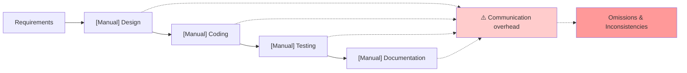
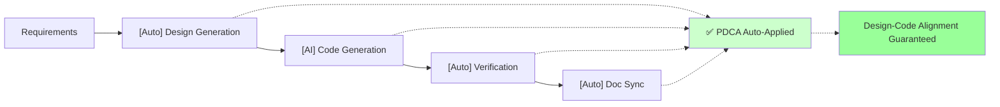
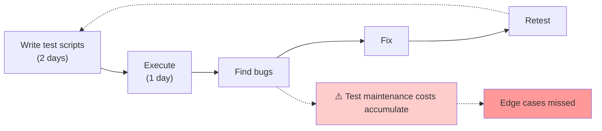
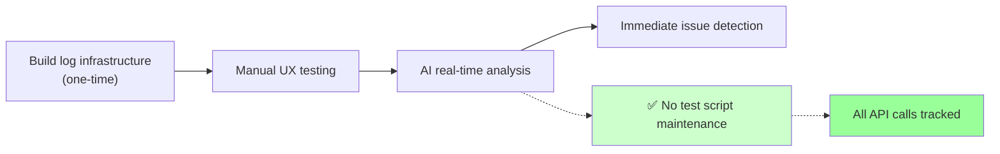

# Bkit Impact Analysis: AI-Native Development Transformation

> **Goal**: Analyze the impact of Bkit adoption through As-Is / To-Be comparison
> to demonstrate the business value of AI-Native development transformation for C-Level executives.

---

## 1. Executive Summary

### 1.1 What is Bkit?

```
Claude Code + PDCA Methodology + 9-Stage Pipeline + Zero Script QA
= AI-Native Development Framework
```

### 1.2 Key Adoption Benefits

| Metric | As-Is | To-Be | Improvement |
|--------|-------|-------|-------------|
| **Team Size** | 10 people | 4 people | 60% reduction |
| **Development Speed** | Baseline | 3x faster | 67% time savings |
| **Design-Implementation Alignment** | 50-70% | 95% | 30%+ improvement |
| **Annual Cost** | $1.1M | $410K | 63% savings |

---

## 2. Development Process Comparison

### 2.1 As-Is vs To-Be

| Aspect | As-Is (Traditional) | To-Be (With Bkit) |
|--------|---------------------|-------------------|
| **Methodology** | Waterfall or Agile (manual) | Automated PDCA cycle |
| **Documentation** | Code first, docs later (or skipped) | Design first → Code generation → Auto-sync |
| **Quality Verification** | Manual QA team testing | Zero Script QA (log-based auto-analysis) |
| **Knowledge Sharing** | In developers' heads / scattered docs | Single Source of Truth (CLAUDE.md) |
| **Onboarding** | 2-4 weeks (senior resource required) | Under 1 week (auto-referenced docs) |

### 2.2 Automated PDCA Cycle

#### Traditional Development Flow



#### Bkit Development Flow



---

## 3. Team Composition Comparison

### 3.1 Staffing Changes

| Role | As-Is (10-person baseline) | To-Be (Bkit) | Change |
|------|---------------------------|--------------|--------|
| **Project Manager** | 1 | 0.5 | PDCA auto-tracking |
| **Senior Developer** | 2 | 1 | AI guides architecture |
| **Junior Developer** | 4 | 2 | 3x productivity with AI |
| **QA Engineer** | 2 | 0.5 | Zero Script QA |
| **Technical Writer** | 1 | 0 | Auto-generated/synced docs |
| **Total** | **10** | **4** | **60% reduction** |

### 3.2 Role Transformation Details

| Role | As-Is | To-Be |
|------|-------|-------|
| **Senior Developer** | Direct coding + Junior reviews + Architecture design | AI verification + Direction setting + Quality standards (AI-Native conductor) |
| **Junior Developer** | Simple feature implementation, asks seniors questions | Can implement complex features through AI collaboration |
| **QA Engineer** | Write and execute manual test scripts | Monitor logs, discover edge cases |

---

## 4. Development Speed Comparison

### 4.1 Time Required by Feature Complexity

| Feature Size | As-Is | To-Be (Bkit) | Improvement |
|--------------|-------|--------------|-------------|
| Simple CRUD | 2-3 days | 2-4 hours | **80% faster** |
| Medium complexity | 1-2 weeks | 2-3 days | **70% faster** |
| Complex feature | 3-4 weeks | 1-2 weeks | **50% faster** |
| Full MVP | 3-6 months | 1-2 months | **60% faster** |

### 4.2 Speed Improvement Breakdown

```
1. Auto-generated boilerplate: -50% coding time
2. Design-code sync: -70% communication overhead
3. Zero Script QA: -80% QA time
4. Auto-documentation: -90% doc writing time
5. AI pair programming: -40% debugging time
```

---

## 5. Quality Comparison

### 5.1 Quality Metrics

| Quality Metric | As-Is | To-Be (Bkit) |
|----------------|-------|--------------|
| **Bug Discovery Timing** | Post-release | During development (log analysis) |
| **Design-Implementation Gap** | 30-50% | Under 5% (auto gap analysis) |
| **Code Consistency** | Varies by developer | Auto-applied conventions |
| **Security Vulnerabilities** | Found post-hoc | Pre-checked (Phase 7) |
| **Technical Debt** | Accumulates | Periodic analysis/resolution |

### 5.2 Zero Script QA Benefits

#### Traditional QA



#### Zero Script QA



---

## 6. Cost Comparison

### 6.1 Annual Cost (10-person project baseline)

| Item | As-Is | To-Be (Bkit) | Savings |
|------|-------|--------------|---------|
| **Personnel** | $900K (10 people) | $360K (4 people) | **$540K** |
| **Tools/Infrastructure** | $22K | $37K (+AI API) | -$15K |
| **Bug Fix Costs** | $75K | $15K | **$60K** |
| **Tech Debt Resolution** | $37K | $7.5K | **$30K** |
| **Annual Total** | **$1.1M** | **$410K** | **$700K savings** |

### 6.2 ROI Calculation

```
- Initial adoption cost: ~$37K (training + infrastructure setup)
- Annual savings: $700K
- ROI: 1,860% (first year)
```

---

## 7. Risk Comparison

### 7.1 Risk Matrix

| Risk | As-Is | To-Be (Bkit) |
|------|-------|--------------|
| **Key Personnel Departure** | Critical (knowledge loss) | Low (documented knowledge) |
| **Project Delays** | Frequent | Predictable (PDCA tracking) |
| **Quality Issues** | Found post-release | Found/resolved during dev |
| **AI Dependency** | None | Requires management (verification skills) |

### 7.2 AI Dependency Risk Mitigation

```
Bkit's AI-Native 3 Core Competencies Training:
1. Verification Ability: Don't blindly trust AI output, verify
2. Direction Setting: Guide AI with clear requirements
3. Quality Standards: Communicate what good code looks like to AI

→ AI becomes "a partner that quickly builds the right thing"
   not "a tool that quickly builds the wrong thing"
```

---

## 8. Phased Adoption Strategy

### 8.1 Phase 1: Pilot (1 month)

```
- Target: 1 new small-scale project
- Team: 2 people (1 senior + 1 junior)
- Goal: Validate Starter level
- Measure: Development speed, quality, satisfaction
```

### 8.2 Phase 2: Expansion (2-3 months)

```
- Target: Expand to medium-scale projects
- Team: Transition training for existing team
- Goal: Apply Dynamic level
- Measure: Team efficiency, cost savings
```

### 8.3 Phase 3: Standardization (3-6 months)

```
- Target: Organization-wide standardization
- Team: Apply to all development teams
- Goal: Include Enterprise level
- Measure: Organization-wide KPI improvement
```

---

## 9. Level-Based Application Scope

### 9.1 Levels by Project Type

| Level | Suitable Projects | Key Features |
|-------|-------------------|--------------|
| **Starter** | Landing pages, static web | HTML/CSS/JS + deployment automation |
| **Dynamic** | SaaS MVP, web apps | Next.js + BaaS(bkend.ai) fullstack |
| **Enterprise** | Large-scale services | MSA + Kubernetes + Terraform |

---

## 10. Key Message

```
┌─────────────────────────────────────────────────────────────────┐
│                                                                 │
│   "It's not about reducing developers,                         │
│    it's about letting developers focus on more valuable work"  │
│                                                                 │
│   • Repetitive tasks → AI handles                               │
│   • Creative design, business logic → Developers focus          │
│   • Documentation, QA → Automated                               │
│   • Direction setting, verification → Human's unique role       │
│                                                                 │
│   Result: Same team creates 3x more value                       │
│                                                                 │
└─────────────────────────────────────────────────────────────────┘
```

---

## 11. Immediate Action Items

| Step | Time Required | Content |
|------|---------------|---------|
| 1 | 30 minutes | Conduct Bkit demo session |
| 2 | 1 week | Select pilot project and form team |
| 3 | 1 month | First results measurement and report |

---

## Appendix A: PDCA Automation

| Phase | Automation Content |
|-------|-------------------|
| **Plan** | Requirements → Auto-generate plan document |
| **Design** | Plan → Auto-generate design document |
| **Do** | Generate code based on design |
| **Check** | Auto-analyze design-implementation gap |
| **Act** | Auto-generate completion report |

---

## Appendix B: 9-Stage Development Pipeline

```
Phase 1: Schema       → Data modeling
Phase 2: Convention   → Define coding conventions
Phase 3: Mockup       → UI/UX mockups
Phase 4: API          → API design and implementation
Phase 5: Design System → Build design system
Phase 6: UI           → UI component integration
Phase 7: SEO/Security → SEO and security checks
Phase 8: Review       → Code review
Phase 9: Deployment   → Production deployment
```

---

## Appendix C: Zero Script QA

```
Traditional Approach: Write test code → Execute → Check results → Maintain
Zero Script: Build log infrastructure → Manual UX testing → AI log analysis → Auto issue detection

Core Principles:
1. Log everything (including 200 OK)
2. Structured JSON logs
3. Track entire flow with Request ID
4. AI monitors real-time and documents issues
```

---

## Appendix D: AI-Native 3 Core Competencies

| Competency | Description | Without It |
|------------|-------------|------------|
| **Verification Ability** | Judge if output is correct | Produce plausibly wrong code |
| **Direction Setting** | Define what to build | AI generates guess-based results |
| **Quality Standards** | Present standards for good code | Inconsistent codebase |

---

## Appendix E: Agent System

| Agent | Role |
|-------|------|
| `starter-guide` | Friendly guidance for non-developers/beginners |
| `pipeline-guide` | Step-by-step Development Pipeline guidance |
| `bkend-expert` | bkend.ai BaaS specialist |
| `infra-architect` | AWS/K8s/Terraform infrastructure design |
| `code-analyzer` | Code quality, security, performance analysis |
| `design-validator` | Design document completeness validation |
| `gap-detector` | Design-implementation gap detection |
| `report-generator` | PDCA completion report generation |
| `qa-monitor` | Zero Script QA log monitoring |

---

## Conclusion

```
Bkit Adoption Impact Summary:

1. Personnel Efficiency: 10 → 4 people (60% reduction)
2. Development Speed: Average 60% time savings
3. Quality Improvement: Design-implementation gap under 5%
4. Cost Savings: $700K annually (10-person baseline)
5. Risk Reduction: Significant decrease in key personnel dependency

Key Success Factors:
- AI-Native 3 Core Competencies training first
- Phased adoption (Pilot → Expansion → Standardization)
- Establish document-driven development culture
```

---

> **Note**: Claude is not perfect. Always verify important decisions.

---

*Document Version: 1.0*
*Created: January 2026*
*Related Documents: 00-ARCHITECTURE.md, README.md*
