# bkit Feature Guide

> **bkit (Vibecoding Kit)**: A comprehensive plugin for AI-native development with Claude Code

## Summary: What bkit Does

```
┌─────────────────────────────────────────────────────────────────┐
│                                                                 │
│   You: "Create a login feature"                                 │
│                                                                 │
│   Without bkit:                                                 │
│   → Claude generates code immediately → Unknown design intent   │
│   → Uncertain quality                                           │
│                                                                 │
│   With bkit:                                                    │
│   → Claude automatically checks design documents                │
│   → If none exists, create design first → Otherwise, implement  │
│     based on design                                             │
│   → After completion, automatically suggests Gap analysis       │
│                                                                 │
│   ⭐ Key point: No need to memorize commands. Claude applies    │
│      them automatically                                         │
│                                                                 │
└─────────────────────────────────────────────────────────────────┘
```

---

## 🎯 Real Success Story: bkamp Project

```
┌─────────────────────────────────────────────────────────────────┐
│                         bkamp Project                           │
├─────────────────────────────────────────────────────────────────┤
│                                                                 │
│   📊 Scale: 13 microservices                                    │
│   ⏱️  Duration: 10 days                                         │
│   👤 Team: 1 person + Claude Code                               │
│                                                                 │
│   Secret:                                                       │
│   1. Maintained document-code sync with PDCA                    │
│   2. Provided sufficient context to AI with 9-phase pipeline    │
│   3. Quality verification without test code using Zero Script   │
│      QA                                                         │
│                                                                 │
│   "With documentation, Claude understood our intent precisely,  │
│    and the PDCA cycle caught missing parts immediately"         │
│                                                                 │
└─────────────────────────────────────────────────────────────────┘
```

---

## What is bkit?

bkit is a Claude Code plugin with the philosophy of **"Automation first, commands are shortcuts"**.

```
Traditional tools: "Memorize and execute these commands"
bkit:              "Just speak. Claude applies them automatically"
```

### How is this possible?

bkit automatically adjusts Claude's behavior through **Instructions** and **Hooks**:

```
Instructions (Always applied rules):
├── pdca-rules.md        → "Check design docs first on feature requests"
├── auto-trigger.md      → "Activate starter-guide when beginner is mentioned"
└── format-rules.md      → "Write documents in this format"

Hooks (Auto-executed at specific points):
├── SessionStart         → Environment check at session start
├── PreToolUse           → Validation before tool use
├── PostToolUse          → Auto-run formatting after Write/Edit
└── Stop                 → Guide to next step after task completion
```

**Result**: Claude automatically applies PDCA even if users don't know commands

### Core Values

| Value | Description |
|-------|-------------|
| **Automation First** | Claude applies PDCA automatically without knowing commands |
| **Level-based Support** | Appropriate guidance from beginners to enterprise |
| **PDCA Methodology** | Continuous quality improvement through document-code sync |
| **9-Phase Pipeline** | Development process guide for AI Native development |
| **Expert Agents** | Appropriate AI experts auto-activate based on context |
| **Zero Script QA** | Log-based quality verification without test code |

---

## Two Core Methodologies

The core of bkit is **PDCA Methodology** and **9-Phase Development Pipeline**. They serve different purposes.

### PDCA Methodology: Document-Code Sync Cycle

**Purpose**: Keep documents and code always in sync while continuously improving quality

```mermaid
flowchart LR
    subgraph PDCA["🔄 PDCA Iterative Cycle"]
        direction LR
        P["📝 Plan<br/>Write Documents"]
        D["💻 Do<br/>Develop Code"]
        C["🔍 Check<br/>Gap Analysis"]
        A["✨ Act<br/>Update Documents"]

        P -->|"Based on Design"| D
        D -->|"Implementation Complete"| C
        C -->|"Gaps Found"| A
        A -->|"Next Cycle"| P
    end

    style P fill:#e1f5fe,stroke:#01579b
    style D fill:#fff3e0,stroke:#e65100
    style C fill:#fce4ec,stroke:#880e4f
    style A fill:#e8f5e9,stroke:#1b5e20
```



> 💡 **By repeating this cycle, both document and code quality improve together**

**Why is it needed?**
- Verify if AI-generated code matches design intent
- Documents always reflect current state even as codebase grows
- Prevent "there's code but I don't know what it does"

**Scope**: All development work (new features, bug fixes, refactoring)

---

### 9-Phase Development Pipeline: AI Native Development Process

**Purpose**: Enable both non-developers and experienced developers to develop in a **new way of collaborating with AI**

#### Traditional vs AI Native Development

| Traditional Development | AI Native Development |
|------------------------|----------------------|
| Requirements → Coding → Testing → Deploy | Define Context → Collaborative Implementation with AI → Verification → Deploy |
| Relies on developer experience and intuition | Structured step-by-step in a form AI can understand |

#### Pipeline Flow


#### Phase Details

| Phase | Name | What It Does | Context AI Gets |
|:-----:|------|--------------|-----------------|
| 1 | **Schema** | Define terms, data structures | "User is an entity with these fields" |
| 2 | **Convention** | Define coding rules | "This project uses pnpm, TypeScript" |
| 3 | **Mockup** | UI prototype | "Screen layout looks like this" |
| 4 | **API** | Define backend contracts | "POST /users returns this response" |
| 5 | **Design System** | Reusable UI components | "Buttons use this style, forms this pattern" |
| 6 | **UI Integration** | FE-BE connection | "API calls use this client" |
| 7 | **SEO/Security** | Enhance quality attributes | "Meta tags, XSS prevention rules" |
| 8 | **Review** | Code quality verification | "Review checklist passed" |
| 9 | **Deployment** | Production release | "Vercel/K8s deployment config" |

**Why is it needed?**
- **Non-developers**: "What should I do first?" → Just follow the order
- **Developers**: Transform old habits (code first) to AI-optimized approach
- **Define necessary information step-by-step** so AI can understand context well

**Scope**: New project development (optional)

---

### PDCA vs Pipeline: When to Use What?

| Situation | PDCA | Pipeline |
|-----------|:----:|:--------:|
| Starting new project (first-time developer) | ✅ | ✅ |
| Starting new project (experienced) | ✅ | Optional |
| Adding features to existing project | ✅ | ❌ |
| Bug fix | ✅ | ❌ |
| Refactoring | ✅ | ❌ |

**Key Summary:**
- **PDCA**: Always applied to all work (document-code sync)
- **Pipeline**: Guide for "what order to develop" in new projects

```
┌─────────────────────────────────────────────────────────────────┐
│                      Relationship Diagram                       │
├─────────────────────────────────────────────────────────────────┤
│                                                                 │
│   Pipeline Phase 1 ──▶ Phase 2 ──▶ Phase 3 ──▶ ... ──▶ 9       │
│                │          │          │               │          │
│              [PDCA]     [PDCA]     [PDCA]         [PDCA]        │
│                                                                 │
│   Run PDCA cycle within each Phase to ensure quality            │
│                                                                 │
└─────────────────────────────────────────────────────────────────┘
```

---

## 💬 Real Conversation Examples: Auto PDCA Application

**You don't need to know commands.** When bkit is installed, Claude automatically applies PDCA.

### Example 1: New Feature Development Request

```
User: "Create a payment feature"

Claude (with bkit):
┌──────────────────────────────────────────────────────────────┐
│ 🔍 Checking design documents...                              │
│                                                              │
│ docs/02-design/payment.design.md file doesn't exist.         │
│                                                              │
│ Following PDCA principles, I'll create the design document   │
│ first. I need to confirm a few things about the payment      │
│ feature:                                                     │
│                                                              │
│ 1. What payment methods to support? (Card, Bank Transfer,    │
│    Mobile Payment)                                           │
│ 2. Is recurring payment needed?                              │
│ 3. What's the refund policy?                                 │
└──────────────────────────────────────────────────────────────┘
```

### Example 2: Auto Verification Suggestion After Implementation

```
User: (Code writing complete)

Claude (with bkit):
┌──────────────────────────────────────────────────────────────┐
│ ✅ Payment feature implementation is complete.               │
│                                                              │
│ 📋 Shall we proceed with the PDCA Check phase?               │
│                                                              │
│ By comparing design documents with implementation code:      │
│ - Verify implementation matches design                       │
│ - Check for missing features                                 │
│ - Identify implementations not in design                     │
│                                                              │
│ Would you like to run Gap analysis?                          │
└──────────────────────────────────────────────────────────────┘
```

### Example 3: Auto Level Switch When Beginner Detected

```
User: "I'm a beginner just starting to code, where should I begin?"

Claude (with bkit):
┌──────────────────────────────────────────────────────────────┐
│ 👋 Hello! starter-guide will help you.                       │
│                                                              │
│ First time with development! Don't worry.                    │
│ I'll explain everything step by step.                        │
│                                                              │
│ What would you like to create first?                         │
│ 1. Portfolio website                                         │
│ 2. Simple blog                                               │
│ 3. Landing page                                              │
│                                                              │
│ (I'll explain any technical terms as they come up!)          │
└──────────────────────────────────────────────────────────────┘
```

---

## Who Is This For?

### Starter Level (Beginners/Non-developers)

```
"I want to create a simple website with HTML and CSS"
"I'm just learning to code"
```

**What bkit provides:**
- `starter-guide` agent provides step-by-step guidance in simple terms
- Friendly explanations for all technical terms
- Guidance to prevent panic when errors occur

**Key commands:**
- `/init-starter` - Initialize static web project
- `/learn-claude-code` - Learn Claude Code usage

---

### Dynamic Level (Fullstack Developers)

```
"I'm building an app that needs login and database"
"I want to use BaaS like bkend.ai"
```

**What bkit provides:**
- `bkend-expert` agent supports authentication, API design
- PDCA cycle manages design-implementation sync
- 9-phase development pipeline guide

**Key commands:**
- `/init-dynamic` - Initialize BaaS fullstack project
- `/pdca-status` - Check current progress
- `/pdca-design` - Generate design document

---

### Enterprise Level (Architects/CTOs)

```
"I need to design a microservices architecture"
"I'm building infrastructure with Kubernetes and Terraform"
```

**What bkit provides:**
- `enterprise-expert` agent provides CTO-level strategic advice
- `infra-architect` agent supports infrastructure design
- Enterprise system building patterns in 10 days

**Key commands:**
- `/init-enterprise` - Initialize MSA project
- `/zero-script-qa` - Log-based quality verification

---

## Main Features: Slash Commands (Power User Shortcuts)

```
⭐ Important: You don't need to memorize commands!

- Just say "create a login feature" and Claude applies PDCA automatically
- Commands are shortcuts for when you want to "quickly" execute specific tasks
- Commands below are for reference. bkit works even if you don't know them
```

### Project Initialization

| Command | Description | Equivalent Natural Language |
|---------|-------------|----------------------------|
| `/init-starter` | Setup static web project | "I want to make a website with HTML" |
| `/init-dynamic` | Setup BaaS fullstack project | "Create an app with login feature" |
| `/init-enterprise` | Setup MSA + K8s project | "Build a microservices system" |

### PDCA Cycle Management (Auto-applied)

```
💡 These commands are suggested by Claude automatically at appropriate times.
   No need to memorize them, just follow Claude's suggestions.
```

| Command | Cycle Phase | Auto-trigger Condition |
|---------|:-----------:|------------------------|
| `/pdca-plan` | Plan | On new feature request → "Shall we write a plan first?" |
| `/pdca-design` | Plan | After plan approval → "Now shall we write detailed design?" |
| `/pdca-iterate` | Check | After gap analysis → "Shall we auto-fix issues?" (Evaluator-Optimizer pattern) |
| `/pdca-analyze` | Check | After implementation → "Shall we run Gap analysis?" |
| `/pdca-report` | Act | After analysis → "Shall we write completion report?" |
| `/pdca-status` | - | "Show me the progress" |
| `/pdca-next` | - | "What should I do next?" |

### Development Pipeline (AI Native Development Process)

```
"What should I do first?" → Follow the 9 phases in order for efficient AI collaboration
```

| Command | Description | Target |
|---------|-------------|--------|
| `/pipeline-start` | Start 9-phase pipeline | Non-developers, new projects |
| `/pipeline-status` | Check current Phase | Track progress |
| `/pipeline-next` | Guide to next Phase | After Phase completion |

**Why experienced developers also use the pipeline:**
- Telling AI "just create a login feature" → Poor quality due to lack of context
- Following pipeline order → AI understands schema, conventions, API specs first → High-quality results

### Quality Verification

| Command | Description | When to Use |
|---------|-------------|-------------|
| `/zero-script-qa` | Run log-based QA | Verify without test code |
| `/zero-script-qa setup` | Build logging infrastructure | Prepare QA environment |
| `/zero-script-qa monitor` | Real-time log monitoring | During manual testing |

### Learning and Setup

| Command | Description | When to Use |
|---------|-------------|-------------|
| `/learn-claude-code` | Learn Claude Code usage | Getting started |
| `/setup-claude-code` | Auto-generate project settings | New project setup |
| `/upgrade-claude-code` | Upgrade existing settings | When improvement needed |
| `/upgrade-level` | Upgrade project level | Starter → Dynamic, etc. |

---

## Expert Agents

bkit automatically activates appropriate expert agents based on context.

### Level-based Guide Agents

| Agent | Role | Auto-activation Condition |
|-------|------|---------------------------|
| `starter-guide` | Beginner-friendly guidance | When "beginner", "초보자" mentioned |
| `bkend-expert` | BaaS integration expert | When "bkend", "auth", "BaaS" mentioned |
| `enterprise-expert` | CTO-level strategic advice | When "enterprise", "strategy", "MSA" mentioned |

### Development Process Agents

| Agent | Role | Auto-activation Condition |
|-------|------|---------------------------|
| `pipeline-guide` | 9-phase pipeline guidance | When asking about development order |
| `design-validator` | Design document completeness check | After design document creation |
| `gap-detector` | Design-implementation gap analysis | When "analyze", "gap analysis" requested |

### Quality Management Agents

| Agent | Role | Auto-activation Condition |
|-------|------|---------------------------|
| `pdca-iterator` | Evaluator-Optimizer auto-iteration | When "iterate", "auto-fix", "반복 개선" requested |
| `qa-monitor` | Real-time Docker log analysis | When Zero Script QA runs |
| `code-analyzer` | Code quality/security analysis | When code review requested |
| `report-generator` | PDCA completion report generation | When feature completion reported |

### Infrastructure Agent

| Agent | Role | Auto-activation Condition |
|-------|------|---------------------------|
| `infra-architect` | AWS/K8s/Terraform design | When infrastructure-related questions |

---

## Skills (Expert Knowledge)

Skills are expert knowledge that Claude references. They auto-activate for related tasks.

### Core Methodologies

| Skill | Content | When Applied |
|-------|---------|--------------|
| `pdca-methodology` | Document-code sync cycle | All tasks |
| `evaluator-optimizer` | Anthropic's iteration pattern | Auto-fix cycles |
| `ai-native-development` | AI collaboration development | Strategy planning |
| `document-standards` | Documentation standards | Document writing |
| `zero-script-qa` | Log-based QA methodology | Quality verification |

### Development Pipeline (9 Phases) - AI Native Development Process

**Purpose**: Define information step-by-step so AI can fully understand context

| Phase | Skill | What It Defines | Context AI Gets |
|:-----:|-------|-----------------|-----------------|
| 1 | `phase-1-schema` | Terms, data structures | "In this project, User is..." |
| 2 | `phase-2-convention` | Coding rules | "This project uses pnpm..." |
| 3 | `phase-3-mockup` | UI prototype | "The screen looks like..." |
| 4 | `phase-4-api` | API contracts | "Endpoints are like..." |
| 5 | `phase-5-design-system` | UI components | "Buttons use this style..." |
| 6 | `phase-6-ui-integration` | FE-BE connection | "API calls are made like..." |
| 7 | `phase-7-seo-security` | Quality attributes | "Security rules are..." |
| 8 | `phase-8-review` | Code quality | "Review checklist..." |
| 9 | `phase-9-deployment` | Deployment config | "Deployment environment is..." |

### Level-based Skills

| Skill | Target |
|-------|--------|
| `starter` | Static web, HTML/CSS/JS |
| `dynamic` | BaaS, Fullstack |
| `enterprise` | MSA, K8s, Terraform |

### Platform Skills

| Skill | Content |
|-------|---------|
| `mobile-app` | React Native, Flutter, Expo |
| `desktop-app` | Electron, Tauri |
| `monorepo-architecture` | Monorepo structure design |

---

## Language & Framework Support (v1.2.1)

### Tier System

bkit classifies languages and frameworks into 4 tiers based on AI-Native development optimization:

| Tier | Focus | Extensions |
|------|-------|------------|
| **Tier 1** | AI-Native | `.py`, `.ts`, `.tsx`, `.js`, `.jsx` |
| **Tier 2** | Mainstream | `.go`, `.rs`, `.dart`, `.vue`, `.svelte`, `.astro` |
| **Tier 3** | Domain | `.java`, `.kt`, `.swift`, `.c`, `.cpp` |
| **Tier 4** | Legacy | `.php`, `.rb`, `.cs`, `.scala` |

### Full Extension List

**Total: 30+ extensions supported**

| Category | Extensions |
|----------|------------|
| Web Frontend | `.ts`, `.tsx`, `.js`, `.jsx`, `.vue`, `.svelte`, `.astro`, `.mdx` |
| Backend | `.py`, `.go`, `.rs`, `.java`, `.kt`, `.rb`, `.php` |
| Mobile | `.dart`, `.swift`, `.kt` |
| System | `.c`, `.cpp`, `.rs`, `.zig` |
| Experimental | `.mojo`, `.zig`, `.v` |

### Framework Detection

| Framework | Detection Method | Tier |
|-----------|-----------------|------|
| Next.js | `next.config.*`, `app/`, `pages/` | Tier 1 |
| React | `.tsx`, `.jsx` files | Tier 1 |
| Vue | `.vue` files, `nuxt.config.*` | Tier 2 |
| Svelte | `.svelte` files, `svelte.config.*` | Tier 2 |
| Astro | `.astro` files, `astro.config.*` | Tier 2 |
| Flutter | `.dart` files, `pubspec.yaml` | Tier 2 |
| Tauri | `tauri.conf.json` | Tier 2 |
| Electron | `electron` in package.json | Tier 3 |

---

## Real Usage Scenarios

### Scenario 1: First-time Developer

```
User: "I'm new to programming, I want to create a simple website"

bkit behavior:
1. Activate starter-guide agent
2. Friendly explanations like "HTML is a language that creates the 'skeleton' of web pages"
3. Initialize project with /init-starter
4. Confirm "Is everything working so far?" at each step
```

### Scenario 2: App Development with Login Feature

```
User: "I want to create an app with signup and login"

bkit behavior:
1. Detect level → Recommend Dynamic
2. Setup BaaS project with /init-dynamic
3. Activate bkend-expert agent
4. Generate login feature design document with /pdca-design
5. Verify design-implementation match with /pdca-analyze after implementation
```

### Scenario 3: Microservices System Building

```
User: "I need to build an MSA system with 13 services"

bkit behavior:
1. Activate enterprise-expert agent
2. Check 3 essential capabilities (Verification, Direction Setting, Quality Standards)
3. Propose 10-day enterprise pattern
4. Design K8s/Terraform with infra-architect
5. Log-based quality verification with /zero-script-qa
```

### Scenario 4: Existing Project Quality Improvement

```
User: "I want to verify if the feature was implemented according to design"

bkit behavior:
1. Activate gap-detector agent
2. Compare design documents with implementation code
3. Generate match percentage and difference report
4. Provide choices: "Fix implementation" vs "Update design"
```

---

## Getting Started

### 1. Install bkit

```bash
# Install as Claude Code plugin
claude plugins add popup-studio-ai/bkit-claude-code
```

### 2. Just Start

```
┌─────────────────────────────────────────────────────────────────┐
│                    Nothing special to do!                       │
├─────────────────────────────────────────────────────────────────┤
│                                                                 │
│  After installation, just talk normally in Claude Code.         │
│                                                                 │
│  "Create a login feature"                                       │
│  "Fix this bug"                                                 │
│  "I'm new to development, where should I start?"                │
│                                                                 │
│  bkit automatically:                                            │
│  ✅ Detects request type                                        │
│  ✅ Activates appropriate agent                                 │
│  ✅ Applies PDCA cycle                                          │
│  ✅ Provides explanations matched to level                      │
│                                                                 │
└─────────────────────────────────────────────────────────────────┘
```

### 3. (Optional) Start Explicitly

If you want to quickly start in a specific mode:

| What You Want | How to Say It |
|---------------|---------------|
| Start new project | "I want to start a new project" or `/init-starter` |
| Learn Claude Code | "Teach me how to use Claude Code" or `/learn-claude-code` |
| Don't know dev order | "What should I do first?" or `/pipeline-start` |
| Check progress | "How far are we?" or `/pdca-status` |

---

## Folder Structure

```
.claude/
├── commands/         # Slash commands (/init-*, /pdca-*, /pipeline-*)
├── agents/           # Expert agents (starter-guide, enterprise-expert...)
├── skills/           # Expert knowledge (pdca-methodology, phase-1-schema...)
├── docs/             # Master guide documents
├── templates/        # Document templates
├── hooks/            # Automation hooks
├── instructions/     # Auto-applied rules
└── settings.json     # Configuration file
```

---

## Core Principles (bkit applies these automatically)

```
┌─────────────────────────────────────────────────────────────────┐
│   You don't need to memorize these principles.                  │
│   bkit adjusts Claude's behavior to apply them automatically.   │
└─────────────────────────────────────────────────────────────────┘
```

| Principle | Claude's Auto Behavior | Result |
|-----------|------------------------|--------|
| **Documentation First** | Feature request → Check design docs → Create if none | Intent clarification |
| **No Guessing** | Unclear content → Ask questions or reference docs | Quality improvement |
| **Continuous Sync** | Implementation complete → Suggest Gap analysis | Document-code match |
| **Always Verify** | AI results also verified in Check phase | Reliability |

### Why Are These Principles Needed?

```
Without bkit                       With bkit
────────────                      ─────────────
"Create login"                    "Create login"
     ↓                                 ↓
Claude implements by guessing     Check design documents
     ↓                                 ↓
Results differ from intent        Design-based implementation
     ↓                                 ↓
Redo everything                   Fine-tune with Gap analysis
     ↓                                 ↓
Time wasted 😫                    High-quality result ✅
```

---

## Permissions and Security

bkit only requests the following permissions:

**Allowed:**
- File read/search
- git, npm, pnpm, yarn, gh commands
- Anthropic/Claude official documentation access

**Denied:**
- `rm -rf /`, `sudo`, `--force` and other dangerous commands
- System file deletion

---

## Additional Resources

- [00-ARCHITECTURE.md](./00-ARCHITECTURE.md) - Overall architecture
- [01-AI-NATIVE-TRANSFORMATION.md](./01-AI-NATIVE-TRANSFORMATION.md) - AI-native transformation analysis
- [02-BKIT-PLUGIN-DESIGN.md](./02-BKIT-PLUGIN-DESIGN.md) - Plugin design

---

## TL;DR (3-Line Summary)

```
┌─────────────────────────────────────────────────────────────────┐
│                                                                 │
│   1. Install bkit and Claude automatically applies PDCA         │
│      → No need to memorize commands, just talk normally         │
│                                                                 │
│   2. Documentation first → Code → Gap analysis → Improve cycle  │
│      → Documents and code always match, quality guaranteed      │
│                                                                 │
│   3. Appropriate guides for Beginner/Fullstack/Enterprise       │
│      → Anyone can develop AI Native style                       │
│                                                                 │
│   Real case: bkamp - 1 person built 13 microservices in 10 days │
│                                                                 │
└─────────────────────────────────────────────────────────────────┘
```

---

> **Note**: Claude is not perfect. Always verify important decisions.
>
> However, bkit's PDCA cycle helps with this verification **systematically**.
