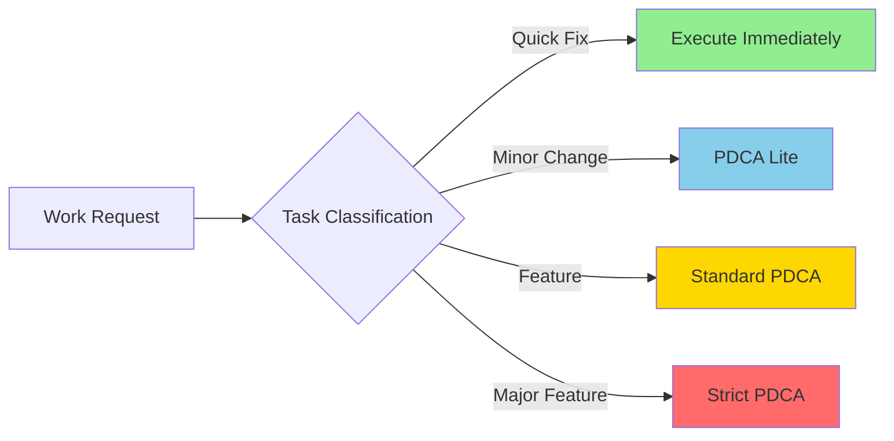
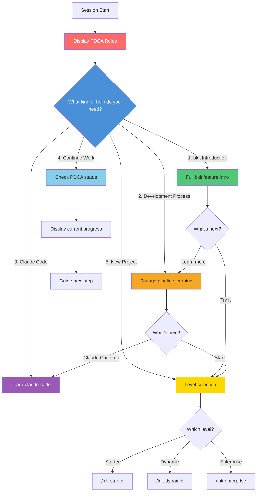
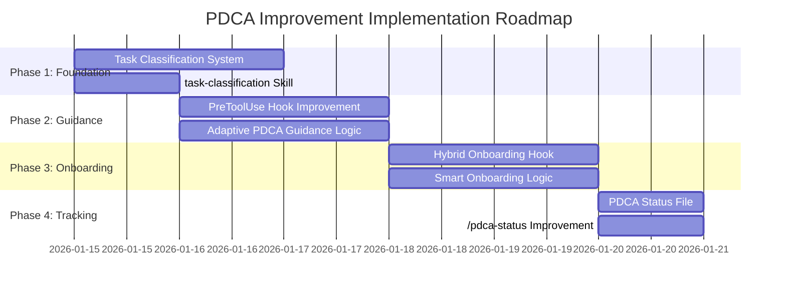

# PDCA Guidance and Onboarding Improvement Proposal

> **Status**: Draft (Revised v2)
> **Author**: Claude (with user collaboration)
> **Date**: 2026-01-15
> **Revision**:
> - v2: Reflects Plugin design consistency (instructions → skills integration pattern)
> - v1: Reflects technical constraints (Enforcement → Guidance)
> **Branch**: feature/improve-onboarding-and-pdca-enforcement
> **Reference**: [02-BKIT-PLUGIN-DESIGN.md](../02-BKIT-PLUGIN-DESIGN.md)

---

## 1. Current State Analysis

### 1.1 Current PDCA Application Mechanism

| Component | Location | Role | Enforcement Level |
|-----------|----------|------|-------------------|
| SessionStart Hook | `hooks/hooks.json:10` | PDCA rules notification | None (informational) |
| PreToolUse Hook | `hooks/hooks.json:22` | Check design docs on Write/Edit | Weak (warning only) |
| PostToolUse Hook | `hooks/hooks.json:34` | Suggest gap analysis after git commit | None (suggestion only) |
| bkit-rules Skill | `skills/bkit-rules/SKILL.md` | Comprehensive PDCA rules | None (reference) |
| pdca-rules Instruction | `.claude/instructions/pdca-rules.md` | Core PDCA rules | Weak (guideline) |

### 1.2 Identified Problems

#### Problem 1: PDCA remains at informational level
```
Current: PreToolUse hook "requests" design doc check but doesn't actually block
Result: Claude can write code without design
```

#### Problem 2: Same PDCA applied regardless of task size
```
Current: Same PDCA process for typo fixes and major features
Result:
  - Enforce PDCA on all tasks → Lack of flexibility, inefficiency
  - Ignore PDCA → Quality degradation, lack of documentation
```

#### Problem 3: Onboarding doesn't consider project state
```
Current: SessionStart always presents 4 options
Result:
  - New users: Don't know what to choose
  - Returning users: Asked the same questions every time
  - Work in progress: Unknown previous PDCA state
```

#### Problem 4: Implicit PDCA workflow
```
Current: Commands (/pdca-plan, /pdca-design) exist but not auto-connected
Result:
  - Users must know commands to use them
  - "Create login feature" request doesn't auto-invoke PDCA commands
```

#### Problem 5: No level-specific PDCA differentiation
```
Current: Starter/Dynamic/Enterprise only affects agent selection
Result:
  - Beginners: Excessive PDCA creates learning barrier
  - Enterprise: Loose PDCA risks quality
```

### 1.3 Technical Constraints (2026-01 Investigation Results)

Due to technical limitations of Claude Code hook system, **PDCA "Enforcement" is not possible**.

#### 1.3.1 PreToolUse Hook Blocking Feature Bugs

| Method | Documented Behavior | Actual Behavior | GitHub Issue |
|--------|---------------------|-----------------|--------------|
| `permissionDecision: "deny"` | Block tool execution | ❌ Ignored | [#4669](https://github.com/anthropics/claude-code/issues/4669) |
| Exit code 2 | Block tool execution | ❌ Write/Edit still executes | [#13744](https://github.com/anthropics/claude-code/issues/13744) |
| `approve: false` | Block tool execution | ❌ Ignored | [#4362](https://github.com/anthropics/claude-code/issues/4362) |

**Conclusion**: "BLOCK" or "REQUIRE" is technically not implementable via hooks. **Only feedback and recommendations are possible**.

#### 1.3.2 SessionStart Hook Limitations

| Installation Type | Hook Type | prompt Type Support | Recommended Alternative |
|-------------------|-----------|---------------------|------------------------|
| .claude folder | command | - | Keep SessionStart |
| Plugin | prompt | ❌ Not supported | **Use UserPromptSubmit** |

> 📚 Source: [Hooks reference - Claude Code Docs](https://code.claude.com/docs/en/hooks)

#### 1.3.3 Design Principle Modification

```diff
- Goal: PDCA "Enforcement"
+ Goal: PDCA "Guidance"

- Method: Block code writing without design
+ Method: Show warning and recommend when no design exists

- Result: Forced PDCA compliance
+ Result: Encourage voluntary PDCA compliance
```

---

## 2. Improvement Proposals

### 2.1 Task Classification System

**Concept**: Classify work requests by scale and differentiate PDCA requirement levels



| Classification | Examples | PDCA Requirement Level |
|----------------|----------|------------------------|
| **Quick Fix** | Typo fixes, config changes, comment edits | None |
| **Minor Change** | Existing function modification, style changes, bug fixes | PDCA Lite (brief record) |
| **Feature** | New feature addition, new API endpoint | Standard PDCA (Plan→Design→Do→Check) |
| **Major Feature** | Architecture changes, core module rewrite | Strict PDCA (review required) |

**Implementation Approach**: Skill + Hook combination

> 📚 **Design Rationale**: Plugin doesn't support `instructions/` folder ([02-BKIT-PLUGIN-DESIGN.md Section 4](../02-BKIT-PLUGIN-DESIGN.md#4-instructions-integration-strategy) reference).
> Following existing `bkit-rules` skill integration pattern, **implement as Skill**.

#### Implementation 1: skills/task-classification/SKILL.md (New)

```markdown
---
name: task-classification
description: |
  Classifies work request scale to determine appropriate PDCA level.
  Referenced by PreToolUse hook, auto-applied before all Write/Edit operations.

  Triggers: task classification, PDCA level, scope judgment,
  タスク分類, 任务分类, quick fix, feature, major
---

# Task Classification System

## Classification Criteria

### Quick Fix (No PDCA)
- Modify 1 file or less
- Change 10 lines or less
- No existing logic changes
- Keywords: "fix", "correct", "typo", "tweak"

### Minor Change (PDCA Lite)
- Modify 1-3 files
- Improve existing features
- No new file creation
- Keywords: "improve", "refactor", "bug fix", "optimize"

### Feature (Standard PDCA)
- New file creation required
- New feature/endpoint addition
- Keywords: "add", "create", "implement", "build"

### Major Feature (Strict PDCA)
- Affects multiple modules
- Architecture changes
- Keywords: "redesign", "migrate", "overhaul", "rewrite"

## Classification Process

1. Detect keywords from user request
2. Estimate expected change scope (file count, line count)
3. Determine classification and apply PDCA level
```

#### Implementation 2: Skill Reference in PreToolUse Hook

```json
{
  "matcher": "Write|Edit",
  "hooks": [{
    "type": "prompt",
    "prompt": "Reference task-classification skill criteria to classify current task and apply PDCA guidance...",
    "timeout": 10000
  }]
}
```

#### Implementation 3: Instruction for .claude folder users (Optional)

Provide same content as `.claude/instructions/task-classification.md` so
non-Plugin users can also benefit.

```
┌─────────────────────────────────────────────────────┐
│ Task Classification System by Installation Type     │
├─────────────────────────────────────────────────────┤
│ Plugin install    → skills/task-classification/SKILL.md │
│ .claude copy      → instructions/ + skills/ both apply  │
└─────────────────────────────────────────────────────┘
```

---

### 2.2 Adaptive PDCA Guidance

**Concept**: Adjust PDCA recommendation intensity based on project level

> ⚠️ **Technical Constraint**: Claude Code's PreToolUse hook currently cannot
> actually block tool execution (see Section 1.3). Only feedback and recommendations are possible.

| Level | PDCA Mode | Description |
|-------|-----------|-------------|
| **Starter** | Educational | PDCA education and suggestion, optional |
| **Dynamic** | Recommended | PDCA recommended for Feature+, warning when skipped |
| **Enterprise** | Strongly Recommended | PDCA strongly recommended for Feature+, warning displayed |

**PreToolUse Hook Improvement**:
```json
{
  "matcher": "Write|Edit",
  "hooks": [{
    "type": "prompt",
    "prompt": "## PDCA Guidance Check

Task Classification: [Quick Fix | Minor Change | Feature | Major Feature]
Project Level: [Starter | Dynamic | Enterprise]

### Decision Matrix (Guidance Level)

| Level | Quick Fix | Minor | Feature | Major |
|-------|-----------|-------|---------|-------|
| Starter | ALLOW | ALLOW | SUGGEST | SUGGEST |
| Dynamic | ALLOW | ALLOW | WARN | STRONG_WARN |
| Enterprise | ALLOW | WARN | STRONG_WARN | STRONG_WARN |

### Guidance Levels
- ALLOW: Proceed immediately
- SUGGEST: Suggest design document creation (can proceed)
- WARN: Recommend design document, display warning message (can proceed)
- STRONG_WARN: Strongly recommend design document, detailed warning (can proceed but request reconfirmation)

### Actions

1. Classify the current task
2. Detect project level from CLAUDE.md or structure
3. Apply decision matrix
4. If WARN/STRONG_WARN and no design doc exists:
   - Display warning message
   - Offer to create inline mini-design
   - Or guide to /pdca-design command
   - Ask user confirmation before proceeding

Respond: {\"decision\": \"allow|suggest|warn|strong_warn\", \"classification\": \"...\", \"reason\": \"...\"}"
  }]
}
```

---

### 2.3 Smart Onboarding

**Concept**: Inject PDCA rules first, then provide options matching user's purpose

#### 2.3.1 Onboarding Structure

```
┌─────────────────────────────────────────────────┐
│  PDCA Core Rules (Always displayed, not optional)│
│  - New feature → Design first                    │
│  - Don't know → Don't guess, ask                 │
│  - After implementation → Gap analysis           │
└─────────────────────────────────────────────────┘
                      ↓
┌─────────────────────────────────────────────────┐
│  What kind of help do you need? (5 options)      │
│                                                  │
│  1. bkit Introduction - Learn what bkit is       │
│  2. Learn Development Process - 9-stage pipeline │
│  3. Learn Claude Code - Setup and usage          │
│  4. Continue Work - Resume previous work         │
│  5. Start New Project - Setup from scratch       │
└─────────────────────────────────────────────────┘
```

#### 2.3.2 Actions by Selection

| Selection | Description | Action |
|-----------|-------------|--------|
| **1. bkit Introduction** | Full bkit feature introduction | Explain PDCA, pipeline, levels, agents, etc. |
| **2. Learn Development Process** | 9-stage pipeline learning | Run `/pipeline-start` or teach 9 stages |
| **3. Learn Claude Code** | Claude Code setup/usage | Run `/learn-claude-code` |
| **4. Continue Work** | Resume previous PDCA | Check PDCA status → Guide next step |
| **5. Start New Project** | New project setup | Select level → Run `/init-*` |

#### 2.3.3 Actual Onboarding Message

```
Welcome to bkit Vibecoding Kit!

📌 PDCA Core Rules (Always Apply)
• New feature request → Check/create design doc first
• Don't guess → Ask when unsure
• After implementation → Suggest Gap analysis

━━━━━━━━━━━━━━━━━━━━━━━━━━━━━━━━━━━━━━━━

What kind of help do you need?

1. bkit Introduction - Learn what bkit is
2. Learn Development Process - 9-stage pipeline learning
3. Learn Claude Code - Setup and usage
4. Continue Work - Resume previous work
5. Start New Project - Setup from scratch
```

#### 2.3.4 Flow Diagram



#### 2.3.5 hooks/hooks.json Improvement (Hybrid Approach)

> ⚠️ **Technical Constraint**: SessionStart event doesn't support `prompt` type,
> and Plugin install has a bug where SessionStart hook output is not captured (see Section 1.3.2).
>
> **Solution**: Plugin uses **UserPromptSubmit** event

##### .claude Folder Install (SessionStart + command)

Keep existing approach in `.claude/settings.json`:
```json
{
  "hooks": {
    "SessionStart": [{
      "once": true,
      "hooks": [{
        "type": "command",
        "command": "$CLAUDE_PROJECT_DIR/.claude/hooks/session-start.sh",
        "timeout": 5000
      }]
    }]
  }
}
```

##### Plugin Install (UserPromptSubmit + prompt)

Use UserPromptSubmit in `hooks/hooks.json`:
```json
{
  "UserPromptSubmit": [
    {
      "once": true,
      "hooks": [
        {
          "type": "prompt",
          "prompt": "Welcome to bkit Vibecoding Kit!\n\n📌 PDCA Core Rules (Always Apply)\n• New feature request → Check/create design doc first\n• Don't guess → Ask when unsure\n• After implementation → Suggest Gap analysis\n\n━━━━━━━━━━━━━━━━━━━━━━━━━━━━━━━━━\n\nUse AskUserQuestion tool to ask:\n\n**Question**: \"What kind of help do you need?\"\n**Options**:\n1. bkit Introduction - Learn what bkit is\n2. Learn Development Process - 9-stage pipeline learning\n3. Learn Claude Code - Setup and usage\n4. Continue Work - Resume previous work\n5. Start New Project - Setup from scratch\n\n**Actions by Selection**:\n- Option 1 → Explain bkit features (PDCA, Pipeline, Levels, Agents)\n- Option 2 → Run /pipeline-start or teach 9 stages\n- Option 3 → Run /learn-claude-code\n- Option 4 → Check PDCA status and guide next step\n- Option 5 → Ask level selection then run /init-*\n\nImportant: Also respond to user's original question.",
          "timeout": 10000
        }
      ]
    }
  ]
}
```

> 💡 **Key Difference**: UserPromptSubmit triggers on user's first message submission,
> so add "Also respond to user's original question" at the end of prompt
> to handle both onboarding and user request simultaneously.

#### 2.3.6 Project State-based Dynamic Guidance (Future Improvement)

```bash
#!/bin/bash
# Future: session-start.sh detects project state
# and auto-displays progress when option 4 is selected

# Detect project state
has_pdca_docs=$(test -d "docs/01-plan" && echo "true" || echo "false")

if [ "$has_pdca_docs" = "true" ]; then
  # Generate list of in-progress PDCA documents
  pdca_files=$(find docs -name "*.plan.md" -o -name "*.design.md" 2>/dev/null | head -5)
  echo "In-progress PDCA docs: $pdca_files"
fi
```

---

### 2.4 PDCA Lite Mode

**Concept**: Lightweight PDCA for Minor Change level tasks

```markdown
## PDCA Lite Format

### Change Summary (3 lines or less)
- What: [Change target]
- Why: [Change reason]
- How: [Change method]

### Impact Scope
- [ ] No impact on existing features
- [ ] No testing required

### Approval
User confirmation: [Y/N]
```

**Application Example**:
```
User: "Change the login button color"

Claude: This change is classified as Minor Change.

📝 PDCA Lite
- What: Login button color
- Why: Design update request
- How: Change button.primary background-color

Shall I proceed? (PDCA Lite will be recorded)
```

---

### 2.5 Explicit Scope Setting

**Concept**: Confirm task scope first for ambiguous requests

```markdown
## Scope Confirmation Question

User: "Fix the login feature"

Claude: How extensive is the fix?

1. 🔧 Simple fix (bug fix, style change)
2. ✨ Feature improvement (new feature, logic change)
3. 🏗️ Large scale change (redesign, architecture change)

→ PDCA application level is determined based on your selection.
```

**Implementation**: Use AskUserQuestion hook
```json
{
  "matcher": "ambiguous_request",
  "hooks": [{
    "type": "prompt",
    "prompt": "Request is ambiguous. Ask user for scope clarification using AskUserQuestion tool before proceeding."
  }]
}
```

---

### 2.6 PDCA Status Tracking

**Concept**: Status file tracking PDCA progress per feature

```markdown
# docs/.pdca-status.json

{
  "features": {
    "login": {
      "status": "design",
      "plan_doc": "docs/01-plan/features/login.plan.md",
      "design_doc": "docs/02-design/features/login.design.md",
      "last_updated": "2026-01-14",
      "next_step": "Do (Implementation)"
    },
    "user-profile": {
      "status": "plan",
      "plan_doc": "docs/01-plan/features/user-profile.plan.md",
      "design_doc": null,
      "last_updated": "2026-01-13",
      "next_step": "Create Design document"
    }
  },
  "quick_changes": [
    {"date": "2026-01-14", "desc": "Button color change", "type": "minor"}
  ]
}
```

**Usage**:
- SessionStart: "In-progress PDCA: login (Design complete)"
- PreToolUse: Check PDCA status of related feature
- /pdca-status: Full PDCA status dashboard

---

## 3. Implementation Priority



| Priority | Item | Reason | Difficulty |
|----------|------|--------|------------|
| 1 | Task Classification System | Foundation for all improvements | Medium |
| 2 | PreToolUse Hook Improvement | Effective guidance delivery | Medium |
| 3 | Smart Onboarding | User experience improvement | High |
| 4 | PDCA Lite | Flexibility | Low |
| 5 | PDCA Status Tracking | Continuity assurance | Medium |

---

## 4. Expected Effects

### Before (Current)
```
User: "Create login feature"
Claude: [Starts writing code immediately] ← PDCA ignored
OR
Claude: "Please run /pdca-plan login first" ← User doesn't know the command
```

### After (Improved)
```
User: "Create login feature"
Claude:
  This task is classified as new feature (Feature).

  📋 Starting PDCA process:
  1. Shall I create a Plan document first?
  2. Or proceed with brief design and implementation?

  [1] Standard PDCA (Recommended)
  [2] PDCA Lite (Quick progress)
```

### Metrics
- PDCA compliance rate: Current estimate 30% → Target 80%
- Design document ownership: Current estimate 20% → Target 70%
- Onboarding completion rate: Not measurable → Target 90%

---

## 5. Risks and Mitigation

| Risk | Impact | Mitigation |
|------|--------|------------|
| Classification errors | Wrong PDCA applied | Provide user reclassification option |
| Excessive questions | User fatigue | Quick Fix proceeds without questions |
| Compatibility issues | Existing project conflicts | Provide migration guide |
| Learning curve | New user confusion | Add explanation to /learn-claude-code |

---

## 6. Conclusion

Current bkit PDCA application remains at **informational level**.
Due to Claude Code hook system technical constraints (Section 1.3), **actual blocking (Enforcement) is not possible**,
but **effective guidance** can encourage PDCA compliance.

This proposal introduces a **Task Classification System** to apply PDCA appropriate to scale,
achieves level-specific flexibility with **Adaptive Guidance**,
and improves user experience with **Smart Onboarding**.

The key is **"Effective Guidance"**:
- WARN/STRONG_WARN to raise awareness of design necessity
- Voluntary PDCA compliance through user confirmation
- Differentiated recommendations based on task scale and project level

---

## 7. Next Steps

After user approval:
1. `/pdca-design pdca-enforcement-improvement` - Detailed design
2. Sequential implementation from Phase 1
3. Verify with `/pdca-analyze` after implementation

---

> This document is a Plan phase deliverable of the bkit PDCA workflow.
