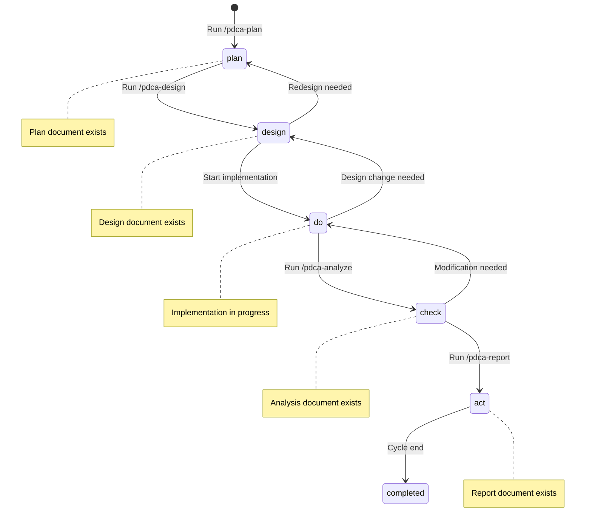

# PDCA Status Tracking Design Document

> **Status**: Draft
> **Author**: Claude (with user collaboration)
> **Date**: 2026-01-15
> **Plan Reference**: `docs/01-plan/features/pdca-enforcement-improvement.plan.md` Section 2.6
> **Related Design**: `adaptive-pdca-guidance.design.md` (PDCA Lite recording integration)
> **Branch**: feature/improve-onboarding-and-pdca-enforcement

---

## 1. Overview

### 1.1 Purpose

**Track PDCA progress status by feature** to ensure continuity across sessions.
Automatically identify progress status when "Continue Work" is selected and guide to the next step.

### 1.2 Scope

- Define `docs/.pdca-status.json` status file
- PDCA status auto-update logic
- Improve `/bkit:pdca-status` command

### 1.3 Terminology

| Term | Description |
|------|-------------|
| **PDCA Status** | Current stage among Plan, Design, Do, Check, Act |
| **Status File** | JSON file storing PDCA progress status |
| **quick_changes** | List of Minor Changes recorded via PDCA Lite |

### 1.4 Technical Constraints

> ⚠️ **PostToolUse Hook support uncertain**
>
> Support for prompt type in PostToolUse hook is unclear in Claude Code official documentation.
> Some docs state it's supported, others don't mention it.
>
> **Alternatives**:
> 1. If PostToolUse doesn't work, update status file directly within /pdca-plan, /pdca-design commands
> 2. Or detect previous Write operations in PreToolUse hook and update status
>
> **Testing required during implementation**: Must verify PostToolUse prompt hook works correctly in actual environment

---

## 2. Current State Analysis

### 2.1 Current Problems

```
Current: No central system to track PDCA progress status
Result:
  - Hard to understand previous work in new session
  - Must manually explore docs/01-plan, docs/02-design folders
  - Cannot immediately answer "Where did I leave off?"
  - PDCA Lite (Minor Change) records are not kept
```

### 2.2 Current PDCA Document Structure

```
docs/
├── 01-plan/
│   └── features/
│       ├── login.plan.md
│       └── payment.plan.md
├── 02-design/
│   └── features/
│       ├── login.design.md
│       └── (no payment design)
├── 03-analysis/
│   └── (empty folder)
└── 04-report/
    └── (empty folder)
```

**Problem**: Must infer status only from file existence

---

## 3. Design Goals

### 3.1 Functional Requirements

1. **Status Tracking**: Explicitly record PDCA stage for each feature
2. **Auto Update**: Automatically update status when PDCA document is created/modified
3. **Quick Query**: Immediately check entire status with `/bkit:pdca-status`
4. **Minor Change Recording**: Record PDCA Lite content as well

### 3.2 Non-functional Requirements

1. **Simplicity**: Manage with a single JSON file
2. **Git-friendly**: Easy to track changes
3. **Automation**: Minimize manual updates

---

## 4. Detailed Design

### 4.1 Status File Schema

**File Location**: `docs/.pdca-status.json`

```json
{
  "$schema": "https://json-schema.org/draft/2020-12/schema",
  "version": "1.0.0",
  "last_updated": "2026-01-15T10:30:00Z",
  "project_level": "dynamic",
  "features": {
    "login": {
      "status": "design",
      "plan_doc": "docs/01-plan/features/login.plan.md",
      "design_doc": "docs/02-design/features/login.design.md",
      "analysis_doc": null,
      "report_doc": null,
      "created_at": "2026-01-10",
      "last_updated": "2026-01-14",
      "next_step": "Do (Implementation)",
      "notes": "Social login addition planned"
    },
    "payment": {
      "status": "plan",
      "plan_doc": "docs/01-plan/features/payment.plan.md",
      "design_doc": null,
      "analysis_doc": null,
      "report_doc": null,
      "created_at": "2026-01-13",
      "last_updated": "2026-01-13",
      "next_step": "Write Design document",
      "notes": null
    }
  },
  "quick_changes": [
    {
      "date": "2026-01-14",
      "desc": "Button color change",
      "type": "minor",
      "what": "Login button color",
      "why": "Design guide reflection",
      "how": "Change button.primary background-color",
      "files": ["src/components/Button.tsx"]
    },
    {
      "date": "2026-01-15",
      "desc": "Typo fix",
      "type": "quick_fix",
      "what": "README.md typo",
      "why": "User report",
      "how": "Fix typo"
    }
  ],
  "statistics": {
    "total_features": 2,
    "completed": 0,
    "in_progress": 2,
    "quick_changes_count": 2
  }
}
```

### 4.2 Status Definitions

| Status | Description | Next Step |
|--------|-------------|-----------|
| **plan** | Plan document complete | Write Design document |
| **design** | Design document complete | Implementation (Do) |
| **do** | Implementation in progress | Gap analysis (Check) |
| **check** | Analysis document complete | Improvement (Act) |
| **act** | Report document complete | Complete |
| **completed** | PDCA cycle complete | - |

### 4.3 Status Transition Diagram



---

## 5. Auto-Update Logic

### 5.1 Status Update Triggers

| Trigger | Status Change |
|---------|---------------|
| `docs/01-plan/**/*.plan.md` created | → `plan` |
| `docs/02-design/**/*.design.md` created | → `design` |
| First Write/Edit on feature-related code | → `do` |
| `docs/03-analysis/**/*.analysis.md` created | → `check` |
| `docs/04-report/**/*.report.md` created | → `act` |

### 5.2 PostToolUse Hook Usage

```json
{
  "PostToolUse": [
    {
      "matcher": "Write",
      "hooks": [
        {
          "type": "prompt",
          "prompt": "File has been created/modified.

PDCA Status Update Check:
- docs/01-plan/**/*.plan.md created? → Update .pdca-status.json
- docs/02-design/**/*.design.md created? → Update .pdca-status.json
- docs/03-analysis/**/*.analysis.md created? → Update .pdca-status.json
- docs/04-report/**/*.report.md created? → Update .pdca-status.json

Automatically perform status file update if needed.

Response: {\"status_updated\": true/false, \"feature\": \"...\", \"new_status\": \"...\"}",
          "timeout": 5000
        }
      ]
    }
  ]
}
```

### 5.3 Feature Name Extraction Logic

Automatically extract feature name from file path:

```
docs/01-plan/features/login.plan.md → feature: "login"
docs/02-design/features/user-profile.design.md → feature: "user-profile"
docs/01-plan/features/payment-gateway.plan.md → feature: "payment-gateway"
```

**Extraction Rule**:
```
docs/{phase}/features/{feature-name}.{phase-type}.md
                       ↑ feature name
```

---

## 6. /bkit:pdca-status Command Improvement

### 6.1 Current Behavior

```bash
/bkit:pdca-status
# → Explore docs/ folder and output document list
```

### 6.2 Improved Behavior

```bash
/bkit:pdca-status
# → Read docs/.pdca-status.json and output structured dashboard
```

### 6.3 Output Format

```
📊 PDCA Status Dashboard
━━━━━━━━━━━━━━━━━━━━━━━━━━━━━━━━━━━━━━━━━━━━━━

📈 Summary
• Total Features: 2
• In Progress: 2
• Completed: 0
• Quick Changes: 5

━━━━━━━━━━━━━━━━━━━━━━━━━━━━━━━━━━━━━━━━━━━━━━

📋 Feature Status

┌──────────────┬──────────┬────────────────────────┐
│ Feature      │ Status   │ Next Step              │
├──────────────┼──────────┼────────────────────────┤
│ login        │ 🔵 design │ Start implementation   │
│ payment      │ 🟡 plan   │ Write Design document  │
└──────────────┴──────────┴────────────────────────┘

━━━━━━━━━━━━━━━━━━━━━━━━━━━━━━━━━━━━━━━━━━━━━━

🔧 Recent Quick Changes (Last 5)

┌────────────┬─────────────────────────────────┐
│ Date       │ Description                     │
├────────────┼─────────────────────────────────┤
│ 2026-01-15 │ Typo fix                        │
│ 2026-01-14 │ Button color change             │
└────────────┴─────────────────────────────────┘

━━━━━━━━━━━━━━━━━━━━━━━━━━━━━━━━━━━━━━━━━━━━━━

💡 Recommendation: Would you like to start implementing the login feature?
```

### 6.4 Status Icons

| Status | Icon | Meaning |
|--------|------|---------|
| plan | 🟡 | Plan complete, design needed |
| design | 🔵 | Design complete, implementation needed |
| do | 🟢 | Implementation in progress |
| check | 🟣 | Analysis complete, improvement needed |
| act | 🟠 | Report complete |
| completed | ✅ | PDCA cycle complete |

---

## 7. Onboarding Integration

### 7.1 When "Continue Work" is Selected

Read `.pdca-status.json` and display status when smart onboarding option 4 is selected.

**smart-onboarding.design.md Integration**:

```
User: [4. Continue Work] selected

→ Check docs/.pdca-status.json
→ Display in-progress feature list
→ Guide next step for most recently updated feature
```

### 7.2 Example Behavior

```
📋 PDCA Status Overview

┌──────────────┬──────────┬────────────────────────┐
│ Feature      │ Status   │ Next Step              │
├──────────────┼──────────┼────────────────────────┤
│ login        │ 🔵 design │ Start implementation   │
│ payment      │ 🟡 plan   │ Write Design document  │
└──────────────┴──────────┴────────────────────────┘

The 'login' feature is in design complete status.
Would you like to start the implementation?
```

---

## 8. Status File Initialization

### 8.1 When `/bkit:init-*` is Run

Create `.pdca-status.json` during project initialization:

```json
{
  "version": "1.0.0",
  "last_updated": "2026-01-15T10:00:00Z",
  "project_level": "dynamic",
  "features": {},
  "quick_changes": [],
  "statistics": {
    "total_features": 0,
    "completed": 0,
    "in_progress": 0,
    "quick_changes_count": 0
  }
}
```

### 8.2 Existing Project Migration

When `.pdca-status.json` doesn't exist in existing project:

1. Auto-create on first `/bkit:pdca-status` run
2. Scan docs/ folder and infer status from existing documents
3. Save after user confirmation

---

## 9. Changed Files List

### 9.1 New Files

| File | Description |
|------|-------------|
| `docs/.pdca-status.json` | PDCA status tracking file (per project) |

### 9.2 Modified Files

| File | Change Content |
|------|----------------|
| `commands/pdca-status.md` | Improve to status file-based output |
| `commands/init-starter.md` | Add status file initialization |
| `commands/init-dynamic.md` | Add status file initialization |
| `commands/init-enterprise.md` | Add status file initialization |
| `hooks/hooks.json` | Add PostToolUse hook |

---

## 10. Test Plan

### 10.1 Test Scenarios

| ID | Scenario | Expected Result |
|----|----------|-----------------|
| T1 | Run /pdca-plan login | Add login(plan) to status.json |
| T2 | Run /pdca-design login | Change login status → design |
| T3 | Run /pdca-status | Dashboard output |
| T4 | Select onboarding option 4 | Display progress status |
| T5 | Apply PDCA Lite | Record to quick_changes |
| T6 | First run on existing project | Auto-migration |

### 10.2 Edge Cases

| Case | Handling |
|------|----------|
| status.json missing | Auto-create |
| status.json corrupted | Backup and recreate |
| Document deleted | Remove from status file also |

---

## 11. Implementation Checklist

- [ ] Define `docs/.pdca-status.json` schema
- [ ] Improve `commands/pdca-status.md`
- [ ] Add status file initialization to `commands/init-*.md`
- [ ] Add PostToolUse hook to `hooks/hooks.json`
- [ ] Add PostToolUse hook to `.claude/settings.json`
- [ ] Integrate smart onboarding option 4
- [ ] Perform tests T1~T6
- [ ] Test existing project migration

---

## 12. Next Steps

1. Approve this design document
2. Implement together with `task-classification.design.md`, `adaptive-pdca-guidance.design.md`
3. Perform testing
4. Create PR

---

> This document is a Design phase deliverable of the bkit PDCA workflow.
