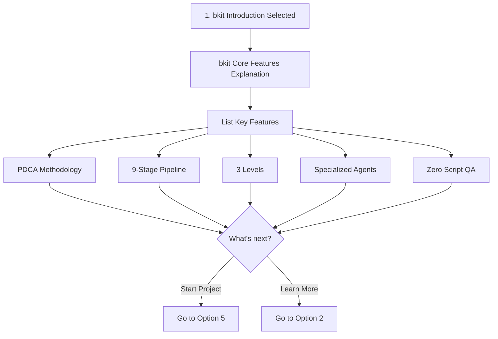
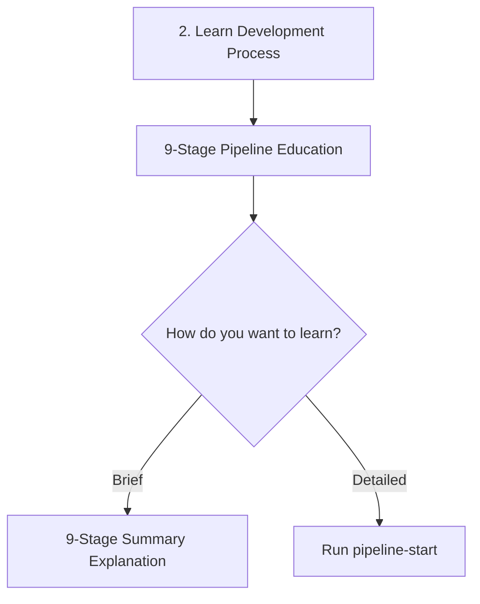
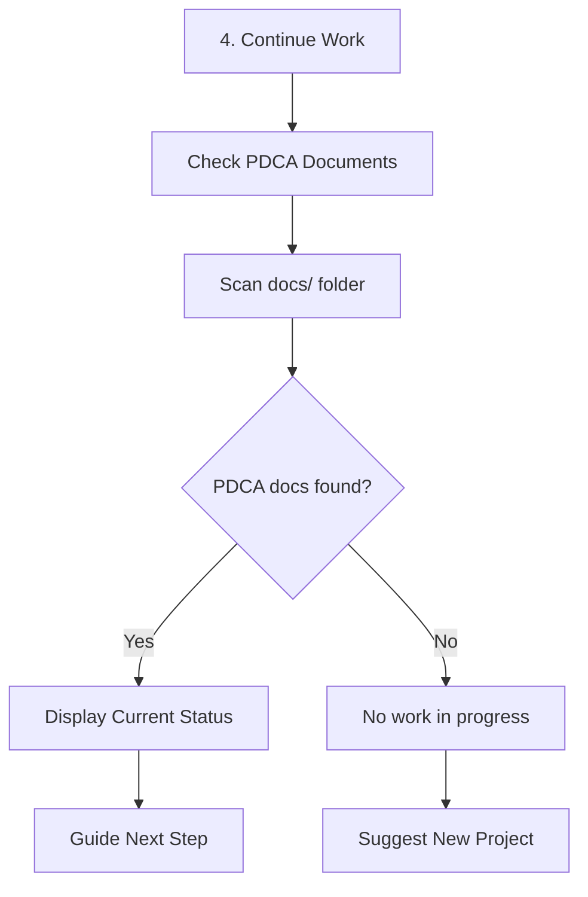
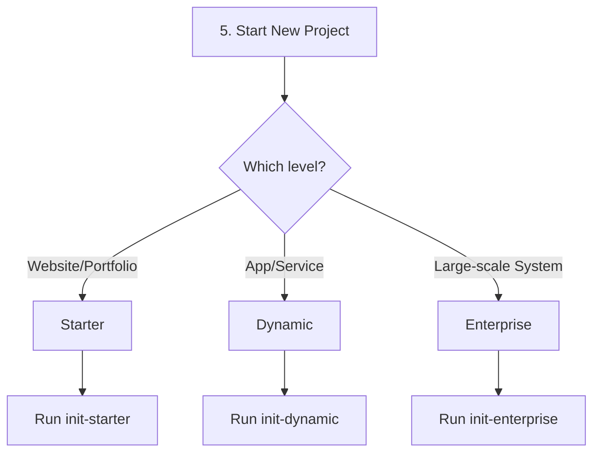

# Smart Onboarding Design Document

> **Status**: Draft (Revised)
> **Author**: Claude (with user collaboration)
> **Date**: 2026-01-15
> **Revision**: Modified to hybrid approach (Plugin: uses UserPromptSubmit)
> **Plan Reference**: `docs/01-plan/features/pdca-enforcement-improvement.plan.md` Section 2.3
> **Branch**: feature/improve-onboarding-and-pdca-enforcement

---

## 1. Overview

### 1.1 Purpose

Provide a **consistent onboarding experience** regardless of whether the bkit plugin or .claude folder installation method is used.

### 1.2 Scope

- SessionStart hook improvement
- PDCA rules injection
- 5-option based onboarding flow

### 1.3 Terminology

| Term | Description |
|------|-------------|
| **Plugin Installation** | Installation via `/plugin install bkit` or marketplace |
| **.claude Folder Installation** | Method of copying `.claude/` folder to project |
| **SessionStart Hook** | Hook that executes at Claude Code session start |
| **AskUserQuestion** | Tool that provides Claude Code's multiple choice UI |

---

## 2. Current State Analysis

### 2.1 Two Installation Methods

```
┌─────────────────────────────────────────────────────────────────┐
│                     bkit Installation Methods                    │
├─────────────────────────────┬───────────────────────────────────┤
│      Plugin Installation    │    .claude Folder Installation    │
├─────────────────────────────┼───────────────────────────────────┤
│ /plugin install bkit        │ cp -r bkit/.claude your-project/  │
│                             │                                   │
│ Uses hooks/hooks.json       │ Uses .claude/settings.json        │
│ type: "prompt"              │ type: "command"                   │
└─────────────────────────────┴───────────────────────────────────┘
```

### 2.2 Current SessionStart Implementation Comparison

#### Plugin (`hooks/hooks.json`)

```json
{
  "SessionStart": [{
    "once": true,
    "hooks": [{
      "type": "prompt",
      "prompt": "bkit Vibecoding Kit v1.1.1...\n\nCore PDCA Rules...",
      "timeout": 5000
    }]
  }]
}
```

**Current content:**
- Version information
- PDCA core rules (text)
- List of available commands
- **No** AskUserQuestion instruction → **No** multiple choice

#### .claude Folder (`.claude/settings.json` + `.claude/hooks/session-start.sh`)

```json
// .claude/settings.json
{
  "hooks": {
    "SessionStart": [{
      "once": true,
      "hooks": [{
        "type": "command",
        "command": "$CLAUDE_PROJECT_DIR/.claude/hooks/session-start.sh",
        "timeout": 5000
      }]
    }]
  }
}
```

```bash
# .claude/hooks/session-start.sh
cat << 'JSON'
{
  "hookSpecificOutput": {
    "additionalContext": "...Use the AskUserQuestion tool..."
  }
}
JSON
```

**Current content:**
- AskUserQuestion instruction → 4 multiple choice options displayed
- Action guide by selection
- Agent auto-activation notice

### 2.3 Problems

| Problem | Description |
|---------|-------------|
| **Inconsistent onboarding content** | Plugin is text only, .claude has multiple choice + guide |
| **Inconsistent user experience** | Completely different first impression depending on installation method |
| **Inconsistent PDCA injection** | Plugin only has rules, .claude guides with AskUserQuestion |

### 2.4 Technical Constraints (2026-01 Research Results)

#### 2.4.1 SessionStart Hook Type Limitations

**Events that support `prompt` type:**
- ✅ Stop, SubagentStop, UserPromptSubmit, PreToolUse

**Events that do NOT support `prompt` type:**
- ❌ **SessionStart** (only supports command type)
- ❌ SessionEnd, PreCompact
- ⚠️ PostToolUse (supported in some docs, not mentioned in others - actual testing needed)

> 📚 Source: [Hooks reference - Claude Code Docs](https://code.claude.com/docs/en/hooks)

#### 2.4.2 Plugin SessionStart Known Bugs

| GitHub Issue | Problem | Status |
|--------------|---------|--------|
| [#12151](https://github.com/anthropics/claude-code/issues/12151) | Plugin hook output not passed to agent context | Open |
| [#12634](https://github.com/anthropics/claude-code/issues/12634) | Plugin SessionStart hook not auto-triggered | Open |
| [#13650](https://github.com/anthropics/claude-code/issues/13650) | SessionStart stdout silently ignored | Open |

**Conclusion**: Plugin's SessionStart hook is currently **unreliable**. Alternative needed.

#### 2.4.3 `once` Field Support

> ⚠️ **Note**: The `once: true` field is not explicitly documented in official documentation.
> Used in some community examples, but official support is uncertain.
> Must test actual behavior during implementation.
>
> **Alternative**: If `once` field doesn't work, prevent duplicate execution with state file in hook script:
> ```bash
> STATE_FILE="$HOME/.cache/bkit-onboarding-shown"
> if [ -f "$STATE_FILE" ]; then exit 0; fi
> touch "$STATE_FILE"
> # Onboarding logic...
> ```

### 2.5 Maintenance System (Existing)

bkit already has a synchronization system using `.claude/` as source of truth:

```
┌─────────────────────────────────────────────────────────────────┐
│  scripts/sync-folders.sh                                        │
│  .claude/ → root/ sync (commands, agents, skills, templates)    │
├─────────────────────────────────────────────────────────────────┤
│  scripts/validate-plugin.sh                                     │
│  Plugin structure and consistency validation                    │
└─────────────────────────────────────────────────────────────────┘
```

---

## 3. Design Goals

### 3.1 Consistency Requirements

```
┌─────────────────────────────────────────────────────────────────┐
│                   Consistent Onboarding Experience               │
├─────────────────────────────────────────────────────────────────┤
│                                                                 │
│  Plugin Install ──┐                                             │
│                   ├──→ Same PDCA rules displayed                │
│  .claude Install ─┘    Same 5 options                           │
│                        Same multiple choice UI                  │
│                                                                 │
└─────────────────────────────────────────────────────────────────┘
```

### 3.2 Functional Requirements

1. **PDCA Rules Injection**: Always display PDCA core rules at session start
2. **5 Options**: Provide multiple choice via AskUserQuestion
3. **Action by Selection**: Appropriate follow-up action for each selection

### 3.3 Non-functional Requirements

1. **Single Source**: Onboarding content defined in one place
2. **Easy Maintenance**: Modify once when content changes
3. **Compatibility**: No impact on existing installation users

---

## 4. Solution Design: Hybrid Approach

### 4.1 Design Principles

1. **Accept Technical Constraints**: SessionStart is unreliable in Plugin, use alternative
2. **Event Separation**: .claude uses SessionStart, Plugin uses UserPromptSubmit
3. **Content Consistency**: Both methods deliver the same onboarding content
4. **Source of Truth**: Onboarding text managed in one place

### 4.2 Hybrid Architecture

```
┌─────────────────────────────────────────────────────────────────┐
│                    Hybrid Onboarding Strategy                    │
├─────────────────────────────────────────────────────────────────┤
│                                                                 │
│  📁 .claude Folder Installation                                 │
│  ┌─────────────────────────────────────────────────────────┐   │
│  │  SessionStart (command type)                             │   │
│  │  → Execute session-start.sh                              │   │
│  │  → Inject onboarding via additionalContext               │   │
│  │  → Display AskUserQuestion immediately at session start  │   │
│  └─────────────────────────────────────────────────────────┘   │
│                                                                 │
│  📦 Plugin Installation                                         │
│  ┌─────────────────────────────────────────────────────────┐   │
│  │  UserPromptSubmit (prompt type) + once: true             │   │
│  │  → Triggered on first user input                         │   │
│  │  → Pass onboarding instruction via prompt                │   │
│  │  → Display AskUserQuestion                               │   │
│  └─────────────────────────────────────────────────────────┘   │
│                                                                 │
└─────────────────────────────────────────────────────────────────┘
```

### 4.3 Event Selection Rationale

| Installation Method | Hook Event | Hook Type | Trigger Timing | Rationale |
|---------------------|------------|-----------|----------------|-----------|
| **.claude Folder** | SessionStart | `command` | Session start | ✅ Confirmed working |
| **Plugin** | UserPromptSubmit | `prompt` | First user input | ✅ Supports prompt type, no bugs |

### 4.4 Trigger Timing Difference

```
┌─────────────────────────────────────────────────────────────────┐
│  .claude Folder Installation (SessionStart)                      │
│                                                                 │
│  Session Start ──→ [Onboarding Display] ──→ Wait for user input │
│                 ↑ Immediately                                   │
└─────────────────────────────────────────────────────────────────┘

┌─────────────────────────────────────────────────────────────────┐
│  Plugin Installation (UserPromptSubmit)                          │
│                                                                 │
│  Session Start ──→ User's first input ──→ [Onboarding] ──→ Response │
│                                        ↑ After first input      │
└─────────────────────────────────────────────────────────────────┘
```

**Difference**: Plugin users see onboarding after first message input.
**Acceptable**: No significant UX difference (first input is usually greeting or question)

### 4.5 `once: true` Setting

Both methods use `once: true` to show onboarding only once per session:

```json
{
  "once": true,  // Execute only once per session
  "hooks": [...]
}
```

---

## 5. Detailed Design

### 5.1 Common Onboarding Prompt

```
Welcome to bkit Vibecoding Kit!

## PDCA Core Rules (Always Apply)
- New feature request → Check/create design doc first
- Don't guess → Check docs → Ask user
- After implementation → Suggest Gap analysis

━━━━━━━━━━━━━━━━━━━━━━━━━━━━━━━━━━━━━━━━

Use AskUserQuestion tool to ask:

**Question**: "What kind of help do you need?"
**Header**: "Help Type"
**Options**:
1. bkit Introduction - Learn what bkit is
2. Learn Development Process - 9-stage pipeline learning
3. Learn Claude Code - Setup and usage
4. Continue Work - Resume previous work
5. Start New Project - Setup from scratch

**Actions by Selection**:
- Option 1 → Explain bkit features (PDCA, Pipeline, Levels, Agents, Zero Script QA)
- Option 2 → Run /bkit:pipeline-start or teach 9 stages
- Option 3 → Run /bkit:learn-claude-code
- Option 4 → Check PDCA status (docs/.pdca-status.json or scan docs/), guide next step
- Option 5 → Ask level selection, run /bkit:init-*

**Important**: End response with 'Claude is not perfect. Always verify important decisions.'
```

### 5.2 .claude/hooks/session-start.sh Changes

`.claude/hooks/session-start.sh` is the SessionStart hook for .claude folder installation users.

#### Before
```bash
#!/bin/bash
cat << 'JSON'
{
  "hookSpecificOutput": {
    "hookEventName": "SessionStart",
    "additionalContext": "## bkit Vibecoding Kit Session Start\n\nGreet the user and ask the following using AskUserQuestion tool:\n\n**Question**: \"What kind of help do you need?\"\n**Options**:\n1. Start a project - New project initial setup\n2. Learn Claude Code - Learn how to use it\n3. Start working - Already configured\n4. Upgrade settings - Improve existing settings\n\n..."
  }
}
JSON
exit 0
```

#### After
```bash
#!/bin/bash
# bkit Vibecoding Kit - SessionStart Hook
# For .claude folder installation users (command type)
# Plugin uses UserPromptSubmit, so not synced with this file

cat << 'JSON'
{
  "hookSpecificOutput": {
    "hookEventName": "SessionStart",
    "additionalContext": "Welcome to bkit Vibecoding Kit!\n\n## PDCA Core Rules (Always Apply)\n- New feature request → Check/create design doc first\n- Don't guess → Check docs → Ask user\n- After implementation → Suggest Gap analysis\n\n━━━━━━━━━━━━━━━━━━━━━━━━━━━━━━━━━━━━━━━━\n\nUse AskUserQuestion tool to ask:\n\n**Question**: \"What kind of help do you need?\"\n**Header**: \"Help Type\"\n**Options**:\n1. bkit Introduction - Learn what bkit is\n2. Learn Development Process - 9-stage pipeline learning\n3. Learn Claude Code - Setup and usage\n4. Continue Work - Resume previous work\n5. Start New Project - Setup from scratch\n\n**Actions by Selection**:\n- Option 1 → Explain bkit features (PDCA, Pipeline, Levels, Agents, Zero Script QA)\n- Option 2 → Run /bkit:pipeline-start or teach 9 stages\n- Option 3 → Run /bkit:learn-claude-code\n- Option 4 → Check PDCA status (docs/.pdca-status.json or scan docs/), guide next step\n- Option 5 → Ask level selection, run /bkit:init-*\n\n**Important**: End response with 'Claude is not perfect. Always verify important decisions.'"
  }
}
JSON
exit 0
```

### 5.3 hooks/hooks.json Changes (Plugin) - Using UserPromptSubmit

Plugin uses **UserPromptSubmit instead of SessionStart**.

**Reasons:**
- SessionStart doesn't support `prompt` type in Plugin
- Bug where SessionStart output isn't injected into context
- UserPromptSubmit supports `prompt` type and works reliably

#### Before (Using SessionStart - Problematic)
```json
{
  "SessionStart": [
    {
      "once": true,
      "hooks": [
        {
          "type": "prompt",
          "prompt": "bkit Vibecoding Kit v1.1.1 by POPUP STUDIO...\n\nCore PDCA Rules...",
          "timeout": 5000
        }
      ]
    }
  ]
}
```

#### After (Using UserPromptSubmit - Hybrid Approach)
```json
{
  "UserPromptSubmit": [
    {
      "once": true,
      "hooks": [
        {
          "type": "prompt",
          "prompt": "Welcome to bkit Vibecoding Kit!\n\n## PDCA Core Rules (Always Apply)\n- New feature request → Check/create design doc first\n- Don't guess → Check docs → Ask user\n- After implementation → Suggest Gap analysis\n\n━━━━━━━━━━━━━━━━━━━━━━━━━━━━━━━━━━━━━━━━\n\nUse AskUserQuestion tool to ask:\n\n**Question**: \"What kind of help do you need?\"\n**Header**: \"Help Type\"\n**Options**:\n1. bkit Introduction - Learn what bkit is\n2. Learn Development Process - 9-stage pipeline learning\n3. Learn Claude Code - Setup and usage\n4. Continue Work - Resume previous work\n5. Start New Project - Setup from scratch\n\n**Actions by Selection**:\n- Option 1 → Explain bkit features (PDCA, Pipeline, Levels, Agents, Zero Script QA)\n- Option 2 → Run /bkit:pipeline-start or teach 9 stages\n- Option 3 → Run /bkit:learn-claude-code\n- Option 4 → Check PDCA status (docs/.pdca-status.json or scan docs/), guide next step\n- Option 5 → Ask level selection, run /bkit:init-*\n\n**Important**: End response with 'Claude is not perfect. Always verify important decisions.'\n\nAlso respond to user's original question.",
          "timeout": 10000
        }
      ]
    }
  ]
}
```

**Key Changes:**
1. Event changed from `SessionStart` → `UserPromptSubmit`
2. Added "Also respond to user's original question." at end of prompt
   - Since UserPromptSubmit triggers after user input, the original question must also be handled

### 5.4 .claude/settings.json (No Changes)

The SessionStart hook configuration in `.claude/settings.json` is **not changed**.
Keep the existing `type: "command"` approach, only update the content in `session-start.sh`.

```json
{
  "hooks": {
    "SessionStart": [
      {
        "once": true,
        "hooks": [
          {
            "type": "command",
            "command": "$CLAUDE_PROJECT_DIR/.claude/hooks/session-start.sh",
            "timeout": 5000
          }
        ]
      }
    ]
  }
}
```

### 5.5 Sync Script Update

Hooks sync logic already exists in `scripts/sync-folders.sh`.
Manual verification is needed for SessionStart content synchronization.

**Note**: `.claude/hooks/session-start.sh` and `hooks/hooks.json` SessionStart prompt content must be manually synchronized. (Difficult to auto-sync due to different formats)

---

## 6. Detailed Actions by Selection

### 6.1 Option 1: bkit Introduction



**Output Content:**
```
bkit (Vibecoding Kit) Introduction

bkit is a comprehensive development tool that supports AI Native development methodology.

📋 Core Features
━━━━━━━━━━━━━━━━━━━━━━━━━━━━━━━━━━

1. PDCA Methodology
   Systematic development with Plan → Do → Check → Act cycle

2. 9-Stage Development Pipeline
   Schema → Convention → Mockup → API → Design System
   → UI → SEO/Security → Review → Deployment

3. Level-based Project Support
   • Starter: Static websites, portfolios
   • Dynamic: BaaS fullstack (bkend.ai)
   • Enterprise: Microservices (K8s/Terraform)

4. Specialized Agents
   AI agents auto-activated for each level and task

5. Zero Script QA
   Verification based on Docker logs without test scripts

What would you like to do next?
```

### 6.2 Option 2: Learn Development Process



**Action:**
- Run `/bkit:pipeline-start` skill
- Or provide brief 9-stage explanation

### 6.3 Option 3: Learn Claude Code

**Action:**
- Run `/bkit:learn-claude-code` command
- Start 4-stage education curriculum

### 6.4 Option 4: Continue Work



**Action:**
1. Check `docs/01-plan/`, `docs/02-design/` folders
2. Display PDCA document list
3. Guide next step based on most recent document

**Output Example:**
```
📋 PDCA Status Overview

┌─────────────────────────────────────────────────────┐
│ Feature        │ Status    │ Next Step              │
├─────────────────────────────────────────────────────┤
│ login          │ Design    │ Start implementation   │
│ user-profile   │ Plan      │ Write design document  │
└─────────────────────────────────────────────────────┘

Would you like to continue implementing the 'login' feature?
```

### 6.5 Option 5: Start New Project



**Action:**
1. Select level with AskUserQuestion
2. Run corresponding `/bkit:init-*` command

---

## 7. Changed Files List

### 7.1 Modified Files

| File | Change Content |
|------|----------------|
| `.claude/hooks/session-start.sh` | Complete onboarding content replacement (English, 5 options) |
| `hooks/hooks.json` | Remove SessionStart, **Add UserPromptSubmit** |

### 7.2 Unchanged Files

| File | Reason |
|------|--------|
| `.claude/settings.json` | Maintain existing command type |
| `hooks/stop-hook.sh` | Unrelated to onboarding |
| `hooks/subagent-stop-hook.sh` | Unrelated to onboarding |
| `.claude/hooks/stop-hook.sh` | Unrelated to onboarding |

### 7.3 Event Change Summary

| Installation Method | Before | After |
|---------------------|--------|-------|
| **.claude Folder** | SessionStart (command) | SessionStart (command) - content only changed |
| **Plugin** | SessionStart (prompt) | **UserPromptSubmit (prompt)** |

---

## 8. Test Plan

### 8.1 Test Scenarios

| ID | Scenario | Expected Result | Trigger Timing |
|----|----------|-----------------|----------------|
| T1 | First message input in Plugin-only project | PDCA rules + 5 options displayed | After first input |
| T2 | Session start in .claude folder only project | PDCA rules + 5 options displayed | Immediately |
| T3 | Session start in project with both | May display twice (acceptable) | Immediately + after first input |
| T4 | Select Option 1 | bkit features explanation output | - |
| T5 | Select Option 2 | Pipeline education starts | - |
| T6 | Select Option 3 | /learn-claude-code runs | - |
| T7 | Select Option 4 (with PDCA docs) | Progress status displayed | - |
| T8 | Select Option 4 (no PDCA docs) | New project suggested | - |
| T9 | Select Option 5 | Level selection question | - |
| T10 | Plugin + second message | Onboarding not displayed (once: true) | - |

### 8.2 Test Environment

```bash
# Test 1: Plugin only installation (UserPromptSubmit test)
mkdir ~/test-plugin-only && cd ~/test-plugin-only
# After /plugin install bkit, start session
# First message input: "hello"
# Expected: Onboarding display + "hello" response

# Test 2: .claude folder only installation (SessionStart test)
mkdir ~/test-folder-only && cd ~/test-folder-only
cp -r /path/to/bkit/.claude .
# Start session
# Expected: Onboarding displays immediately

# Test 3: Both installed (conflict test)
mkdir ~/test-both && cd ~/test-both
cp -r /path/to/bkit/.claude .
# After /plugin install bkit, start session
# Expected: Onboarding via SessionStart, may show again on first input
```

### 8.3 T3 Conflict Scenario Notes

When both are installed:
1. Session start → SessionStart (.claude) → Onboarding displayed
2. After user selection and input → UserPromptSubmit (Plugin) → May display again

**Mitigation:**
- `once: true` setting limits to once per session
- Even if displayed twice, no significant UX issue
- Expected scenario when developing the bkit repo itself

---

## 9. Migration Guide

### 9.1 Impact on Existing Users

| User Type | Impact | Action |
|-----------|--------|--------|
| Plugin users | Auto-updated | None (auto-applied on plugin update) |
| .claude folder users | Manual update needed | Need to copy new settings.json |
| Customization users | Verification needed | Backup custom session-start.sh content recommended |

### 9.2 Rollback Method

```bash
# Plugin: Rollback to previous version
/plugin uninstall bkit
/plugin install bkit@1.1.1  # Previous version

# .claude folder: Restore with Git
git checkout HEAD~1 -- .claude/settings.json
```

---

## 10. Implementation Checklist

- [ ] Modify `.claude/hooks/session-start.sh` content (English, 5 options)
- [ ] Modify `hooks/hooks.json`:
  - [ ] Remove existing SessionStart
  - [ ] Add UserPromptSubmit (once: true)
- [ ] Perform tests T1~T10
- [ ] Run `./scripts/validate-plugin.sh` for validation
- [ ] Update README (add onboarding explanation - optional)

---

## 11. Next Steps

1. Approve this design document
2. Start implementation
3. Perform testing (especially T1: Plugin UserPromptSubmit verification)
4. Create PR

---

> This document is a Design phase deliverable of the bkit PDCA workflow.
