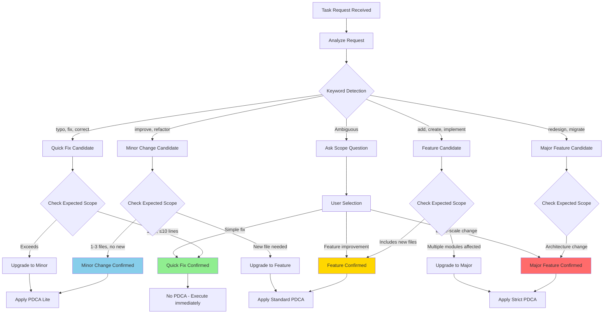

# Task Classification System Design Document

> **Status**: Draft
> **Author**: Claude (with user collaboration)
> **Date**: 2026-01-15
> **Plan Reference**: `docs/01-plan/features/pdca-enforcement-improvement.plan.md` Section 2.1, 2.5
> **Branch**: feature/improve-onboarding-and-pdca-enforcement

---

## 1. Overview

### 1.1 Purpose

**Automatically classify task requests by scope** to apply appropriate PDCA levels.
Instead of enforcing the same PDCA for all tasks, provide a flexible approach matching the scope.

### 1.2 Scope

- Define task classification criteria
- Create new `skills/task-classification/SKILL.md`
- PreToolUse Hook Skill reference logic

### 1.3 Terminology

| Term | Description |
|------|-------------|
| **Quick Fix** | Minor change that can be executed immediately (no PDCA needed) |
| **Minor Change** | Small improvement to existing features (PDCA Lite applied) |
| **Feature** | New feature addition (Standard PDCA applied) |
| **Major Feature** | Large-scale work at architecture change level (Strict PDCA applied) |

---

## 2. Current State Analysis

### 2.1 Current Problems

```
Current: Same PDCA rules applied to all Write/Edit operations
Result:
  - "Check design document" requested even for typo fixes
  - Excessive questions cause user fatigue
  - PDCA perceived as an obstacle
```

### 2.2 Current PreToolUse Hook

```json
{
  "matcher": "Write|Edit",
  "hooks": [{
    "type": "prompt",
    "prompt": "Check file path and apply PDCA rules:
- src/* or app/* → Check if related design exists in docs/02-design/
..."
  }]
}
```

**Problem**: Same check performed regardless of task scope

---

## 3. Design Goals

### 3.1 Functional Requirements

1. **Auto Classification**: Analyze user request and automatically classify into 4 levels
2. **Differentiated PDCA**: Apply different PDCA levels based on classification
3. **Reclassification Support**: User can adjust classification results

### 3.2 Non-functional Requirements

1. **Plugin Compatible**: Implement as Skill to support both Plugin and .claude
2. **Low Latency**: Classification judgment completes quickly
3. **Transparency**: Show classification result to user explicitly

---

## 4. Detailed Design

### 4.1 Classification Criteria

```
┌─────────────────────────────────────────────────────────────────┐
│                  Task Classification Decision Tree               │
├─────────────────────────────────────────────────────────────────┤
│                                                                 │
│  1. Keyword-based Initial Classification                        │
│     "typo", "fix", "correct" → Quick Fix candidate              │
│     "create", "add", "implement" → Feature candidate            │
│     "redesign", "migration" → Major Feature candidate           │
│                                                                 │
│  2. Expected Change Scope Analysis                              │
│     1 file, 10 lines or less → Quick Fix                        │
│     1-3 files, no new files → Minor Change                      │
│     New file creation needed → Feature                          │
│     Multiple modules affected → Major Feature                   │
│                                                                 │
│  3. Final Classification Decision                               │
│     Determine by combining keywords + scope                     │
│                                                                 │
└─────────────────────────────────────────────────────────────────┘
```

### 4.2 Detailed Criteria by Classification

#### 4.2.1 Quick Fix (No PDCA needed)

| Criteria | Value |
|----------|-------|
| Number of files | 1 or less |
| Changed lines | 10 or less |
| New files | None |
| Logic change | None |

**Keywords (Multilingual)**:
```
EN: fix, typo, correct, adjust, tweak
KO: 수정해줘, 고쳐줘, 바꿔줘, 오타, 변경해줘
JA: 修正, 直して, タイポ
ZH: 修复, 改一下, 错字
```

**Examples**:
- "Fix the typo in README"
- "Change the button color"
- "Update the setting value"

#### 4.2.2 Minor Change (PDCA Lite)

| Criteria | Value |
|----------|-------|
| Number of files | 1-3 |
| Changed lines | 10-50 |
| New files | None |
| Logic change | Improve existing logic |

**Keywords (Multilingual)**:
```
EN: improve, refactor, enhance, optimize, update
KO: 개선해줘, 리팩토링, 최적화, 업데이트
JA: 改善, リファクタリング, 最適化
ZH: 改进, 重构, 优化
```

**Examples**:
- "Refactor the login function"
- "Fix the bug" (within existing feature)
- "Improve performance"

#### 4.2.3 Feature (Standard PDCA)

| Criteria | Value |
|----------|-------|
| Number of files | 1 or more new |
| Changed lines | 50 or more |
| New files | Yes |
| Logic change | New feature addition |

**Keywords (Multilingual)**:
```
EN: add, create, implement, build, new feature
KO: 추가해줘, 만들어줘, 구현해줘, 기능 추가
JA: 追加, 作って, 実装して, 新機能
ZH: 添加, 创建, 实现, 新功能
```

**Examples**:
- "Create a login feature"
- "Add a new API endpoint"
- "Implement a dashboard page"

#### 4.2.4 Major Feature (Strict PDCA)

| Criteria | Value |
|----------|-------|
| Number of files | Many |
| Changed lines | Large scale |
| New files | Many |
| Logic change | Architecture change |

**Keywords (Multilingual)**:
```
EN: redesign, migrate, architecture, overhaul, rewrite
KO: 재설계, 마이그레이션, 아키텍처, 전면 개편
JA: 再設計, マイグレーション, アーキテクチャ
ZH: 重新设计, 迁移, 架构, 全面改造
```

**Examples**:
- "Redesign the authentication system"
- "Migrate to monorepo"
- "Overhaul the state management"

### 4.3 PDCA Application by Classification Result

| Classification | PDCA Applied | Action |
|----------------|--------------|--------|
| **Quick Fix** | None | Execute immediately |
| **Minor Change** | PDCA Lite | Proceed after 3-line summary |
| **Feature** | Standard | Check or create Plan/Design document |
| **Major Feature** | Strict | Must proceed with Plan/Design, user confirmation required |

---

## 5. Implementation Design

### 5.1 skills/task-classification/SKILL.md

> 📚 **Design Rationale**: Plugin doesn't support `instructions/` (See [02-BKIT-PLUGIN-DESIGN.md Section 4](../../02-BKIT-PLUGIN-DESIGN.md#4-instructions-integration-strategy))

```markdown
---
name: task-classification
description: |
  Classifies task request scope to determine appropriate PDCA level.
  Automatically referenced from PreToolUse hooks, applied before Write/Edit operations.

  Triggers: task classification, PDCA level, scope judgment,
  タスク分類, 任务分类, quick fix, feature, major, classification
---

# Task Classification System

## Classification Criteria

### Quick Fix (No PDCA needed)
- Modify 1 file or less
- Change 10 lines or less
- No existing logic change
- Keywords: "fix", "correct", "typo", "adjust"

### Minor Change (PDCA Lite)
- Modify 1-3 files
- Improve existing feature
- No new file creation
- Keywords: "improve", "refactor", "bug fix", "optimize"

### Feature (Standard PDCA)
- New file creation needed
- Add new feature/endpoint
- Keywords: "add", "create", "implement"

### Major Feature (Strict PDCA)
- Multiple modules affected
- Architecture change
- Keywords: "redesign", "migration", "architecture", "overhaul"

## Classification Process

1. Detect keywords in user request
2. Estimate expected change scope (file count, line count)
3. Determine classification
4. Apply corresponding PDCA level

## PDCA Application Levels

| Classification | PDCA | Action |
|----------------|------|--------|
| Quick Fix | None | Execute immediately |
| Minor Change | Lite | 3-line summary |
| Feature | Standard | Check/write design |
| Major Feature | Strict | Design required, confirmation needed |
```

### 5.2 PreToolUse Hook Skill Reference

Reference task-classification skill in PreToolUse hooks of `hooks/hooks.json` and `.claude/settings.json`.

**hooks/hooks.json (Plugin)**:
```json
{
  "PreToolUse": [
    {
      "matcher": "Write|Edit",
      "hooks": [
        {
          "type": "prompt",
          "prompt": "## Task Classification & PDCA Guidance

Reference task-classification skill criteria to classify the current task.

### Classification Process
1. Analyze user request (keywords, expected scope)
2. Classify as Quick Fix / Minor Change / Feature / Major Feature
3. Apply PDCA based on classification result

### Actions by Classification Result
- Quick Fix → Proceed immediately
- Minor Change → PDCA Lite (display 3-line summary, then proceed)
- Feature → Check design document, suggest creation if missing
- Major Feature → Design required, request user confirmation

### Response Format
{
  \"classification\": \"quick_fix|minor_change|feature|major_feature\",
  \"reason\": \"Classification rationale explanation\",
  \"pdca_action\": \"none|lite|standard|strict\",
  \"decision\": \"approve\"
}",
          "timeout": 10000
        }
      ]
    }
  ]
}
```

### 5.3 Ambiguous Request Handling (Section 2.5 Scope Verification)

Ask user for confirmation when classification is ambiguous:

```
User: "Fix the login feature"

Claude: Let me verify the task scope.

What level of fix is this?

1. 🔧 Simple fix (bug fix, style change) → Quick Fix/Minor
2. ✨ Feature improvement (add new feature, change logic) → Feature
3. 🏗️ Large-scale change (redesign, architecture change) → Major Feature
```

**Using AskUserQuestion**:
```json
{
  "questions": [{
    "question": "What level of fix is this?",
    "header": "Task Scope",
    "options": [
      {"label": "Simple fix", "description": "Bug fix, style change, small modifications"},
      {"label": "Feature improvement", "description": "Add new feature, change logic"},
      {"label": "Large-scale change", "description": "Redesign, architecture change"}
    ],
    "multiSelect": false
  }]
}
```

---

## 6. Classification Flowchart



---

## 7. Expected Behavior Examples

### 7.1 Quick Fix Example

```
User: "Fix the typo in README.md"

[Classification]: Quick Fix
[Rationale]: "typo", "fix" keywords, single file modification expected
[PDCA]: None

→ Proceed with README.md modification immediately
```

### 7.2 Minor Change Example

```
User: "Improve the login function performance"

[Classification]: Minor Change
[Rationale]: "improve" keyword, existing function modification
[PDCA]: Lite

📝 PDCA Lite
• What: login() function performance
• Why: Response time reduction requested
• How: Add caching logic

Proceed?
```

### 7.3 Feature Example

```
User: "Create a signup feature"

[Classification]: Feature
[Rationale]: "create" keyword, new feature addition
[PDCA]: Standard

📋 This task is classified as a new feature addition (Feature).

Design document is required:
1. [Recommended] Write design document with /bkit:pdca-design signup
2. [Quick proceed] Proceed after brief inline design

What would you like to do?
```

### 7.4 Major Feature Example

```
User: "Redesign the authentication system"

[Classification]: Major Feature
[Rationale]: "redesign" keyword, architecture change expected
[PDCA]: Strict

⚠️ This task is classified as a large-scale change (Major Feature).

Design document is required:
1. Write plan document with /bkit:pdca-plan auth-redesign
2. Write design document with /bkit:pdca-design auth-redesign

Would you like to start with the design document?
```

---

## 8. Changed Files List

### 8.1 New Files

| File | Description |
|------|-------------|
| `skills/task-classification/SKILL.md` | Task classification skill |

### 8.2 Modified Files

| File | Change Content |
|------|----------------|
| `hooks/hooks.json` | Add classification logic to PreToolUse hook |
| `.claude/settings.json` | Update PreToolUse hook |

### 8.3 Sync Target

```
┌─────────────────────────────────────────────────────┐
│ Source of Truth: .claude/                           │
├─────────────────────────────────────────────────────┤
│ .claude/skills/task-classification/SKILL.md        │
│     ↓ scripts/sync-folders.sh                      │
│ skills/task-classification/SKILL.md                │
└─────────────────────────────────────────────────────┘
```

---

## 9. Test Plan

### 9.1 Test Scenarios

| ID | Input | Expected Classification | Expected PDCA |
|----|-------|-------------------------|---------------|
| T1 | "Fix the typo" | Quick Fix | None |
| T2 | "Change the button color" | Quick Fix | None |
| T3 | "Refactor the function" | Minor Change | Lite |
| T4 | "Fix the bug" | Minor Change | Lite |
| T5 | "Add a new API" | Feature | Standard |
| T6 | "Create a login feature" | Feature | Standard |
| T7 | "Redesign the architecture" | Major Feature | Strict |
| T8 | "Do the migration" | Major Feature | Strict |
| T9 | "Fix the login" (ambiguous) | Ask scope question | Depends on selection |

### 9.2 Edge Cases

| Case | Handling |
|------|----------|
| Compound request ("fix typo and add new feature") | Apply higher classification (Feature) |
| Mixed English/Korean | Recognize all language keywords |
| Reclassification request | User can change classification |

---

## 10. Implementation Checklist

- [ ] Create `skills/task-classification/SKILL.md`
- [ ] Create `.claude/skills/task-classification/SKILL.md` (Source of Truth)
- [ ] Modify `hooks/hooks.json` PreToolUse hook
- [ ] Modify `.claude/settings.json` PreToolUse hook
- [ ] Add new skill to `scripts/sync-folders.sh`
- [ ] Perform tests T1~T9
- [ ] Validate with `./scripts/validate-plugin.sh`

---

## 11. Next Steps

1. Approve this design document
2. Implement in conjunction with `adaptive-pdca-guidance.design.md`
3. Perform testing
4. Create PR

---

> This document is a Design phase deliverable of the bkit PDCA workflow.
