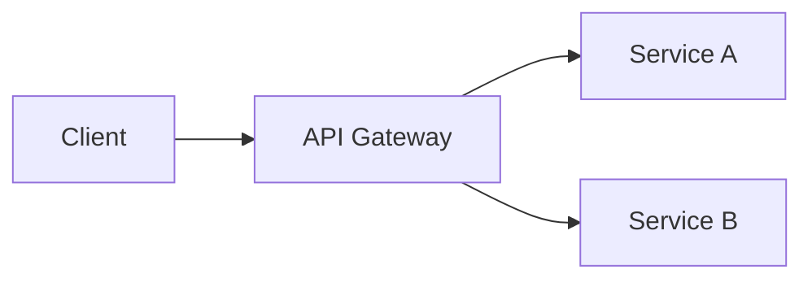

# Document Writing Standards

## File Naming Rules

### Basic Format

```
{number}_{english_name}.md
{number}-{english_name}.md
{feature}.{type}.md
```

### Examples

```
# Phase-based (order matters)
00-requirement/
01-development/
02-scenario/

# Number-based (order matters)
01_system_architecture_design.md
02_core_feature_design.md

# Feature-based
login.plan.md
login.design.md
login.analysis.md
```

## Document Structure Templates

### Common Header for All Documents

```markdown
# {Document Title}

> **Summary**: {One-line description}
>
> **Author**: {Name}
> **Created**: {YYYY-MM-DD}
> **Last Modified**: {YYYY-MM-DD}
> **Status**: {Draft | Review | Approved | Deprecated}

---

## Table of Contents

1. [Overview](#1-overview)
2. ...

---
```

### Plan Document Structure

```markdown
# {Feature} Plan

## 1. Overview

### 1.1 Purpose
{Purpose of this feature}

### 1.2 Background
{Why it is needed}

### 1.3 Related Documents
- [Requirements](../01-plan/requirements.md)
- [Design](../02-design/{feature}.design.md)

## 2. Scope

### 2.1 Included
- {Included item 1}
- {Included item 2}

### 2.2 Excluded
- {Excluded item 1}

## 3. Requirements

### 3.1 Functional Requirements
| ID | Requirement | Priority |
|----|-------------|----------|
| FR-01 | {requirement} | High |

### 3.2 Non-functional Requirements
- Performance: {criteria}
- Security: {criteria}

## 4. Success Criteria
- [ ] {Criterion 1}
- [ ] {Criterion 2}

## 5. Risks
| Risk | Impact | Mitigation |
|------|--------|------------|
| {risk} | High | {mitigation} |
```

### Design Document Structure

```markdown
# {Feature} Design Document

## 1. Overview
{Design overview}

## 2. Architecture

### 2.1 Component Diagram
```
[ASCII diagram or image link]
```

### 2.2 Data Flow
{How data flows}

## 3. Data Model

### 3.1 Entity Definitions
```typescript
interface User {
  id: string;
  email: string;
  // ...
}
```

### 3.2 Relationships
{Entity relationship description}

## 4. API Specification

### 4.1 Endpoint List
| Method | Path | Description |
|--------|------|-------------|
| POST | /api/users | Create user |

### 4.2 Detailed Specification
#### POST /api/users
**Request:**
```json
{
  "email": "string",
  "password": "string"
}
```
**Response:**
```json
{
  "id": "string",
  "email": "string"
}
```

## 5. Error Handling
| Code | Message | Description |
|------|---------|-------------|
| 400 | Invalid input | Input validation error |

## 6. Test Plan
- [ ] Unit tests
- [ ] Integration tests
- [ ] E2E tests
```

## _INDEX.md Format

Document list and status tracking for each folder:

```markdown
# {Folder Name} Index

> **Last Updated**: {date}

## Document List

| Document | Status | Last Modified | Owner |
|----------|--------|---------------|-------|
| [architecture.md](./architecture.md) | ✅ Approved | 2024-12-01 | Kay |
| [api-spec.md](./api-spec.md) | 🔄 In Progress | 2024-12-10 | - |

## Status Legend

| Status | Description |
|--------|-------------|
| ✅ Approved | Review complete, implementation baseline |
| 🔄 In Progress | Being written |
| ⏸️ On Hold | Temporarily paused |
| ❌ Deprecated | No longer valid |

## PDCA Status

```
Current phase: [Plan] → Design → Do → Check → Act
```
```

## Version Control Rules

### Document Version Notation

```
Version section within document:

## Version History

| Version | Date | Changes | Author |
|---------|------|---------|--------|
| 1.0 | 2024-12-01 | Initial draft | Kay |
| 1.1 | 2024-12-05 | Added API spec | Kay |
| 2.0 | 2024-12-10 | Architecture change | Kay |
```

### Filename Version Notation (Optional)

```
# Version in filename for important docs
architecture-v1.md
architecture-v2.md

# Date-based
2024-12-01_initial_design.md
2024-12-15_improved_design.md
```

## Cross-Reference Rules

### Document Links

```markdown
## Related Documents
- Plan: [login.plan.md](../01-plan/features/login.plan.md)
- Design: [login.design.md](../02-design/features/login.design.md)
- Analysis: [login-gap.md](../03-analysis/gap-analysis/login-gap.md)
```

### Code References

```markdown
## Implementation Location
- Component: `src/components/LoginForm.tsx`
- API: `src/api/auth.ts`
- Service: `services/auth/app/services/auth_service.py`
```

## Writing Style

### Consistency Rules

```
✅ Good examples:
- End sentences consistently (use same style throughout)
- Start list items with verbs ("Create", "Verify")
- Specify language in code blocks

❌ Bad examples:
- Mixed writing styles
- Unclear pronouns ("this", "that")
- Unexplained abbreviations
```

### Diagrams

```
# ASCII diagrams (for simple ones)
┌───────┐     ┌───────┐
│ Client │────▶│ Server │
└───────┘     └───────┘

# Mermaid (for complex ones)

```
