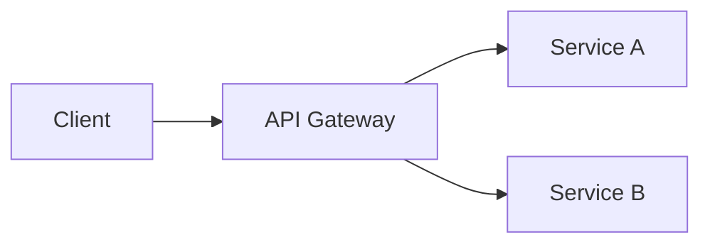

# 문서 작성 표준

## 파일명 규칙

### 기본 형식

```
{순번}_{영문명}.md
{순번}-{영문명}.md
{feature}.{type}.md
```

### 예시

```
# Phase 기반 (순서 중요)
00-requirement/
01-development/
02-scenario/

# 번호 기반 (순서 중요)
01_시스템_아키텍처_설계서.md
02_핵심_기능_설계서.md

# 기능 기반
login.plan.md
login.design.md
login.analysis.md
```

## 문서 구조 템플릿

### 모든 문서 공통 헤더

```markdown
# {문서 제목}

> **요약**: {한 줄 설명}
>
> **작성자**: {이름}
> **작성일**: {YYYY-MM-DD}
> **최종 수정**: {YYYY-MM-DD}
> **상태**: {Draft | Review | Approved | Deprecated}

---

## 목차

1. [개요](#1-개요)
2. ...

---
```

### 계획 문서 구조

```markdown
# {기능명} 계획서

## 1. 개요

### 1.1 목적
{이 기능의 목적}

### 1.2 배경
{왜 필요한지}

### 1.3 관련 문서
- [요구사항](../01-plan/requirements.md)
- [설계서](../02-design/{feature}.design.md)

## 2. 범위

### 2.1 포함
- {포함 항목 1}
- {포함 항목 2}

### 2.2 제외
- {제외 항목 1}

## 3. 요구사항

### 3.1 기능 요구사항
| ID | 요구사항 | 우선순위 |
|----|---------|---------|
| FR-01 | {요구사항} | 높음 |

### 3.2 비기능 요구사항
- 성능: {기준}
- 보안: {기준}

## 4. 성공 기준
- [ ] {기준 1}
- [ ] {기준 2}

## 5. 리스크
| 리스크 | 영향도 | 대응 방안 |
|--------|--------|----------|
| {리스크} | 높음 | {방안} |
```

### 설계 문서 구조

```markdown
# {기능명} 설계서

## 1. 개요
{설계 개요}

## 2. 아키텍처

### 2.1 컴포넌트 다이어그램
```
[ASCII 다이어그램 또는 이미지 링크]
```

### 2.2 데이터 흐름
{데이터가 어떻게 흐르는지}

## 3. 데이터 모델

### 3.1 엔티티 정의
```typescript
interface User {
  id: string;
  email: string;
  // ...
}
```

### 3.2 관계
{엔티티 간 관계 설명}

## 4. API 명세

### 4.1 엔드포인트 목록
| Method | Path | 설명 |
|--------|------|------|
| POST | /api/users | 사용자 생성 |

### 4.2 상세 명세
#### POST /api/users
**Request:**
```json
{
  "email": "string",
  "password": "string"
}
```
**Response:**
```json
{
  "id": "string",
  "email": "string"
}
```

## 5. 에러 처리
| 코드 | 메시지 | 설명 |
|------|--------|------|
| 400 | Invalid input | 입력값 오류 |

## 6. 테스트 계획
- [ ] 단위 테스트
- [ ] 통합 테스트
- [ ] E2E 테스트
```

## _INDEX.md 형식

각 폴더의 문서 목록 및 상태 추적:

```markdown
# {폴더명} 인덱스

> **최종 업데이트**: {날짜}

## 문서 목록

| 문서 | 상태 | 최종 수정 | 담당자 |
|------|------|----------|--------|
| [architecture.md](./architecture.md) | ✅ 확정 | 2024-12-01 | Kay |
| [api-spec.md](./api-spec.md) | 🔄 진행중 | 2024-12-10 | - |

## 상태 범례

| 상태 | 설명 |
|------|------|
| ✅ 확정 | 리뷰 완료, 구현 기준 |
| 🔄 진행중 | 작성 중 |
| ⏸️ 보류 | 임시 중단 |
| ❌ 폐기 | 더 이상 유효하지 않음 |

## PDCA 현황

```
현재 단계: [Plan] → Design → Do → Check → Act
```
```

## 버전 관리 규칙

### 문서 버전 표기

```
문서 내 버전 섹션:

## 버전 이력

| 버전 | 날짜 | 변경 내용 | 작성자 |
|------|------|----------|--------|
| 1.0 | 2024-12-01 | 초안 작성 | Kay |
| 1.1 | 2024-12-05 | API 명세 추가 | Kay |
| 2.0 | 2024-12-10 | 아키텍처 변경 | Kay |
```

### 파일명 버전 표기 (선택)

```
# 중요 문서에 버전 명시
architecture-v1.md
architecture-v2.md

# 날짜 기반
2024-12-01_초기설계.md
2024-12-15_개선설계.md
```

## 상호 참조 규칙

### 문서 간 링크

```markdown
## 관련 문서
- 계획: [login.plan.md](../01-plan/features/login.plan.md)
- 설계: [login.design.md](../02-design/features/login.design.md)
- 분석: [login-gap.md](../03-analysis/gap-analysis/login-gap.md)
```

### 코드 참조

```markdown
## 구현 위치
- 컴포넌트: `src/components/LoginForm.tsx`
- API: `src/api/auth.ts`
- 서비스: `services/auth/app/services/auth_service.py`
```

## 작성 스타일

### 일관성 규칙

```
✅ 좋은 예:
- 문장은 "~입니다", "~합니다"로 끝내기
- 목록은 동사로 시작 ("생성한다", "확인한다")
- 코드 블록에 언어 명시

❌ 나쁜 예:
- 문체 혼용 ("~함", "~입니다")
- 불명확한 대명사 ("이것", "그것")
- 설명 없는 약어
```

### 다이어그램

```
# ASCII 다이어그램 (간단한 것)
┌───────┐     ┌───────┐
│ Client │────▶│ Server │
└───────┘     └───────┘

# Mermaid (복잡한 것)

```
